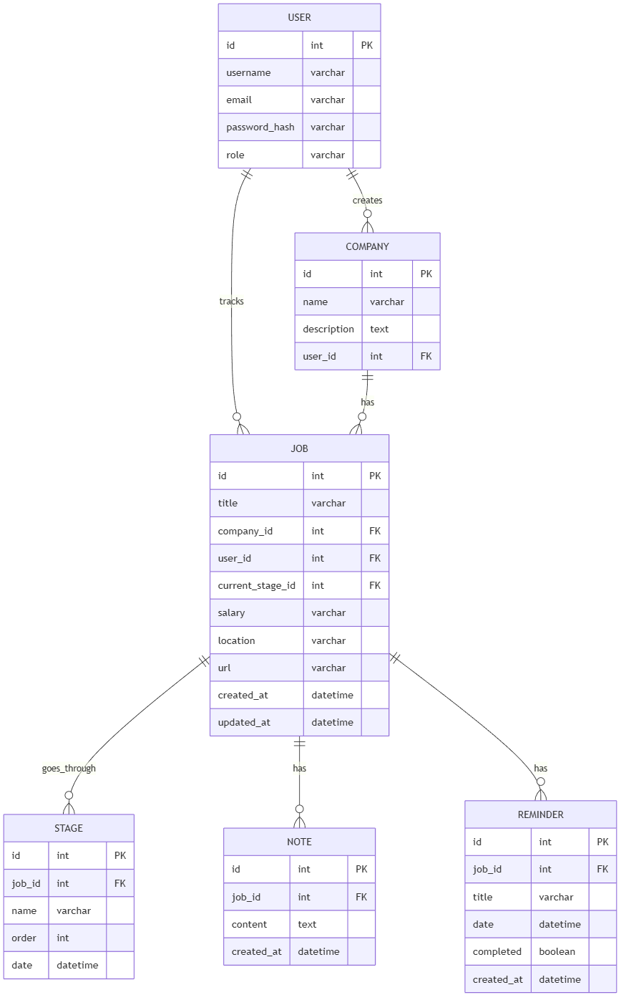
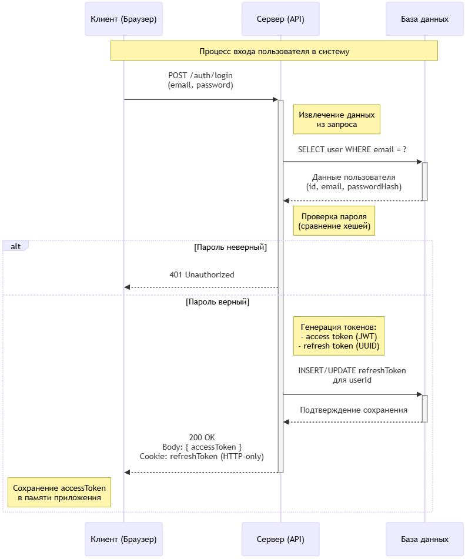

# 2. Разработка алгоритмов

В данном разделе представлено описание ключевых алгоритмов системы, включая структуру сущностей и связей, алгоритмы формирования канбан-доски, обработки операций с данными и механизмы аутентификации пользователей.

## 2.1. Описание сущностей и связей

Модель данных системы включает шесть основных сущностей, связанных между собой отношениями различных типов [1]. Детальная структура представлена в таблице 2.1.

Таблица 2.1 – Описание основных сущностей системы

| Сущность | Основные атрибуты | Назначение |
|----------|-------------------|------------|
| User | id, username, email, passwordHash, role | Хранение информации о пользователях системы с разграничением ролей |
| Company | id, name, description, userId | Представление компаний-работодателей, созданных пользователем |
| Job | id, title, companyId, userId, status, currentStageId, salary, location, url | Описание вакансий с привязкой к компании и текущему этапу |
| Stage | id, jobId, name, order, date | Этапы прохождения отбора по конкретной вакансии |
| Note | id, jobId, content, createdAt | Текстовые заметки пользователя к вакансиям |
| Reminder | id, jobId, title, date, completed | Напоминания о событиях, связанных с вакансиями |

Связи между сущностями реализованы через механизм внешних ключей с соблюдением правил каскадного удаления [2]. Один пользователь может создать множество компаний, при этом каждая компания принадлежит ровно одному пользователю [2]. Аналогичная связь существует между пользователем и вакансиями, где один пользователь может отслеживать множество вакансий [2].

Каждая вакансия связана с одной компанией, при этом компания может иметь несколько вакансий [2]. Такая структура позволяет группировать вакансии по работодателям и анализировать активность по компаниям [2]. При удалении компании все связанные с ней вакансии также удаляются для поддержания целостности данных [2].

Вакансия может проходить через несколько этапов отбора, представленных сущностью Stage [2]. Каждый этап имеет порядковый номер, определяющий последовательность прохождения [2]. Вакансия содержит ссылку на текущий этап, что позволяет быстро определить статус отклика [2]. При удалении вакансии все связанные этапы удаляются автоматически [2].

К каждой вакансии может быть привязано произвольное количество заметок и напоминаний [2]. Заметки используются для фиксации важной информации, полученной в процессе взаимодействия с работодателем [2]. Напоминания позволяют отслеживать предстоящие события с указанием даты и времени [2]. При удалении вакансии все связанные заметки и напоминания также удаляются [2].

Диаграмма связей сущностей показана на рисунке 2.1.


Рисунок 2.1 – Диаграмма связей сущностей системы

Как видно из рисунка 2.1, центральной сущностью является Job, которая связывает пользователя, компанию, этапы, заметки и напоминания в единую структуру. Такая архитектура обеспечивает эффективный доступ к связанным данным и поддерживает целостность при удалении записей [2].

## 2.2. Алгоритм формирования канбан-доски

Канбан-доска представляет собой визуальное отображение вакансий, сгруппированных по этапам отбора [1]. Формирование структуры данных для канбана выполняется на серверной стороне и включает несколько последовательных шагов.

На первом шаге выполняется аутентификация пользователя и извлечение его идентификатора из JWT-токена [5]. Это необходимо для обеспечения доступа только к вакансиям текущего пользователя [2]. Если токен недействителен или отсутствует, запрос отклоняется с кодом ошибки 401 [5].

На втором шаге из базы данных извлекаются все вакансии пользователя с включением связанных данных о компании и текущем этапе [1]. Запрос выполняется с использованием механизма eager loading для минимизации количества обращений к базе данных [3]. Для каждой вакансии загружаются основные атрибуты, включая название, информацию о компании, зарплате, локации и URL [1].

На третьем шаге формируется список уникальных этапов на основе данных из связанной таблицы Stage [1]. Этапы сортируются по порядковому номеру, определяющему последовательность их отображения на канбане [1]. Для каждого этапа создаётся структура данных, содержащая идентификатор, название, порядковый номер и пустой массив для вакансий [1].

На четвёртом шаге вакансии распределяются по соответствующим этапам [1]. Для каждой вакансии определяется текущий этап на основе значения поля currentStageId [2]. Вакансия добавляется в массив jobs соответствующего этапа [1]. Если у вакансии не указан текущий этап, она пропускается или помещается в специальную категорию неразмеченных вакансий [3].

На пятом шаге сформированная структура данных преобразуется в формат JSON и отправляется клиенту в качестве ответа на запрос [2]. Структура имеет вид объекта с полем stages, содержащим массив этапов, каждый из которых включает массив вакансий [1].

Псевдокод алгоритма формирования канбан-доски представлен следующим образом:

```
ФУНКЦИЯ generateKanban(userId):
  // Получение всех вакансий пользователя
  jobs ← SELECT * FROM Job WHERE userId = userId INCLUDE company, currentStage
  
  // Получение всех уникальных этапов
  stages ← SELECT DISTINCT * FROM Stage WHERE jobId IN (jobs.map(j => j.id))
  
  // Сортировка этапов по порядковому номеру
  stages ← SORT stages BY order ASC
  
  // Инициализация структуры канбана
  kanban ← []
  ДЛЯ КАЖДОГО stage ИЗ stages:
    kanban.add({
      id: stage.id,
      name: stage.name,
      order: stage.order,
      jobs: []
    })
  
  // Распределение вакансий по этапам
  ДЛЯ КАЖДОГО job ИЗ jobs:
    ЕСЛИ job.currentStageId НЕ NULL:
      stageIndex ← FIND kanban WHERE id = job.currentStageId
      ЕСЛИ stageIndex НАЙДЕН:
        kanban[stageIndex].jobs.add(job)
  
  ВЕРНУТЬ kanban
```

Клиентская часть получает данные канбана и отображает их в виде колонок с карточками [3]. Каждая колонка соответствует этапу и содержит карточки вакансий этого этапа [1]. Пользователь может перетаскивать карточки между колонками для изменения текущего этапа вакансии [1].

## 2.3. Алгоритм перемещения вакансии между этапами

Перемещение вакансии между этапами на канбан-доске инициируется действием пользователя в интерфейсе и требует обновления данных на сервере [1]. Алгоритм обработки этой операции включает валидацию прав доступа, проверку существования целевого этапа и обновление состояния вакансии.

При инициировании перемещения клиент отправляет HTTP-запрос методом PUT на endpoint обновления вакансии с указанием нового значения поля currentStageId [2]. Запрос содержит JWT-токен для аутентификации пользователя [5].

Серверная часть извлекает идентификатор пользователя из токена и проверяет, является ли он владельцем изменяемой вакансии [2]. Если пользователь не имеет прав на изменение вакансии, запрос отклоняется с кодом ошибки 403 [2]. Это обеспечивает изоляцию данных между пользователями [2].

Далее выполняется проверка существования целевого этапа в базе данных [2]. Если указанный этап не найден или не принадлежит данной вакансии, возвращается ошибка валидации с кодом 400 [2]. Это предотвращает установку некорректных связей между сущностями [2].

После успешной валидации выполняется обновление записи вакансии в базе данных [2]. Поле currentStageId устанавливается равным идентификатору целевого этапа [2]. Также обновляется временная метка updatedAt для отслеживания последнего изменения [2]. Операция обновления выполняется атомарно для обеспечения консистентности данных [4].

В случае успешного обновления сервер возвращает клиенту обновлённые данные вакансии с кодом 200 [2]. Клиент обновляет отображение канбан-доски, перемещая визуальную карточку в новую колонку [3].

Псевдокод алгоритма перемещения вакансии:

```
ФУНКЦИЯ moveJobToStage(jobId, newStageId, userId):
  // Проверка владения вакансией
  job ← SELECT * FROM Job WHERE id = jobId
  ЕСЛИ job.userId ≠ userId:
    ВЕРНУТЬ error(403, "Access denied")
  
  // Проверка существования целевого этапа
  stage ← SELECT * FROM Stage WHERE id = newStageId AND jobId = jobId
  ЕСЛИ stage НЕ НАЙДЕН:
    ВЕРНУТЬ error(400, "Invalid stage for this job")
  
  // Обновление вакансии
  UPDATE Job SET currentStageId = newStageId, updatedAt = NOW() WHERE id = jobId
  
  // Получение обновлённых данных
  updatedJob ← SELECT * FROM Job WHERE id = jobId INCLUDE company, currentStage
  
  ВЕРНУТЬ success(200, updatedJob)
```

Данный алгоритм обеспечивает корректную обработку перемещений с соблюдением правил безопасности и целостности данных [2].

## 2.4. Алгоритм обработки напоминаний

Система напоминаний позволяет пользователям устанавливать уведомления о важных событиях, связанных с вакансиями [1]. Обработка напоминаний включает создание, получение списка активных напоминаний и отметку напоминаний как выполненных.

При создании напоминания клиент отправляет POST-запрос с данными, включающими идентификатор вакансии, название напоминания и дату события [1]. Серверная часть выполняет валидацию входных данных, проверяя обязательность заполнения всех полей и корректность формата даты [2].

Важным требованием является проверка того, что дата напоминания находится в будущем [2]. Если указана дата в прошлом, возвращается ошибка валидации с соответствующим сообщением [2]. Это предотвращает создание бессмысленных напоминаний [3].

После валидации проверяется принадлежность указанной вакансии текущему пользователю [2]. Это необходимо для предотвращения создания напоминаний к чужим вакансиям [2]. Если проверка пройдена успешно, создаётся новая запись в таблице Reminder с заполнением всех полей [2].

Для получения списка активных напоминаний реализован endpoint, возвращающий напоминания пользователя с возможностью фильтрации [1]. Клиент может указать параметры фильтрации, такие как идентификатор вакансии, статус выполнения и временной диапазон [2]. Серверная часть формирует SQL-запрос с соответствующими условиями WHERE и возвращает отфильтрованный список напоминаний [2].

Напоминания сортируются по дате в порядке возрастания, чтобы ближайшие события отображались первыми [3]. Каждое напоминание включает информацию о связанной вакансии для предоставления контекста пользователю [1].

Отметка напоминания как выполненного осуществляется через PUT-запрос с обновлением поля completed [1]. После обновления напоминание может быть исключено из списка активных при применении соответствующего фильтра [3].

Псевдокод алгоритма создания напоминания:

```
ФУНКЦИЯ createReminder(jobId, title, date, userId):
  // Валидация даты
  ЕСЛИ date < NOW():
    ВЕРНУТЬ error(400, "Date must be in the future")
  
  // Проверка владения вакансией
  job ← SELECT * FROM Job WHERE id = jobId
  ЕСЛИ job.userId ≠ userId:
    ВЕРНУТЬ error(403, "Access denied")
  
  // Создание напоминания
  reminder ← INSERT INTO Reminder (
    id: generateUUID(),
    jobId: jobId,
    title: title,
    date: date,
    completed: false,
    createdAt: NOW()
  )
  
  ВЕРНУТЬ success(201, reminder)
```

В базовой версии системы уведомления пользователей о наступлении времени напоминания не реализованы [3]. Пользователь самостоятельно просматривает список активных напоминаний через интерфейс приложения [1]. В дальнейшем может быть добавлена функциональность push-уведомлений или отправки email-напоминаний [3].

## 2.5. Схема аутентификации и авторизации

Безопасность системы обеспечивается механизмами аутентификации на основе JWT-токенов с поддержкой refresh-механизма [5]. Архитектура аутентификации включает раздельное управление короткоживущими access-токенами и долгоживущими refresh-токенами.

Процесс аутентификации начинается с регистрации или входа пользователя [1]. При регистрации пользователь предоставляет имя пользователя, адрес электронной почты и пароль [1]. Серверная часть выполняет валидацию данных, проверяя уникальность имени пользователя и адреса электронной почты в базе данных [2]. Пароль хешируется с использованием алгоритма bcrypt с достаточным количеством раундов для обеспечения стойкости к атакам перебора [5].

После успешной регистрации создаётся запись пользователя в базе данных с сохранённым хешем пароля [2]. Пользователю немедленно выдаются access и refresh токены, позволяя выполнить вход без дополнительных действий [5].

При входе пользователь предоставляет адрес электронной почты и пароль [1]. Серверная часть находит пользователя по адресу электронной почты и сравнивает хеш предоставленного пароля с сохранённым хешем [5]. Если хеши совпадают, аутентификация считается успешной [5].

В случае успешной аутентификации генерируется пара токенов [5]. Access-токен содержит идентификатор пользователя, роль и время истечения [5]. Время жизни access-токена составляет короткий период, например пятнадцать минут, для минимизации последствий компрометации токена [5]. Refresh-токен имеет длительный срок действия, например семь дней, и используется для получения нового access-токена без повторного ввода учётных данных [5].

Refresh-токен перед отправкой клиенту хешируется и сохраняется в таблице RefreshToken вместе с информацией о времени истечения, IP-адресе и user-agent клиента [5]. Сам токен передаётся клиенту в защищённом HTTP-only cookie, что предотвращает доступ к нему из JavaScript-кода и защищает от XSS-атак [5]. Access-токен возвращается в теле ответа и сохраняется клиентом в памяти приложения [5].

При выполнении запросов к защищённым endpoints клиент включает access-токен в заголовок Authorization с префиксом Bearer [5]. Серверная часть извлекает токен из заголовка, проверяет его подпись и время истечения [5]. Если токен действителен, из него извлекается идентификатор пользователя, который используется для авторизации запроса [2].

Если access-токен истёк, клиент автоматически выполняет запрос на обновление токена, отправляя refresh-токен в cookie [5]. Серверная часть извлекает refresh-токен, хеширует его и ищет соответствующую запись в таблице RefreshToken [5]. Если токен найден, не отозван и не истёк, генерируется новая пара токенов [5]. Старый refresh-токен отмечается как отозванный с сохранением ссылки на новый токен для обеспечения трассируемости [5]. Новые токены отправляются клиенту, который обновляет свои хранилища и повторяет исходный запрос [5].

При выходе из системы клиент отправляет запрос на logout с refresh-токеном [5]. Серверная часть находит соответствующую запись токена и отмечает её как отозванную, устанавливая значение поля revokedAt [5]. Также очищается cookie с refresh-токеном [5]. После этого refresh-токен больше не может быть использован для получения новых access-токенов [5].

Авторизация выполняется на основе роли пользователя, извлечённой из access-токена [2]. Для операций, требующих прав администратора, выполняется проверка значения поля role [2]. Если роль пользователя не соответствует требуемой, запрос отклоняется с кодом ошибки 403 [2].

Для операций с данными, принадлежащими конкретному пользователю, выполняется проверка соответствия идентификатора пользователя из токена идентификатору владельца ресурса [2]. Это обеспечивает изоляцию данных и предотвращает несанкционированный доступ [2].

Последовательность процесса аутентификации показана на рисунке 2.2.


Рисунок 2.2 – Последовательность аутентификации пользователя

Согласно рисунку 2.2, процесс аутентификации включает взаимодействие клиента, сервера и базы данных с генерацией и валидацией токенов на каждом этапе. Такая архитектура обеспечивает баланс между безопасностью и удобством использования [5].
