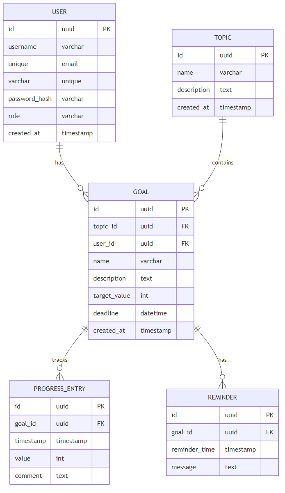

# 1 Постановка задачи

## 1.1 Исходные данные

Система предназначена для управления учебным процессом и включает четыре основные сущности данных.

Сущность User представляет пользователя системы и содержит уникальный идентификатор типа UUID, имя пользователя username длиной от 3 до 30 символов, состоящее из латинских букв, цифр и символа подчёркивания, адрес электронной почты email в стандартном формате, хешированный пароль password_hash и роль role со значениями admin или user. Каждый пользователь имеет временную метку создания created_at.

Сущность Topic описывает учебную тему и включает уникальный идентификатор типа UUID, название name, текстовое описание description и временную метку создания created_at. Темы служат для группировки целей по предметным областям.

Сущность Goal представляет учебную цель и содержит уникальный идентификатор типа UUID, ссылку на тему topic_id, ссылку на пользователя user_id, название цели name, описание description, целевое значение target_value в числовом формате, дедлайн deadline в формате datetime и временную метку создания created_at. Текущий прогресс current_progress вычисляется как сумма всех значений value из связанных записей прогресса. Процент выполнения progress_percentage вычисляется по формуле: (current_progress / target_value) × 100.

Сущность ProgressEntry фиксирует запись о прогрессе выполнения цели и включает уникальный идентификатор типа UUID, ссылку на цель goal_id, временную метку записи timestamp, числовое значение прогресса value и текстовый комментарий comment длиной до 5000 символов.

Между сущностями установлены следующие связи. Каждая тема Topic может содержать множество целей Goal, реализуя связь один ко многим. Каждый пользователь User может иметь множество целей Goal, также реализуя связь один ко многим. Каждая цель Goal может иметь множество записей прогресса ProgressEntry, образуя связь один ко многим. Диаграмма сущностей представлена на рисунке 1.1.

Рисунок 1.1 – Диаграмма сущностей (ERD)

На рисунке 1.1 показана структура базы данных с четырьмя основными таблицами и связями между ними, обеспечивающими целостность данных через внешние ключи.

## 1.2 Функциональные требования

Система должна обеспечивать функциональность для двух типов пользователей: администратора и обычного пользователя. Разграничение доступа реализуется на уровне API с проверкой роли пользователя при каждом запросе.

Администратор системы имеет полный доступ ко всем функциям управления данными. Он может создавать, просматривать, редактировать и удалять учётные записи пользователей. Администратор выполняет создание, редактирование и удаление учебных тем. Он создаёт цели и назначает их конкретным пользователям, указывая тему, целевое значение и дедлайн. Администратор может редактировать все поля целей любых пользователей и удалять цели. Он имеет доступ к просмотру прогресса всех пользователей системы и может генерировать отчёты как по отдельным пользователям, так и по темам в целом.

Обычный пользователь имеет ограниченный доступ, определяемый принципом минимальных привилегий [3]. Пользователь может просматривать список всех учебных тем, но работать только со своими целями. Он видит исключительно те цели, которые назначены ему администратором, через применение фильтра WHERE user_id = текущий_пользователь на уровне SQL-запросов. Пользователь может редактировать только определённые поля своих целей: название name, описание description и дедлайн deadline, но не может изменять целевое значение target_value, тему или владельца цели.

Пользователь добавляет записи прогресса исключительно к своим целям. Система проверяет принадлежность цели текущему пользователю перед сохранением записи прогресса. Он может просматривать, редактировать и удалять свои записи прогресса. Пользователь имеет доступ к личному дашборду с диаграммами и графиками прогресса и может генерировать отчёты только по своим данным. При попытке доступа к чужим данным система возвращает ошибку 403 Forbidden.

Система обеспечивает автоматическое вычисление прогресса выполнения целей. При добавлении новой записи прогресса система суммирует все значения value из таблицы ProgressEntry для данной цели и вычисляет процент выполнения. Если текущий прогресс превышает целевое значение, процент выполнения ограничивается значением 100%.

Генерация отчётов предусматривает два типа запросов. Отчёт пользователя возвращает статистику по всем целям конкретного пользователя: общее количество целей, количество завершённых целей, количество целей в процессе выполнения, средний процент выполнения и группировку по темам. Отчёт по теме доступен только администратору и включает статистику по всем пользователям, работающим с данной темой.

Функциональность напоминаний о дедлайнах целей не входит в минимально жизнеспособный продукт и может быть реализована на последующих этапах развития системы.

## 1.3 Нефункциональные требования

Система должна соответствовать следующим нефункциональным требованиям для обеспечения надёжной и безопасной работы.

В области производительности система должна обрабатывать запросы пользователей с минимальной задержкой. Время отклика на типовые операции чтения данных не должно превышать 500 миллисекунд при работе в локальной сети. Для обеспечения быстрого доступа к данным используются индексы на внешних ключах таблиц goals и progress_entries по полям user_id, topic_id и goal_id.

Безопасность данных обеспечивается комплексом мер. Пароли пользователей хранятся в виде хешей с использованием алгоритма bcrypt с фактором сложности не менее 10 [1]. Аутентификация реализована на основе JWT-токенов: краткосрочный access токен с временем жизни 15 минут для авторизации запросов и долгосрочный refresh токен с временем жизни 7 дней для обновления сессии. Refresh-токен передаётся в защищённом httpOnly cookie для предотвращения доступа из JavaScript и снижения риска XSS-атак.

На сервере применяется middleware для защиты от распространённых угроз. Библиотека helmet устанавливает заголовки HTTP для защиты от clickjacking и других атак. CORS-политика ограничивает доступ к API только с разрешённых доменов фронтенда. Все входные данные валидируются на сервере с использованием схем Zod для предотвращения инъекций и некорректных данных.

Масштабируемость обеспечивается архитектурными решениями. Серверная часть построена по модульному принципу с разделением на routes, services и controllers, что упрощает добавление новых функций. Prisma ORM обеспечивает абстракцию доступа к данным и упрощает миграции схемы базы данных при развитии системы.

Надёжность системы достигается использованием транзакций базы данных для критических операций, обеспечивающих атомарность изменений. Обработка ошибок реализована на всех уровнях приложения с возвратом информативных сообщений клиенту в структурированном формате JSON.

Удобство сопровождения поддерживается использованием TypeScript как на сервере, так и на клиенте для статической типизации и раннего выявления ошибок. Код структурирован согласно принципам разделения ответственности с выделением слоёв маршрутизации, бизнес-логики и доступа к данным.

## 1.4 Ограничения и допущения

При разработке системы приняты следующие ограничения и допущения.

Система предназначена для работы в локальной среде разработки и не включает конфигурацию для продакшн-развёртывания. Отсутствует контейнеризация средствами Docker и настройка для облачных платформ. Предполагается, что база данных PostgreSQL и серверные компоненты развёртываются на одном сервере.

Функциональность напоминаний о дедлайнах и геймификация с системой достижений не реализованы в текущей версии системы. Эти возможности могут быть добавлены на последующих этапах развития проекта после завершения и тестирования основного функционала.

Система не включает модуль автоматизированного тестирования. Проверка корректности работы осуществляется через ручное тестирование основных пользовательских сценариев. Для промышленной эксплуатации рекомендуется добавить unit-тесты для бизнес-логики и интеграционные тесты для API-эндпоинтов.

Отсутствует функционал экспорта данных в форматы для внешнего анализа, такие как CSV или Excel. Генерация отчётов реализована в виде JSON-ответов API для визуализации на клиенте.

Предполагается, что пользователи имеют базовые навыки работы с веб-приложениями и доступ к современным веб-браузерам с поддержкой JavaScript ES6 и выше. Система не оптимизирована для работы в устаревших браузерах.

База данных должна быть настроена вручную перед первым запуском приложения. Автоматическая инициализация и миграции выполняются через команды Prisma, которые должны быть запущены пользователем согласно инструкции в README.

## 1.5 Чеклист приёмки MVP

Минимально жизнеспособный продукт считается принятым при выполнении следующих критериев.

Успешная регистрация и аутентификация пользователей. Пользователь может зарегистрироваться в системе через форму регистрации, указав имя пользователя, email и пароль. После регистрации пользователь может войти в систему с получением JWT-токенов. При истечении срока действия access-токена система автоматически обновляет сессию через refresh-токен без требования повторного ввода учётных данных. Пользователь может выйти из системы с удалением refresh-токена.

Управление темами администратором. Администратор может создавать новые учебные темы с указанием названия и описания. Созданные темы отображаются в списке и доступны для редактирования и удаления. Обычные пользователи могут просматривать список тем, но не могут их модифицировать.

Управление целями. Администратор может создавать цели, указывая тему, пользователя, название, описание, целевое значение и дедлайн. Обычный пользователь видит только свои цели на дашборде. Пользователь может редактировать название, описание и дедлайн своих целей, но не может изменять целевое значение и тему. При попытке доступа к чужой цели система возвращает ошибку доступа.

Добавление и отображение прогресса. Пользователь может добавлять записи прогресса к своим целям, указывая значение выполненной работы и комментарий. После добавления записи система автоматически пересчитывает текущий прогресс цели как сумму всех значений и вычисляет процент выполнения. Обновлённый процент выполнения отображается на дашборде пользователя.

Корректное создание и отображение диаграмм прогресса. На дашборде пользователя отображаются диаграммы с процентом выполнения каждой цели. Диаграммы обновляются при добавлении новых записей прогресса. Визуализация позволяет оценить прогресс по каждой теме и цели.

Генерация отчётов. Пользователь может запросить отчёт по своим данным, содержащий общее количество целей, количество завершённых целей, средний процент выполнения и группировку по темам. Администратор может генерировать отчёты как по отдельным пользователям, так и по темам в целом с агрегированной статистикой.

Разграничение доступа по ролям. Обычный пользователь не может получить доступ к административным функциям и данным других пользователей. При попытке несанкционированного доступа система возвращает ошибку 403 Forbidden. Администратор имеет доступ ко всем данным системы для управления и мониторинга.

Валидация данных. Система проверяет корректность вводимых данных на сервере. При попытке создания цели с некорректными данными, например, с отрицательным целевым значением или несуществующей темой, система возвращает информативное сообщение об ошибке с указанием некорректного поля.
