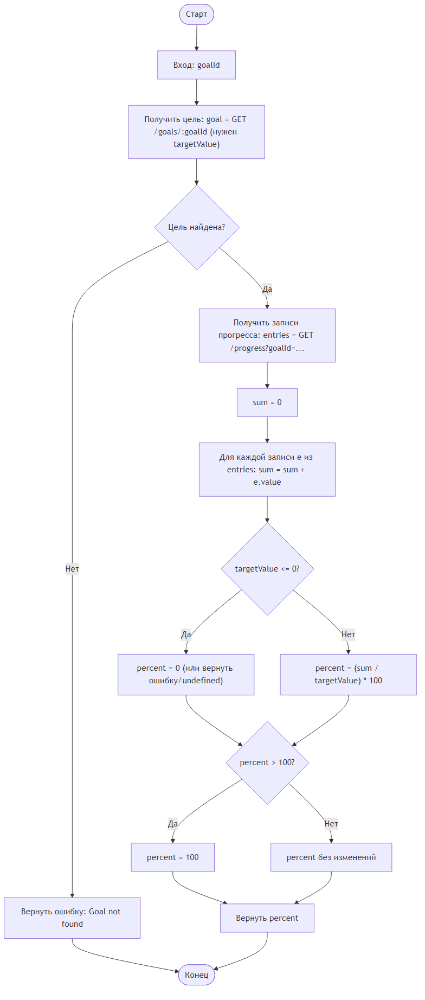
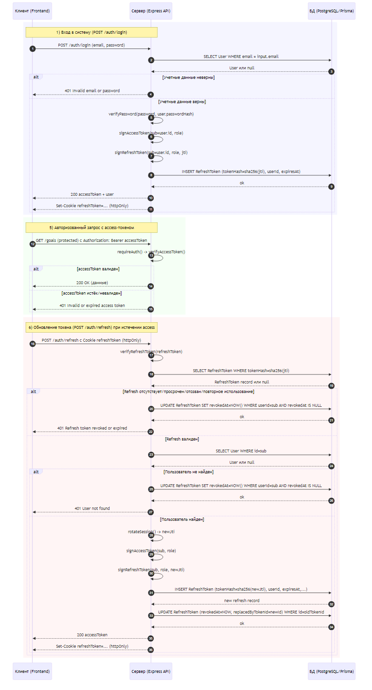

# 2 Разработка алгоритмов

## 2.1 Описание сущностей и связей

Модель данных системы включает четыре основные сущности, связанные отношениями внешних ключей для обеспечения ссылочной целостности.

Таблица users хранит информацию о пользователях системы и содержит следующие поля. Поле id типа UUID является первичным ключом и генерируется автоматически. Поле username типа TEXT содержит имя пользователя, должно быть уникальным и соответствовать регулярному выражению для проверки формата: от 3 до 30 символов латиницы, цифр или подчёркивания. Поле email типа TEXT содержит адрес электронной почты пользователя, должно быть уникальным и соответствовать формату email. Поле password_hash типа TEXT хранит хеш пароля, вычисленный с использованием bcrypt. Поле role типа TEXT принимает значения admin или user, по умолчанию устанавливается user. Поле created_at типа TIMESTAMP WITH TIME ZONE фиксирует момент создания записи и автоматически устанавливается при вставке.

Таблица topics содержит учебные темы и включает следующие поля. Поле id типа UUID является первичным ключом. Поле name типа TEXT содержит название темы и не может быть пустым. Поле description типа TEXT содержит текстовое описание темы и является опциональным. Поле created_at типа TIMESTAMP WITH TIME ZONE фиксирует момент создания темы.

Таблица goals хранит учебные цели пользователей и содержит следующие поля. Поле id типа UUID является первичным ключом. Поле topic_id типа UUID является внешним ключом, ссылающимся на таблицу topics с каскадным удалением. Поле user_id типа UUID является внешним ключом, ссылающимся на таблицу users с каскадным удалением. Поле name типа TEXT содержит название цели и не может быть пустым. Поле description типа TEXT содержит описание цели и является опциональным. Поле target_value типа INTEGER содержит целевое значение для достижения и должно быть положительным числом. Поле deadline типа TIMESTAMP WITH TIME ZONE содержит дедлайн выполнения цели и является опциональным. Поле created_at типа TIMESTAMP WITH TIME ZONE фиксирует момент создания цели.

Для таблицы goals созданы индексы на полях user_id и topic_id для ускорения запросов фильтрации целей по пользователю и теме. Эти индексы критичны для производительности, так как большинство запросов к целям включают фильтрацию по принадлежности пользователю.

Таблица progress_entries хранит записи о прогрессе выполнения целей и содержит следующие поля. Поле id типа UUID является первичным ключом. Поле goal_id типа UUID является внешним ключом, ссылающимся на таблицу goals с каскадным удалением. Поле timestamp типа TIMESTAMP WITH TIME ZONE фиксирует момент добавления записи прогресса и по умолчанию устанавливается в текущее время. Поле value типа INTEGER содержит числовое значение выполненной работы и должно быть неотрицательным. Поле comment типа TEXT содержит текстовый комментарий к записи длиной до 5000 символов и является опциональным.

Для таблицы progress_entries созданы индексы на полях goal_id и timestamp для ускорения запросов получения прогресса по конкретной цели и фильтрации записей по временному диапазону.

Связи между таблицами реализуют следующую структуру. Каждая цель в таблице goals связана с одной темой через внешний ключ topic_id, образуя связь многие к одному между goals и topics. Каждая цель связана с одним пользователем через внешний ключ user_id, образуя связь многие к одному между goals и users. Каждая запись прогресса в таблице progress_entries связана с одной целью через внешний ключ goal_id, образуя связь многие к одному между progress_entries и goals.

Применение каскадного удаления ON DELETE CASCADE обеспечивает автоматическое удаление зависимых записей. При удалении пользователя удаляются все его цели и связанные с ними записи прогресса. При удалении темы удаляются все цели этой темы и их записи прогресса. При удалении цели удаляются все связанные записи прогресса.

## 2.2 Алгоритм вычисления прогресса цели

Вычисление процента выполнения цели является ключевой операцией системы и выполняется при каждом запросе детальной информации о цели или генерации отчётов. Алгоритм представлен на рисунке 2.1.

Рисунок 2.1 – Алгоритм вычисления прогресса цели

Алгоритм вычисления прогресса цели выполняется в следующей последовательности. На первом шаге система получает из базы данных цель по её идентификатору, извлекая поля id, target_value и другие атрибуты. На втором шаге выполняется SQL-запрос для получения всех записей прогресса, связанных с данной целью через поле goal_id. На третьем шаге система вычисляет сумму всех значений поля value из полученных записей прогресса, получая общий накопленный прогресс current_progress.

На четвёртом шаге выполняется проверка целевого значения. Если target_value равно нулю или отрицательно, что не должно происходить при корректной валидации, процент выполнения устанавливается в ноль для предотвращения деления на ноль. Иначе вычисляется процент выполнения по формуле: progress_percentage = (current_progress / target_value) × 100.

На пятом шаге выполняется нормализация процента выполнения. Если вычисленное значение превышает 100%, оно ограничивается значением 100% для корректного отображения на диаграммах. Если значение отрицательно, что возможно при ошибках в данных, оно устанавливается в 0%.

На шестом шаге система формирует ответ, включающий идентификатор цели, название, описание, целевое значение, текущий прогресс, процент выполнения, дедлайн и другие атрибуты. Вычисленные значения current_progress и progress_percentage добавляются динамически и не хранятся в базе данных для избежания избыточности и обеспечения актуальности данных.

Данный алгоритм реализуется в сервисном слое приложения с использованием ORM Prisma, которая автоматически выполняет JOIN-запросы для получения связанных записей прогресса. Для оптимизации производительности при работе с большим количеством целей используется агрегирующий SQL-запрос с функцией SUM для вычисления прогресса за один запрос к базе данных.

## 2.3 Алгоритм формирования отчёта пользователя

Генерация отчёта пользователя агрегирует данные по всем целям конкретного пользователя и предоставляет статистику для визуализации на дашборде.

Алгоритм выполняется в следующей последовательности. На первом шаге система проверяет права доступа: если текущий пользователь не является администратором и запрашивает отчёт не о себе, возвращается ошибка 403 Forbidden. На втором шаге выполняется запрос всех целей пользователя из таблицы goals с фильтром WHERE user_id = запрашиваемый_пользователь_id.

На третьем шаге для каждой цели вычисляется процент выполнения с использованием алгоритма, описанного в разделе 2.2. Цели классифицируются как завершённые, если процент выполнения равен или превышает 100%, и как находящиеся в процессе выполнения в противном случае.

На четвёртом шаге вычисляются агрегированные показатели. Общее количество целей определяется подсчётом всех записей. Количество завершённых целей определяется подсчётом целей с процентом выполнения 100% и более. Количество целей в процессе определяется как разность между общим количеством и завершёнными. Средний процент выполнения вычисляется как среднее арифметическое процентов всех целей.

На пятом шаге формируется группировка по темам. Цели группируются по полю topic_id, для каждой группы вычисляются количество целей, количество завершённых целей и средний процент выполнения по теме. Результаты включают идентификатор и название темы для отображения.

На шестом шаге, если требуется визуализация динамики прогресса во времени, система группирует записи прогресса по датам и вычисляет кумулятивный прогресс на каждую дату. Это позволяет построить график изменения прогресса пользователя с течением времени.

На седьмом шаге формируется JSON-ответ, включающий идентификатор и имя пользователя, общее количество целей, количество завершённых целей, количество целей в процессе, средний процент выполнения, массив статистики по темам и массив точек данных для графика прогресса во времени.

## 2.4 Алгоритм аутентификации и авторизации

Система использует JWT-токены для аутентификации пользователей и поддержания сессий. Схема аутентификации представлена на рисунке 2.2.

Рисунок 2.2 – Схема аутентификации с использованием JWT

Процесс аутентификации пользователя выполняется следующим образом. На первом шаге пользователь отправляет POST-запрос на эндпоинт /auth/login с телом запроса, содержащим email и password в формате JSON. На втором шаге сервер получает запрос и извлекает учётные данные из тела запроса.

На третьем шаге выполняется поиск пользователя в базе данных по адресу email. Если пользователь не найден, возвращается ошибка 401 Unauthorized с сообщением о неверных учётных данных. На четвёртом шаге выполняется проверка пароля путём сравнения переданного пароля с хешем, хранящимся в поле password_hash, с использованием функции bcrypt.compare [1]. Если пароль не совпадает, возвращается ошибка 401 Unauthorized.

На пятом шаге, если учётные данные корректны, сервер генерирует два JWT-токена. Access-токен создаётся с полезной нагрузкой, содержащей идентификатор пользователя, имя пользователя и роль, и временем жизни 15 минут. Refresh-токен создаётся с полезной нагрузкой, содержащей идентификатор пользователя, и временем жизни 7 дней. Оба токена подписываются секретными ключами JWT_ACCESS_SECRET и JWT_REFRESH_SECRET соответственно.

На шестом шаге сервер формирует ответ. Access-токен включается в тело JSON-ответа для хранения в памяти клиентского приложения. Refresh-токен устанавливается в httpOnly cookie, что предотвращает доступ к нему из JavaScript и защищает от XSS-атак. Cookie также помечается флагом secure для передачи только по HTTPS в продакшн-среде и флагом sameSite для защиты от CSRF-атак. В ответе также включаются данные пользователя: идентификатор, имя пользователя, email и роль.

При выполнении авторизованных запросов клиент включает access-токен в заголовок Authorization в формате Bearer <token>. На сервере middleware аутентификации извлекает токен из заголовка, верифицирует его подпись и срок действия, извлекает полезную нагрузку и добавляет данные пользователя в объект запроса req.user для использования в последующих обработчиках.

Когда срок действия access-токена истекает, клиент автоматически отправляет POST-запрос на эндпоинт /auth/refresh с refresh-токеном из cookie. Сервер верифицирует refresh-токен, проверяет его в базе данных или списке активных токенов, и если токен валиден, генерирует новый access-токен и возвращает его клиенту. Это позволяет поддерживать сессию пользователя без повторного ввода учётных данных [4].

При выходе пользователя из системы клиент отправляет POST-запрос на эндпоинт /auth/logout. Сервер удаляет refresh-токен из базы данных или списка активных токенов и очищает cookie, установив пустое значение и срок действия в прошлом. После этого использование старого refresh-токена становится невозможным.

## 2.5 Алгоритм проверки прав доступа

Разграничение доступа к данным реализуется на уровне API через middleware и проверки в сервисном слое. Система применяет два уровня контроля доступа: на уровне маршрута и на уровне записи.

На уровне маршрута применяется middleware requireAuth, который проверяет наличие и валидность JWT-токена. Если токен отсутствует или невалиден, запрос отклоняется с ошибкой 401 Unauthorized. Для административных операций применяется дополнительный middleware requireAdmin, который проверяет, что роль пользователя в токене равна admin. Если пользователь не является администратором, запрос отклоняется с ошибкой 403 Forbidden.

На уровне записи выполняется проверка владельца ресурса. Для операций с целями система проверяет, что user_id цели соответствует идентификатору текущего пользователя или пользователь является администратором. Если обычный пользователь пытается получить доступ к чужой цели, возвращается ошибка 403 Forbidden.

При получении списка целей через GET /goals обычный пользователь автоматически получает только свои цели путём добавления условия WHERE user_id = текущий_пользователь_id в SQL-запрос. Администратор получает все цели без фильтрации. Это реализуется в сервисном слое с проверкой роли пользователя перед формированием запроса к базе данных.

Аналогичная логика применяется для записей прогресса. При создании записи прогресса система сначала загружает цель по goal_id и проверяет её принадлежность текущему пользователю. Только если user_id цели совпадает с идентификатором текущего пользователя или пользователь является администратором, запись прогресса сохраняется. При попытке добавления прогресса к чужой цели возвращается ошибка доступа.

Для редактирования целей применяется дополнительная логика. Обычный пользователь может изменять только поля name, description и deadline своих целей. Система игнорирует попытки изменения полей user_id, topic_id и target_value в запросе от обычного пользователя. Администратор может изменять все поля любой цели.

## 2.6 Транзакции и согласованность данных

Для обеспечения целостности данных при выполнении связанных операций используются транзакции базы данных. Prisma ORM предоставляет API для выполнения транзакций через метод $transaction.

При создании пользователя с одновременной инициализацией демо-данных операции создания пользователя и связанных записей выполняются в одной транзакции. Если любая из операций завершается ошибкой, все изменения откатываются, и база данных остаётся в согласованном состоянии.

При удалении пользователя или темы каскадное удаление зависимых записей обеспечивается на уровне базы данных через constraints ON DELETE CASCADE. Это гарантирует, что при удалении родительской записи все связанные дочерние записи удаляются автоматически в рамках одной транзакции.

Для операций вычисления прогресса транзакции не требуются, так как вычисления выполняются на основе существующих данных без их модификации. Агрегирующие запросы выполняются в режиме чтения с изоляцией READ COMMITTED, что обеспечивает консистентное представление данных на момент выполнения запроса.
