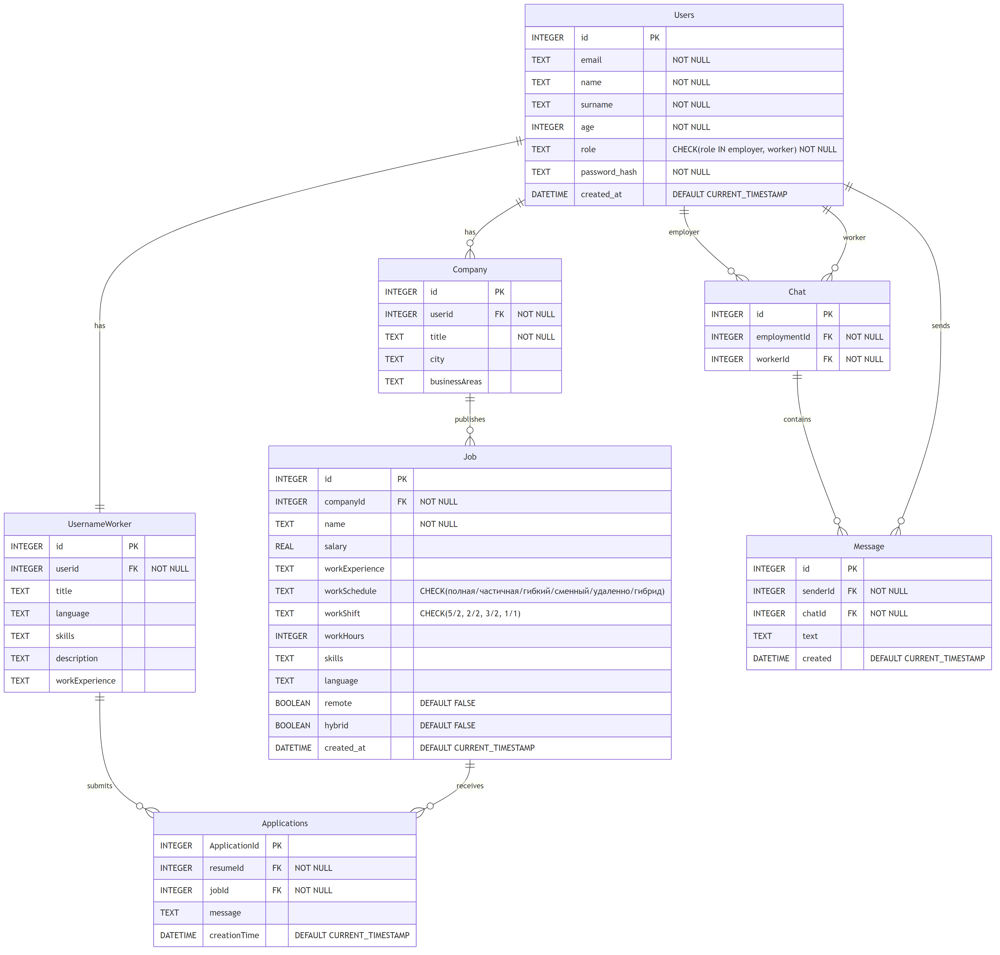

# 2 Разработка алгоритмов

## 2.1 Описание сущностей и связей

Модель данных системы включает восемь основных сущностей, обеспечивающих хранение информации о пользователях, компаниях, вакансиях, резюме, откликах и коммуникациях. Связи между сущностями реализованы с использованием внешних ключей, гарантирующих целостность данных.

Сущность «Пользователь» содержит идентификатор, адрес электронной почты, имя, фамилию, возраст, роль и хэш пароля. Роль определяет принадлежность к категории работодателей или соискателей и влияет на доступные функции системы. Временная метка создания записи позволяет отслеживать момент регистрации пользователя [5].

Сущность «Компания» связана с пользователем-работодателем через внешний ключ. Каждая компания имеет название, город и список направлений деятельности. Направления деятельности включают разработку программного обеспечения, DevOps, мобильную разработку, анализ данных, искусственный интеллект, кибербезопасность, блокчейн, разработку игр и проектирование пользовательских интерфейсов. Один работодатель может управлять несколькими компаниями.

Сущность «Вакансия» связана с компанией и содержит описание предлагаемой позиции. Атрибуты вакансии включают наименование должности, размер заработной платы, требуемый опыт работы, график работы, тип смены, количество рабочих часов, перечень необходимых навыков и языков, а также признаки удалённой или гибридной занятости. График работы может принимать значения полной занятости, частичной занятости, проектной работы, стажировки, волонтёрства или временной работы. Тип смены определяется как пятидневная рабочая неделя с двумя выходными, график два через два, три через два или один через один.

Сущность «Резюме» связана с пользователем-соискателем и описывает его профессиональные компетенции. Резюме содержит желаемую должность, список языков, перечень навыков, текстовое описание опыта и требуемый стаж работы. Один соискатель создаёт одно резюме, которое используется при подаче откликов на вакансии.

Сущность «Отклик» связывает резюме соискателя с конкретной вакансией. Отклик включает уникальный идентификатор, ссылки на резюме и вакансию, необязательное текстовое сообщение и временную метку подачи. Система не накладывает ограничений на количество откликов одного соискателя, однако не предотвращает повторную подачу заявки на одну и ту же вакансию.

Сущность «Чат» обеспечивает связь между работодателем и соискателем для обмена сообщениями. Чат связан с идентификаторами обоих участников и создаётся работодателем после просмотра отклика кандидата.

Сущность «Сообщение» содержит текст, идентификатор отправителя, ссылку на чат и временную метку создания. Сообщения упорядочиваются по времени отправки, обеспечивая хронологическую последовательность переписки.

Таблица 2.1 представляет основные сущности системы с указанием их атрибутов и типов данных.

| Сущность | Ключевые атрибуты | Связи |
|----------|-------------------|-------|
| Пользователь | Идентификатор, Email, Имя, Фамилия, Возраст, Роль, Хэш пароля | Один ко многим с Компанией и Резюме |
| Компания | Идентификатор, ID пользователя, Название, Город, Направления | Многие к одному с Пользователем, Один ко многим с Вакансией |
| Вакансия | Идентификатор, ID компании, Название, Зарплата, Опыт, График | Многие к одному с Компанией, Один ко многим с Откликом |
| Резюме | Идентификатор, ID пользователя, Должность, Языки, Навыки | Многие к одному с Пользователем, Один ко многим с Откликом |
| Отклик | Идентификатор, ID резюме, ID вакансии, Сообщение, Время | Многие к одному с Резюме и Вакансией |
| Чат | Идентификатор, ID работодателя, ID соискателя | Многие к одному с Пользователями, Один ко многим с Сообщением |
| Сообщение | Идентификатор, ID отправителя, ID чата, Текст, Время | Многие к одному с Чатом и Пользователем |

Таблица 2.1 – Основные сущности системы

Диаграмма сущность-связь показана на рисунке 2.1.


Рисунок 2.1 – Диаграмма сущность-связь

Согласно рисунку 2.1, центральной сущностью является пользователь, который может выступать в роли работодателя или соискателя. Работодатель создаёт компании и публикует вакансии, соискатель формирует резюме и подаёт отклики. Чаты связывают пользователей для коммуникации после подачи отклика.

## 2.2 Алгоритм формирования списка вакансий

Формирование списка вакансий для отображения соискателю осуществляется с применением пагинации для обеспечения производительности. Алгоритм включает следующие шаги:

Получение параметров запроса, включающих номер страницы и количество элементов на странице. По умолчанию используется первая страница и размер страницы, равный десяти элементам.

Вычисление смещения в базе данных путём умножения разности номера страницы и единицы на размер страницы. Это позволяет определить начальную позицию выборки в общем списке вакансий.

Выполнение запроса к базе данных с использованием конструкции SQL SELECT, ограничивающей количество возвращаемых строк и применяющей смещение. Запрос возвращает записи вакансий, упорядоченные по убыванию времени создания.

Для каждой полученной записи вакансии извлекается связанная информация о компании путём выполнения дополнительного запроса по внешнему ключу компании. Это обогащает данные вакансии сведениями о работодателе.

Формирование итогового списка объектов вакансий с включением всех атрибутов, включая наименование, зарплату, требования, график работы и информацию о компании-работодателе.

Возвращение сформированного списка клиентской части для отображения пользователю. Клиент получает структурированные данные в формате JSON, готовые для визуализации в интерфейсе.

Псевдокод алгоритма формирования списка вакансий представлен ниже:

```
ФУНКЦИЯ получить_список_вакансий(номер_страницы, размер_страницы):
    смещение = (номер_страницы - 1) * размер_страницы
    
    вакансии = ВЫПОЛНИТЬ_ЗАПРОС(
        "SELECT * FROM Job ORDER BY created_at DESC LIMIT размер_страницы OFFSET смещение"
    )
    
    результат = []
    
    ДЛЯ КАЖДОЙ вакансия ИЗ вакансии:
        компания = ВЫПОЛНИТЬ_ЗАПРОС(
            "SELECT * FROM Company WHERE id = вакансия.companyId"
        )
        
        объект_вакансии = {
            "id": вакансия.id,
            "name": вакансия.name,
            "salary": вакансия.salary,
            "workExperience": вакансия.workExperience,
            "skills": РАЗОБРАТЬ_JSON(вакансия.skills),
            "language": РАЗОБРАТЬ_JSON(вакансия.language),
            "workSchedule": вакансия.workSchedule,
            "workShift": вакансия.workShift,
            "workHours": вакансия.workHours,
            "remote": вакансия.remote,
            "hybrid": вакансия.hybrid,
            "company": компания
        }
        
        ДОБАВИТЬ объект_вакансии В результат
    
    ВЕРНУТЬ результат
```

Данный алгоритм обеспечивает эффективную загрузку вакансий порциями, предотвращая передачу избыточного объёма данных при единственном запросе. Клиентская часть реализует навигацию по страницам, позволяя пользователю последовательно просматривать все доступные вакансии.

## 2.3 Алгоритм подачи отклика на вакансию

Процесс подачи отклика соискателем на вакансию включает проверку наличия резюме, валидацию данных и создание записи отклика в базе данных. Алгоритм состоит из следующих этапов:

Получение от клиента запроса с идентификатором вакансии, на которую подаётся отклик, идентификатором резюме соискателя и необязательным текстовым сообщением. Запрос сопровождается JWT-токеном для идентификации пользователя.

Извлечение и проверка JWT-токена для определения идентификатора текущего пользователя. При отсутствии действительного токена запрос отклоняется с кодом ошибки аутентификации.

Проверка существования указанного резюме в базе данных и его принадлежности текущему пользователю. Если резюме не найдено или принадлежит другому пользователю, возвращается ошибка доступа.

Проверка существования вакансии с указанным идентификатором в базе данных. При отсутствии вакансии возвращается сообщение об ошибке с соответствующим HTTP-статусом.

Создание новой записи отклика в таблице Applications с заполнением полей идентификатора резюме, идентификатора вакансии, текста сообщения и временной метки создания.

Возвращение клиенту подтверждения успешного создания отклика с включением идентификатора созданной записи и временной метки подачи заявки.

Псевдокод алгоритма подачи отклика:

```
ФУНКЦИЯ подать_отклик(данные_отклика, токен):
    пользователь = ПРОВЕРИТЬ_ТОКЕН(токен)
    
    ЕСЛИ пользователь == NULL:
        ВЕРНУТЬ ОШИБКУ "Не авторизован"
    
    резюме = НАЙТИ_РЕЗЮМЕ(данные_отклика.resumeId)
    
    ЕСЛИ резюме == NULL ИЛИ резюме.userid != пользователь.id:
        ВЕРНУТЬ ОШИБКУ "Резюме не найдено или доступ запрещён"
    
    вакансия = НАЙТИ_ВАКАНСИЮ(данные_отклика.jobId)
    
    ЕСЛИ вакансия == NULL:
        ВЕРНУТЬ ОШИБКУ "Вакансия не найдена"
    
    отклик = СОЗДАТЬ_ЗАПИСЬ({
        "resumeId": данные_отклика.resumeId,
        "jobId": данные_отклика.jobId,
        "message": данные_отклика.message,
        "creationTime": ТЕКУЩЕЕ_ВРЕМЯ()
    })
    
    СОХРАНИТЬ отклик В БАЗУ_ДАННЫХ
    
    ВЕРНУТЬ {
        "applicationId": отклик.ApplicationId,
        "creationTime": отклик.creationTime,
        "status": "success"
    }
```

Реализация данного алгоритма обеспечивает целостность данных и предотвращает подачу откликов от имени других пользователей благодаря проверке токена и принадлежности резюме.

## 2.4 Алгоритм аутентификации пользователя

Аутентификация пользователя осуществляется с применением технологии JSON Web Token, обеспечивающей безопасную передачу информации о пользователе между клиентом и сервером. Процесс аутентификации включает этапы регистрации и входа в систему.

При регистрации нового пользователя клиент передаёт на сервер адрес электронной почты, имя, фамилию, возраст, пароль и выбранную роль. Сервер выполняет валидацию полученных данных, проверяя соответствие адреса электронной почты формату, уникальность email в базе данных, соответствие возраста допустимому диапазону от четырнадцати до ста лет и минимальную длину пароля.

После успешной валидации пароль пользователя преобразуется в криптографический хэш с использованием алгоритма bcrypt. Алгоритм bcrypt применяет случайную соль, что делает невозможным восстановление исходного пароля из хэша и препятствует атакам с использованием предвычисленных таблиц [6].

Псевдокод алгоритма регистрации:

```
ФУНКЦИЯ зарегистрировать_пользователя(данные_регистрации):
    ЕСЛИ НЕ ВАЛИДНЫЙ_EMAIL(данные_регистрации.email):
        ВЕРНУТЬ ОШИБКУ "Некорректный формат email"
    
    ЕСЛИ СУЩЕСТВУЕТ_ПОЛЬЗОВАТЕЛЬ(данные_регистрации.email):
        ВЕРНУТЬ ОШИБКУ "Пользователь с таким email уже существует"
    
    ЕСЛИ данные_регистрации.age < 14 ИЛИ данные_регистрации.age > 100:
        ВЕРНУТЬ ОШИБКУ "Недопустимый возраст"
    
    ЕСЛИ ДЛИНА(данные_регистрации.password) < 6:
        ВЕРНУТЬ ОШИБКУ "Пароль должен содержать минимум 6 символов"
    
    хэш_пароля = BCRYPT_HASH(данные_регистрации.password)
    
    пользователь = СОЗДАТЬ_ЗАПИСЬ({
        "email": данные_регистрации.email,
        "name": данные_регистрации.name,
        "surname": данные_регистрации.surname,
        "age": данные_регистрации.age,
        "role": данные_регистрации.role,
        "password_hash": хэш_пароля,
        "created_at": ТЕКУЩЕЕ_ВРЕМЯ()
    })
    
    СОХРАНИТЬ пользователь В БАЗУ_ДАННЫХ
    
    ВЕРНУТЬ {
        "id": пользователь.id,
        "email": пользователь.email,
        "name": пользователь.name,
        "surname": пользователь.surname,
        "role": пользователь.role
    }
```

Процесс входа в систему начинается с получения от клиента адреса электронной почты и пароля. Сервер выполняет поиск пользователя в базе данных по указанному email. При отсутствии пользователя возвращается сообщение об ошибке аутентификации.

Если пользователь найден, сервер извлекает сохранённый хэш пароля и сравнивает его с хэшем введённого пароля с использованием функции проверки bcrypt. Функция проверки учитывает соль, применённую при создании хэша, и возвращает результат сравнения.

При успешной проверке пароля сервер генерирует JWT-токен, содержащий идентификатор пользователя, адрес электронной почты и роль. Токен подписывается секретным ключом сервера с использованием алгоритма HS256. Срок действия токена устанавливается равным трём тысячам шестистам минутам, что соответствует шестидесяти часам.

Псевдокод алгоритма входа в систему:

```
ФУНКЦИЯ войти_в_систему(данные_входа):
    пользователь = НАЙТИ_ПОЛЬЗОВАТЕЛЯ_ПО_EMAIL(данные_входа.email)
    
    ЕСЛИ пользователь == NULL:
        ВЕРНУТЬ ОШИБКУ "Неверный email или пароль"
    
    пароль_верен = BCRYPT_VERIFY(данные_входа.password, пользователь.password_hash)
    
    ЕСЛИ НЕ пароль_верен:
        ВЕРНУТЬ ОШИБКУ "Неверный email или пароль"
    
    полезная_нагрузка = {
        "user_id": пользователь.id,
        "email": пользователь.email,
        "role": пользователь.role,
        "exp": ТЕКУЩЕЕ_ВРЕМЯ() + 3600 минут
    }
    
    токен = JWT_ENCODE(полезная_нагрузка, СЕКРЕТНЫЙ_КЛЮЧ, алгоритм="HS256")
    
    ВЕРНУТЬ {
        "access_token": токен,
        "token_type": "bearer",
        "user": {
            "id": пользователь.id,
            "email": пользователь.email,
            "name": пользователь.name,
            "surname": пользователь.surname,
            "role": пользователь.role
        }
    }
```

Полученный токен сохраняется клиентом в локальном хранилище браузера и включается в заголовок Authorization последующих запросов к защищённым endpoint-ам сервера. Сервер извлекает токен из заголовка, проверяет его подпись и срок действия, после чего идентифицирует пользователя для выполнения запрошенной операции.

Алгоритм проверки токена при обращении к защищённому ресурсу:

```
ФУНКЦИЯ проверить_токен(заголовок_авторизации):
    ЕСЛИ заголовок_авторизации == NULL:
        ВЕРНУТЬ ОШИБКУ "Токен отсутствует"
    
    токен = ИЗВЛЕЧЬ_ТОКЕН_ИЗ_ЗАГОЛОВКА(заголовок_авторизации)
    
    ПОПЫТКА:
        полезная_нагрузка = JWT_DECODE(токен, СЕКРЕТНЫЙ_КЛЮЧ, алгоритм="HS256")
    ИСКЛЮЧЕНИЕ:
        ВЕРНУТЬ ОШИБКУ "Недействительный токен"
    
    ЕСЛИ полезная_нагрузка.exp < ТЕКУЩЕЕ_ВРЕМЯ():
        ВЕРНУТЬ ОШИБКУ "Срок действия токена истёк"
    
    пользователь = НАЙТИ_ПОЛЬЗОВАТЕЛЯ_ПО_ID(полезная_нагрузка.user_id)
    
    ЕСЛИ пользователь == NULL:
        ВЕРНУТЬ ОШИБКУ "Пользователь не найден"
    
    ВЕРНУТЬ пользователь
```

Применение JWT-токенов позволяет реализовать stateless-аутентификацию, при которой сервер не хранит информацию о сессиях пользователей. Это упрощает масштабирование системы и снижает нагрузку на сервер за счёт отсутствия необходимости управления сессиями [7].

## 2.5 Транзакции и согласованность данных

Обеспечение согласованности данных в системе достигается за счёт использования транзакций при выполнении операций, затрагивающих несколько связанных сущностей. SQLite поддерживает транзакции, соответствующие принципам ACID: атомарность, согласованность, изолированность и долговечность.

При создании отклика на вакансию система проверяет существование резюме и вакансии перед созданием записи отклика. Если в процессе обработки запроса обнаруживается отсутствие одной из связанных сущностей, транзакция отменяется, и изменения не применяются к базе данных.

Создание чата между работодателем и соискателем также требует проверки существования обоих пользователей и отсутствия дублирующего чата для данной пары участников. Транзакция гарантирует, что чат будет создан только при выполнении всех условий.

Внешние ключи в схеме базы данных обеспечивают ссылочную целостность. При попытке удаления записи, на которую ссылаются другие таблицы, система предотвращает удаление или каскадно удаляет зависимые записи в зависимости от настроек связи.

Индексы по первичным ключам и внешним связям ускоряют операции поиска и соединения таблиц, что критично для производительности при формировании списков вакансий с информацией о компаниях или списков откликов с данными резюме.
