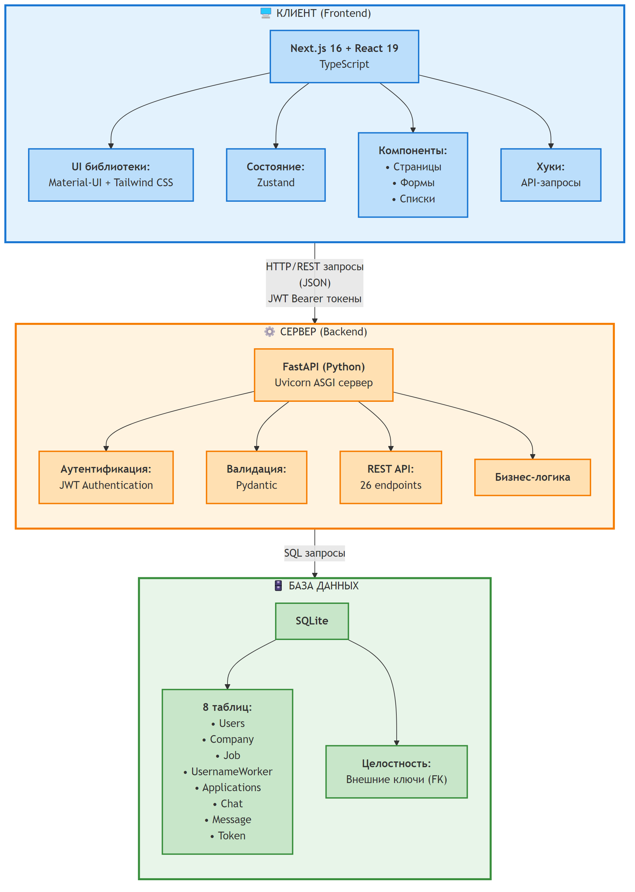
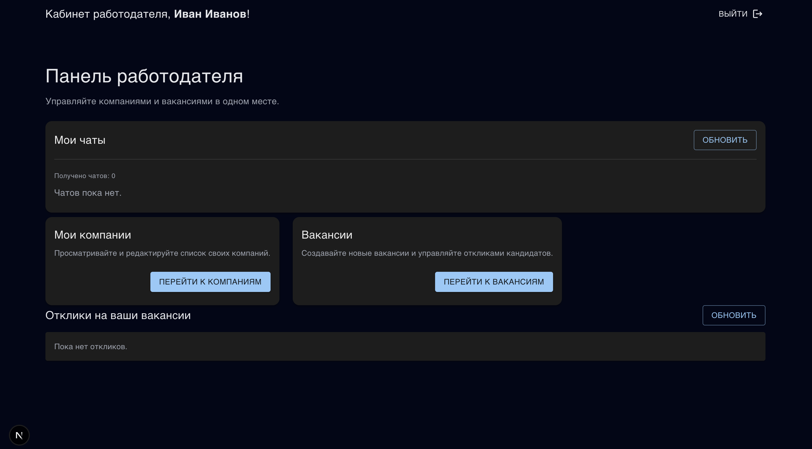
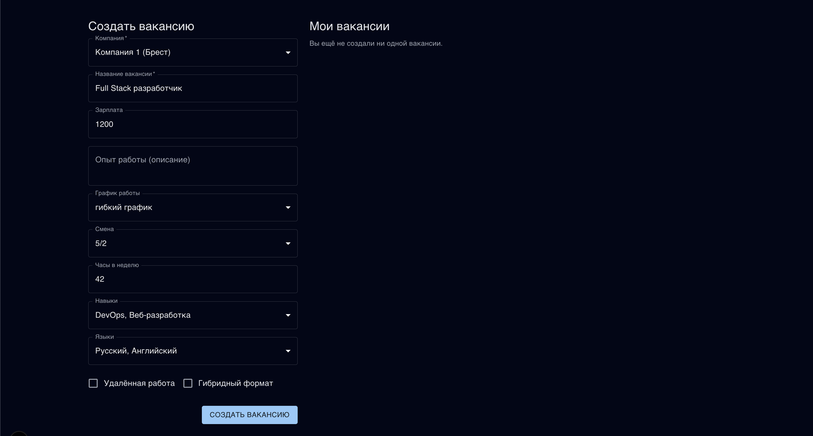
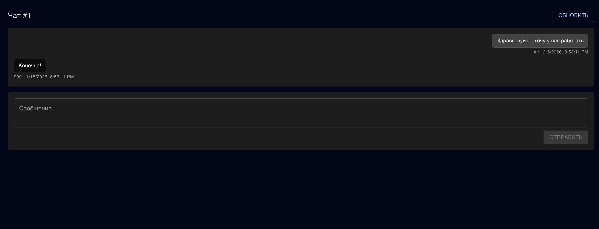
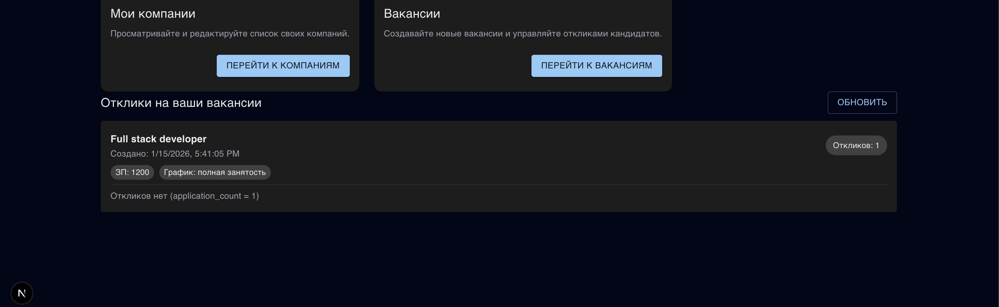

# 3 Разработка программы

## 3.1 Архитектура системы

Архитектура разработанной системы основана на трёхуровневой модели взаимодействия компонентов, включающей клиентскую часть, серверную часть и уровень хранения данных. Разделение системы на независимые слои обеспечивает гибкость разработки, упрощает сопровождение и позволяет масштабировать компоненты независимо друг от друга.

Клиентская часть реализована в виде одностраничного веб-приложения, выполняющегося в браузере пользователя. Приложение взаимодействует с сервером посредством HTTP-запросов к REST API, получает данные в формате JSON и отображает их в пользовательском интерфейсе. Клиент не имеет прямого доступа к базе данных и не содержит бизнес-логики обработки данных.

Серверная часть представляет собой RESTful API, обрабатывающее запросы клиентов, выполняющее валидацию входных данных, осуществляющее операции с базой данных и возвращающее результаты в стандартизированном формате. Сервер реализует механизмы аутентификации и авторизации, обеспечивая защищённый доступ к ресурсам системы.

Уровень хранения данных использует реляционную систему управления базами данных SQLite. База данных содержит восемь таблиц, связанных внешними ключами для обеспечения целостности данных. Структура таблиц соответствует модели сущностей, описанной в предыдущем разделе.

Взаимодействие между компонентами осуществляется по следующей схеме: клиент отправляет HTTP-запрос к серверу с указанием требуемой операции и необходимых параметров, сервер проверяет JWT-токен при обращении к защищённым ресурсам, извлекает или модифицирует данные в базе, формирует ответ в формате JSON и возвращает его клиенту. Клиент обрабатывает полученные данные и обновляет пользовательский интерфейс.

Архитектура системы показана на рисунке 3.1.

Рисунок 3.1 – Трёхуровневая архитектура системы

Как видно из рисунка 3.1, система состоит из трёх основных уровней: уровня представления, реализованного на Next.js и React, уровня бизнес-логики, реализованного на FastAPI, и уровня данных на базе SQLite. Обмен данными между уровнями осуществляется через REST API с использованием JSON-формата и JWT-токенов для аутентификации.

## 3.2 Выбранный технологический стек и обоснование

Технологический стек системы подобран с учётом требований к производительности, безопасности и удобству разработки. Каждая технология выбрана на основе её соответствия задачам конкретного уровня архитектуры и совместимости с остальными компонентами системы [8].

Клиентская часть реализована с использованием фреймворка Next.js версии шестнадцать, построенного на библиотеке React версии девятнадцать. Next.js предоставляет инструменты для создания серверного рендеринга, статической генерации страниц и оптимизации производительности. Встроенная система маршрутизации на основе файловой структуры упрощает организацию страниц приложения. Поддержка TypeScript обеспечивает статическую типизацию, снижающую количество ошибок на этапе разработки.

Библиотека React применяется для построения компонентной архитектуры пользовательского интерфейса. Компоненты представляют собой изолированные переиспользуемые блоки, управляющие собственным состоянием и взаимодействующие через свойства. Хуки React обеспечивают управление побочными эффектами, такими как загрузка данных с сервера и подписка на изменения состояния.

Управление глобальным состоянием приложения осуществляется библиотекой Zustand. По сравнению с альтернативными решениями, такими как Redux, Zustand предлагает минималистичный API и не требует создания дополнительных слоёв абстракции. Хранилища Zustand используются для хранения информации о текущем пользователе и его резюме, обеспечивая доступ к этим данным из любого компонента приложения.

Визуальное оформление интерфейса реализовано с применением библиотеки компонентов Material-UI версии семь. Material-UI предоставляет набор готовых компонентов, соответствующих принципам Material Design и обеспечивающих единообразие визуального представления. Компоненты библиотеки поддерживают темизацию, адаптивность и доступность. Дополнительная стилизация выполнена с использованием Tailwind CSS, обеспечивающего утилитарные классы для быстрого прототипирования интерфейса.

Серверная часть построена на фреймворке FastAPI для языка Python. FastAPI обеспечивает высокую производительность благодаря асинхронной обработке запросов и автоматической генерации документации API на основе аннотаций типов. Валидация входных данных осуществляется библиотекой Pydantic, интегрированной в FastAPI. Модели Pydantic автоматически проверяют соответствие полученных данных объявленным типам и форматам, возвращая понятные сообщения об ошибках при несоответствии.

ASGI-сервер Uvicorn используется для запуска FastAPI-приложения. Uvicorn поддерживает асинхронные операции ввода-вывода, что позволяет обрабатывать множество одновременных запросов без блокировки выполнения. Это особенно важно для операций чтения из базы данных и взаимодействия с внешними сервисами.

Аутентификация пользователей реализована с применением библиотеки PyJWT для создания и проверки JSON Web Token. Хэширование паролей выполняется библиотекой bcrypt, обеспечивающей криптографически стойкое преобразование паролей с использованием соли. Алгоритм bcrypt специально разработан для защиты паролей и включает параметр стоимости, позволяющий адаптировать сложность вычислений к росту производительности вычислительной техники [9].

Система управления базами данных SQLite выбрана в качестве решения для хранения данных благодаря простоте развёртывания и отсутствию необходимости установки отдельного сервера базы данных. SQLite хранит всю базу данных в единственном файле, что упрощает резервное копирование и перенос данных. Для учебного проекта и прототипа производительность SQLite достаточна, однако при промышленной эксплуатации рекомендуется переход на клиент-серверные СУБД, такие как PostgreSQL или MySQL.

Таблица 3.1 представляет полный технологический стек системы.

| Уровень | Технология | Версия | Назначение |
|---------|-----------|--------|------------|
| Фронтенд | Next.js | 16.0.7 | Фреймворк веб-приложения |
| Фронтенд | React | 19.2.0 | Библиотека пользовательского интерфейса |
| Фронтенд | TypeScript | 5.x | Статическая типизация |
| Фронтенд | Zustand | 5.0.9 | Управление состоянием |
| Фронтенд | Material-UI | 7.3.6 | Библиотека компонентов |
| Фронтенд | Tailwind CSS | 4.x | Утилитарные стили |
| Бэкенд | FastAPI | 0.104.1 | REST API фреймворк |
| Бэкенд | Uvicorn | 0.24.0 | ASGI сервер |
| Бэкенд | Pydantic | 2.5.0 | Валидация данных |
| Бэкенд | PyJWT | 3.3.0 | JSON Web Token |
| Бэкенд | bcrypt | 4.0.1 | Хэширование паролей |
| СУБД | SQLite | 3.x | Хранение данных |

Таблица 3.1 – Технологический стек системы

Выбранные технологии обеспечивают баланс между производительностью, безопасностью и скоростью разработки, что критично для реализации учебного проекта в ограниченные сроки.

## 3.3 Описание модулей серверной части

Серверная часть организована в виде единого модуля main.py, содержащего определения маршрутов API, обработчики запросов и вспомогательные функции. Дополнительные модули включают Models.py для определения моделей данных Pydantic, sqliteDB.py для инициализации базы данных и Utilities.py для вспомогательных функций валидации и обработки данных.

Модуль main.py содержит двадцать шесть endpoint-ов, обрабатывающих различные операции системы. Endpoint-ы сгруппированы по функциональным областям: аутентификация и пользователи, управление компаниями, операции с вакансиями, работа с резюме, отклики на вакансии, чаты и сообщения.

Группа endpoint-ов аутентификации включает регистрацию пользователя, вход в систему, получение профиля текущего пользователя и проверку действительности токена. Регистрация принимает данные пользователя, валидирует их, хэширует пароль и создаёт запись в базе данных. Вход в систему проверяет учётные данные и возвращает JWT-токен для последующих запросов.

Группа endpoint-ов управления компаниями позволяет работодателям создавать профили компаний, просматривать список всех компаний, получать детальную информацию о конкретной компании и просматривать компании, принадлежащие определённому пользователю. Создание компании требует аутентификации и проверки роли пользователя.

Операции с вакансиями включают публикацию новой вакансии, получение списка всех вакансий с пагинацией, просмотр детальной информации о вакансии, получение вакансий конкретного работодателя и получение вакансий работодателя с информацией о поданных откликах. Публикация вакансии доступна только аутентифицированным работодателям и требует указания идентификатора компании.

Работа с резюме представлена endpoint-ами создания резюме соискателем и получения резюме по идентификатору пользователя. Создание резюме требует аутентификации и доступно только пользователям с ролью соискателя.

Отклики на вакансии обрабатываются двумя endpoint-ами: подача отклика на вакансию и получение списка откликов текущего пользователя. Подача отклика требует наличия резюме у соискателя и проверяет существование указанной вакансии.

Система обмена сообщениями реализована через endpoint-ы создания чата, получения списка чатов пользователя, получения детальной информации о чате, получения сообщений чата и отправки нового сообщения. Все операции с чатами требуют аутентификации и проверяют принадлежность пользователя к участникам чата.

Модуль sqliteDB.py содержит функции инициализации базы данных, создания таблиц с определением структуры и внешних ключей. При запуске сервера модуль проверяет наличие файла базы данных и создаёт его при отсутствии, после чего выполняет SQL-скрипты создания всех необходимых таблиц.

Модуль Models.py определяет модели Pydantic для валидации данных запросов и ответов. Модели включают RegisterRequest для регистрации, LoginRequest для входа, JobCreate для создания вакансии, CompanyCreate для создания компании, ResumeCreate для создания резюме, ApplicationCreate для подачи отклика, ChatCreate для создания чата и MessageCreate для отправки сообщения. Каждая модель содержит аннотации типов и валидаторы для проверки корректности данных.

Модуль Utilities.py предоставляет вспомогательные функции для работы с токенами, включая создание JWT-токена, извлечение пользователя из токена и проверку принадлежности пользователя к определённой роли. Функции utilities используются в качестве зависимостей FastAPI для автоматической проверки авторизации перед выполнением обработчика endpoint-а.

## 3.4 Описание структуры фронтенда

Клиентская часть организована в соответствии с соглашениями Next.js с использованием директории app для определения маршрутов приложения. Каждый маршрут представлен отдельной папкой, содержащей файл page.tsx с реализацией страницы.

Корневой маршрут приложения отображает главную страницу, которая различается в зависимости от роли пользователя. Для работодателей отображается компонент EmployerHomePage, предоставляющий доступ к управлению компаниями, вакансиями и просмотру чатов. Для соискателей отображается компонент CandidateHomePage с функциями управления резюме, просмотра откликов и доступа к переписке.

Маршрут auth/login содержит страницу входа в систему с формой для ввода адреса электронной почты и пароля. Маршрут auth/register предоставляет форму регистрации с полями для ввода персональных данных и выбора роли пользователя. После успешной регистрации или входа токен сохраняется в локальном хранилище браузера, и пользователь перенаправляется на главную страницу.

Маршрут jobs отображает список всех доступных вакансий с возможностью пагинации и фильтрации. Соискатели могут просматривать детальную информацию о вакансии и подавать отклики. Маршрут jobs/[id] предоставляет детальное представление конкретной вакансии с описанием требований и условий работы.

Маршрут employer/companies предназначен для работодателей и предоставляет интерфейс управления компаниями. Компонент CompanyFormWithList отображает форму создания новой компании и список существующих компаний пользователя. Маршрут employer/jobs отображает вакансии работодателя с возможностью фильтрации по статусу и количеству откликов.

Маршрут chats/[id] отображает интерфейс чата с конкретным пользователем, включающий историю сообщений и форму для отправки новых сообщений. Компонент использует параметр маршрута id для загрузки сообщений соответствующего чата.

Компоненты приложения разделены на две категории: страничные компоненты, представляющие целые экраны, и переиспользуемые компоненты, инкапсулирующие отдельные блоки функциональности. Компонент AuthGate проверяет наличие действительного токена и перенаправляет неавторизованных пользователей на страницу входа. Компонент AuthWatcher следит за изменениями токена в локальном хранилище и обновляет глобальное состояние пользователя.

Компонент CreateJobForm предоставляет форму для публикации вакансии с полями для всех необходимых атрибутов. Компонент CandidateResume отображает форму создания или редактирования резюме соискателя. Компонент EmployerJobList показывает список вакансий работодателя с фильтрацией и сортировкой. Компонент EmployerJobsAppliedList отображает вакансии с откликами и детальной информацией о кандидатах.

Компонент EmployerChatsList предоставляет список чатов работодателя с возможностью навигации к конкретной переписке. Компонент CreateChatButton позволяет работодателю инициировать чат с соискателем после просмотра его отклика.

Хуки для взаимодействия с API инкапсулируют логику выполнения HTTP-запросов и обработки ответов. Хук useLogin выполняет запрос входа в систему и сохраняет полученный токен. Хук useRegister отправляет данные регистрации на сервер. Хук useJobs загружает список вакансий с пагинацией. Хук useJob получает детальную информацию о конкретной вакансии. Хук useApplyToJob отправляет отклик на вакансию. Хук useMyApplications загружает список откликов текущего пользователя.

Хук useResume управляет созданием и получением резюме соискателя. Хук useCompanies загружает список компаний. Хук useChats получает список чатов пользователя. Хук useChatMessages загружает сообщения конкретного чата. Хук useSendMessage отправляет новое сообщение в чат. Хук useCreateChat создаёт новый чат между пользователями. Хук useEmployerJobsApplied загружает вакансии работодателя с информацией о поданных откликах.

Типизация данных обеспечивается интерфейсами TypeScript, определёнными в директории types. Интерфейсы описывают структуру объектов User, Job, Resume, Company, Application, Chat и Message, соответствующих моделям данных серверной части. Использование общих типов на клиенте и сервере снижает вероятность несоответствия форматов данных.

Конфигурация темы Material-UI определена в файле mui-theme.ts и включает настройки цветовой палитры, типографики и параметров компонентов. Константы для выпадающих списков, такие как варианты графиков работы, типы смен, языки и навыки, вынесены в отдельные файлы для централизованного управления справочными данными.

Главная страница приложения показана на рисунке 3.2.

Рисунок 3.2 – Главная страница для работодателя

Согласно рисунку 3.2, главная страница работодателя предоставляет быстрый доступ к основным функциям: управлению компаниями, публикации вакансий, просмотру откликов и переписке с кандидатами.

## 3.5 Спецификация программного интерфейса приложения

Взаимодействие клиентской и серверной частей осуществляется через REST API, предоставляющий набор endpoint-ов для выполнения операций с данными. Каждый endpoint принимает HTTP-запрос определённого метода, обрабатывает параметры и тело запроса, выполняет соответствующую операцию и возвращает ответ в формате JSON.

Таблица 3.2 содержит спецификацию endpoint-ов аутентификации и управления пользователями.

| Endpoint | Метод | Описание | Аутентификация | Тело запроса | Ответ успеха | Ошибки |
|----------|-------|----------|----------------|--------------|--------------|--------|
| /register | POST | Регистрация нового пользователя | Нет | email, name, surname, age, password, role | Объект пользователя без пароля | 400: данные невалидны, 409: email занят |
| /login | POST | Вход в систему | Нет | email, password | Токен доступа, тип токена, объект пользователя | 401: неверные учётные данные |
| /profile | GET | Получение профиля текущего пользователя | JWT | - | Объект пользователя | 401: токен недействителен |
| /verify-token | GET | Проверка действительности токена | JWT | - | Сообщение о валидности | 401: токен недействителен |
| /users | GET | Список пользователей с пагинацией | Нет | page, limit (query) | Массив пользователей | - |
| /users/{user_id} | GET | Получение пользователя по ID | Нет | - | Объект пользователя | 404: пользователь не найден |

Таблица 3.2 – Endpoint-ы аутентификации и пользователей

Таблица 3.3 представляет спецификацию endpoint-ов управления компаниями.

| Endpoint | Метод | Описание | Аутентификация | Тело запроса | Ответ успеха | Ошибки |
|----------|-------|----------|----------------|--------------|--------------|--------|
| /companies | POST | Создание компании | JWT (employer) | userid, title, city, businessAreas | Объект компании | 401: не авторизован, 403: роль не employer |
| /companies | GET | Список всех компаний | Нет | - | Массив компаний | - |
| /companies/{company_id} | GET | Получение компании по ID | Нет | - | Объект компании | 404: компания не найдена |
| /users/{user_id}/companies | GET | Компании конкретного пользователя | JWT | - | Массив компаний | 401: не авторизован |

Таблица 3.3 – Endpoint-ы управления компаниями

Таблица 3.4 описывает endpoint-ы работы с вакансиями.

| Endpoint | Метод | Описание | Аутентификация | Тело запроса | Ответ успеха | Ошибки |
|----------|-------|----------|----------------|--------------|--------------|--------|
| /jobs | POST | Создание вакансии | JWT (employer) | companyId, name, salary, workExperience, workSchedule, workShift, workHours, skills, language, remote, hybrid | Объект вакансии | 401: не авторизован, 403: роль не employer, 404: компания не найдена |
| /jobs | GET | Список вакансий с пагинацией | Нет | page, limit (query) | Массив вакансий | - |
| /jobs/{job_id} | GET | Детальная информация о вакансии | Нет | - | Объект вакансии | 404: вакансия не найдена |
| /employer/jobs | GET | Вакансии текущего работодателя | JWT (employer) | - | Массив вакансий | 401: не авторизован |
| /employer/jobs/applied | GET | Вакансии работодателя с откликами | JWT (employer) | - | Массив вакансий с откликами и резюме | 401: не авторизован |

Таблица 3.4 – Endpoint-ы работы с вакансиями

Форма создания вакансии показана на рисунке 3.3.

Рисунок 3.3 – Форма создания вакансии

Как видно из рисунка 3.3, форма создания вакансии содержит поля для указания всех необходимых параметров, включая название должности, зарплату, требуемый опыт, график работы, навыки и языки.

Таблица 3.5 представляет endpoint-ы работы с резюме и откликами.

| Endpoint | Метод | Описание | Аутентификация | Тело запроса | Ответ успеха | Ошибки |
|----------|-------|----------|----------------|--------------|--------------|--------|
| /resumes | POST | Создание резюме | JWT (worker) | userid, title, language, skills, description, workExperience | Объект резюме | 401: не авторизован, 403: роль не worker |
| /resumes/{user_id} | GET | Получение резюме пользователя | JWT | - | Объект резюме | 401: не авторизован, 404: резюме не найдено |
| /applications | POST | Подача отклика на вакансию | JWT | resumeId, jobId, message | Объект отклика | 401: не авторизован, 404: резюме или вакансия не найдены |
| /applications/user | GET | Отклики текущего пользователя | JWT | - | Массив откликов с вакансиями | 401: не авторизован |

Таблица 3.5 – Endpoint-ы резюме и откликов

Таблица 3.6 описывает endpoint-ы системы обмена сообщениями.

| Endpoint | Метод | Описание | Аутентификация | Тело запроса | Ответ успеха | Ошибки |
|----------|-------|----------|----------------|--------------|--------------|--------|
| /chats | POST | Создание чата | JWT | employmentId, workerId | Объект чата | 401: не авторизован, 404: пользователи не найдены |
| /chats | GET | Список чатов пользователя | JWT | - | Массив чатов | 401: не авторизован |
| /chats/{chat_id} | GET | Получение детальной информации о чате | JWT | - | Объект чата | 401: не авторизован, 403: не участник чата, 404: чат не найден |
| /chats/{chat_id}/messages | GET | Сообщения конкретного чата | JWT | - | Массив сообщений | 401: не авторизован, 403: не участник чата |
| /message | POST | Отправка сообщения | JWT | senderId, chatId, text | Объект сообщения | 401: не авторизован, 403: не участник чата, 404: чат не найден |

Таблица 3.6 – Endpoint-ы системы обмена сообщениями

Интерфейс чата между работодателем и соискателем показан на рисунке 3.4.

Рисунок 3.4 – Интерфейс обмена сообщениями

Согласно рисунку 3.4, интерфейс чата отображает историю переписки в хронологическом порядке и предоставляет форму для отправки новых сообщений.

Все endpoint-ы, требующие аутентификации, ожидают получения JWT-токена в заголовке Authorization запроса в формате Bearer Token. При отсутствии токена или его недействительности сервер возвращает ответ с кодом четыреста один. Endpoint-ы, требующие конкретной роли пользователя, дополнительно проверяют соответствие роли и возвращают код четыреста три при несоответствии.

Формат тела запроса и ответа для всех endpoint-ов соответствует спецификации JSON. Даты и временные метки представляются в формате ISO восемь тысяч шестьсот один. Массивы навыков, языков и направлений деятельности передаются в виде списков строк.

## 3.6 Модель данных

База данных системы содержит восемь таблиц, реализующих хранение информации о пользователях, компаниях, вакансиях, резюме, откликах, чатах, сообщениях и токенах. Таблицы связаны внешними ключами, обеспечивающими ссылочную целостность данных.

Таблица Users хранит информацию о зарегистрированных пользователях. Первичным ключом является автоинкрементный идентификатор. Поле email имеет ограничение уникальности. Поле role принимает значения worker или employer с использованием ограничения CHECK. Поле password_hash содержит результат хэширования пароля алгоритмом bcrypt. Поле created_at хранит временную метку регистрации пользователя.

Таблица Company связана с таблицей Users через внешний ключ userid. Одному пользователю-работодателю может принадлежать несколько компаний. Поле businessAreas хранит список направлений деятельности в формате JSON. Возможные значения направлений включают DevOps, WebDev, MobileDev, DataScience, AI_ML, Cybersecurity, Blockchain, GameDev и UI_UX.

Таблица Job связана с таблицей Company через внешний ключ companyId. Одна компания может опубликовать множество вакансий. Поля skills и language хранят списки в формате JSON. Поле workSchedule принимает значения Full_time, Part_time, Contract, Internship, Volunteer или Temporary. Поле workShift определяет график смены: Five_two, Two_two, Three_two или One_one. Поля remote и hybrid являются булевыми и указывают на возможность удалённой или гибридной работы. Поле created_at хранит время публикации вакансии.

Таблица UsernameWorker представляет резюме соискателей. Название таблицы обусловлено историческими причинами разработки. Таблица связана с Users через внешний ключ userid с ограничением уникальности, что обеспечивает наличие не более одного резюме у каждого соискателя. Поля language и skills хранят списки в формате JSON. Поле workExperience содержит требуемый стаж работы в годах.

Таблица Applications хранит отклики соискателей на вакансии. Первичным ключом является ApplicationId. Внешние ключи resumeId и jobId связывают отклик с конкретным резюме и вакансией. Поле message содержит необязательное сопроводительное сообщение соискателя. Поле creationTime фиксирует момент подачи отклика.

Таблица Chat обеспечивает связь между работодателем и соискателем для обмена сообщениями. Поле employmentId ссылается на идентификатор работодателя, поле workerId — на идентификатор соискателя. Оба поля являются внешними ключами к таблице Users.

Таблица Message содержит текстовые сообщения переписки. Поле senderId ссылается на отправителя сообщения, поле chatId — на чат, в котором отправлено сообщение. Поле created хранит временную метку отправки. Сообщения упорядочиваются по возрастанию временной метки для отображения в хронологическом порядке.

Таблица Token предназначена для хранения информации о выданных токенах доступа. В текущей реализации таблица используется минимально, так как система применяет stateless-аутентификацию с проверкой подписи токена без обращения к базе данных.

Таблица 3.7 представляет детальное описание структуры таблицы Users.

| Поле | Тип данных | Ограничения | Описание |
|------|-----------|-------------|----------|
| id | INTEGER | PRIMARY KEY, AUTOINCREMENT | Уникальный идентификатор пользователя |
| email | TEXT | NOT NULL, UNIQUE | Адрес электронной почты |
| name | TEXT | NOT NULL | Имя пользователя |
| surname | TEXT | NOT NULL | Фамилия пользователя |
| age | INTEGER | NOT NULL, CHECK(age >= 14 AND age <= 100) | Возраст пользователя |
| role | TEXT | NOT NULL, CHECK(role IN ('worker', 'employer')) | Роль пользователя |
| password_hash | TEXT | NOT NULL | Хэш пароля |
| created_at | TEXT | NOT NULL | Временная метка регистрации |

Таблица 3.7 – Структура таблицы Users

Таблица 3.8 описывает структуру таблицы Job.

| Поле | Тип данных | Ограничения | Описание |
|------|-----------|-------------|----------|
| id | INTEGER | PRIMARY KEY, AUTOINCREMENT | Уникальный идентификатор вакансии |
| companyId | INTEGER | NOT NULL, FOREIGN KEY -> Company(id) | Идентификатор компании |
| name | TEXT | NOT NULL | Название должности |
| salary | INTEGER | NOT NULL | Размер заработной платы |
| workExperience | INTEGER | NOT NULL | Требуемый опыт работы в годах |
| workSchedule | TEXT | NOT NULL | График работы |
| workShift | TEXT | NOT NULL | Тип смены |
| workHours | INTEGER | NOT NULL | Количество рабочих часов |
| skills | TEXT | NOT NULL | Список навыков в формате JSON |
| language | TEXT | NOT NULL | Список языков в формате JSON |
| remote | INTEGER | NOT NULL | Возможность удалённой работы (0/1) |
| hybrid | INTEGER | NOT NULL | Возможность гибридной работы (0/1) |
| created_at | TEXT | NOT NULL | Временная метка создания |

Таблица 3.8 – Структура таблицы Job

Индексация таблиц осуществляется автоматически по первичным ключам. Внешние ключи также индексируются для ускорения операций соединения таблиц. Дополнительные индексы не создаются, поскольку объём данных учебного проекта не требует оптимизации запросов сверх стандартной индексации.

Список откликов на вакансии работодателя показан на рисунке 3.5.

Рисунок 3.5 – Просмотр откликов на вакансию

Как видно из рисунка 3.5, работодатель видит список вакансий с количеством поданных откликов и может просмотреть детальную информацию о каждом кандидате, включая его резюме и сопроводительное сообщение.

## 3.7 Конфигурация окружения и инструкция по запуску

Развёртывание системы требует установки программного обеспечения для выполнения клиентской и серверной частей. Клиентская часть требует среды выполнения Node.js версии двадцать или выше. Серверная часть требует интерпретатора Python версии три точка одиннадцать. Пакетные менеджеры npm, yarn или pnpm используются для установки зависимостей клиента.

Процесс развёртывания начинается с установки зависимостей клиентской части. Необходимо перейти в директорию фронтенда и выполнить команду установки пакетов. Команда npm install загружает все зависимости, указанные в файле package.json, включая Next.js, React, Material-UI, Zustand и вспомогательные библиотеки.

После установки зависимостей клиента запускается режим разработки командой npm run dev. Next.js компилирует приложение и запускает сервер разработки, обычно на порту три тысячи. Приложение становится доступным по адресу localhost с указанием порта. Режим разработки поддерживает горячую перезагрузку модулей, обеспечивая автоматическое обновление интерфейса при изменении исходного кода.

Развёртывание серверной части начинается с создания виртуального окружения Python для изоляции зависимостей проекта. Необходимо перейти в директорию backend и выполнить команду создания виртуального окружения с указанием интерпретатора Python версии три точка одиннадцать.

После создания виртуального окружения необходимо активировать его. В операционной системе Windows активация выполняется запуском скрипта activate, расположенного в поддиректории Scripts виртуального окружения. В Unix-подобных системах используется команда source с указанием пути к скрипту activate в директории bin.

Установка зависимостей серверной части выполняется командой pip install с указанием файла requirements.txt. Файл содержит список всех необходимых библиотек с указанием версий, включая FastAPI, Uvicorn, Pydantic, bcrypt и PyJWT.

Запуск сервера осуществляется выполнением файла main.py интерпретатором Python. Сервер инициализирует базу данных, создаёт таблицы при их отсутствии и начинает прослушивать входящие запросы. По умолчанию сервер запускается на локальном адресе с портом восемь тысяч. Uvicorn выводит в консоль информацию о запуске и адресе, по которому доступен API.

Конфигурация CORS на сервере разрешает запросы с любых источников в режиме разработки. Это позволяет клиентскому приложению, запущенному на порту три тысячи, обращаться к серверному API на порту восемь тысяч без ограничений политики одного источника. При промышленной эксплуатации рекомендуется ограничить список разрешённых источников конкретными доменами [10].

Переменные окружения для конфигурации сервера жёстко закодированы в исходном коде. Секретный ключ для подписи JWT-токенов установлен в значение двести двадцать восемь. Для реальной эксплуатации необходимо сгенерировать криптографически стойкий случайный ключ и хранить его в переменных окружения или защищённом хранилище конфигурации.

База данных SQLite создаётся автоматически при первом запуске сервера в файле job_platform.db в директории backend. Файл базы данных содержит всю информацию системы и может быть скопирован для резервного копирования или переноса на другой сервер.

Для остановки сервера разработки используется сигнал прерывания, отправляемый комбинацией клавиш Control плюс C в терминале, в котором запущен процесс. Виртуальное окружение Python деактивируется командой deactivate после завершения работы с проектом.
