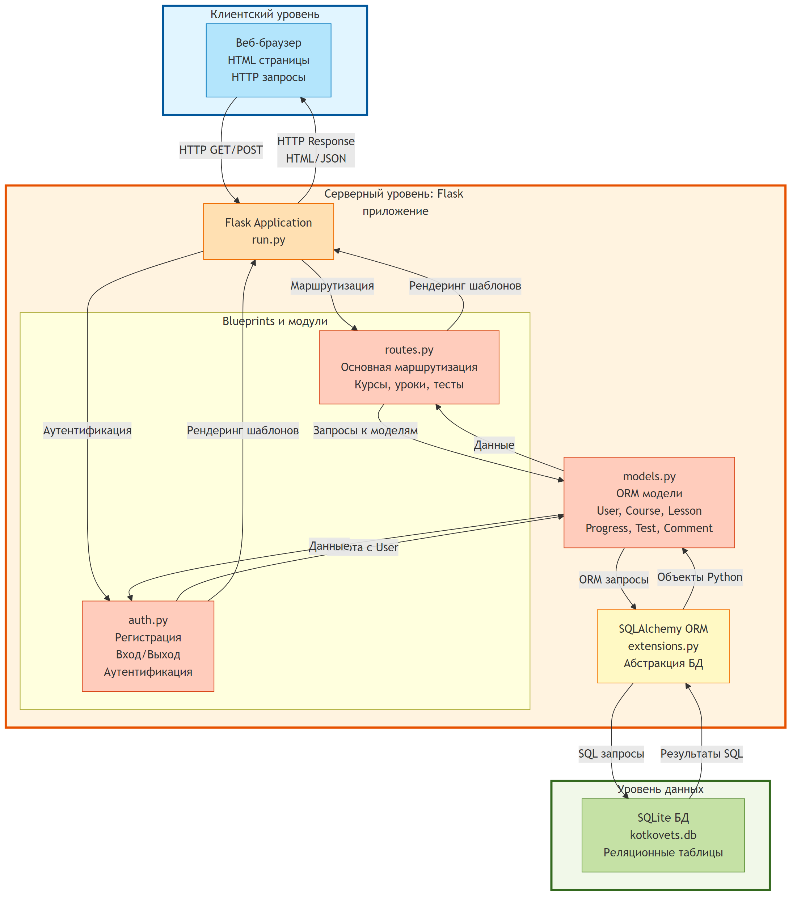
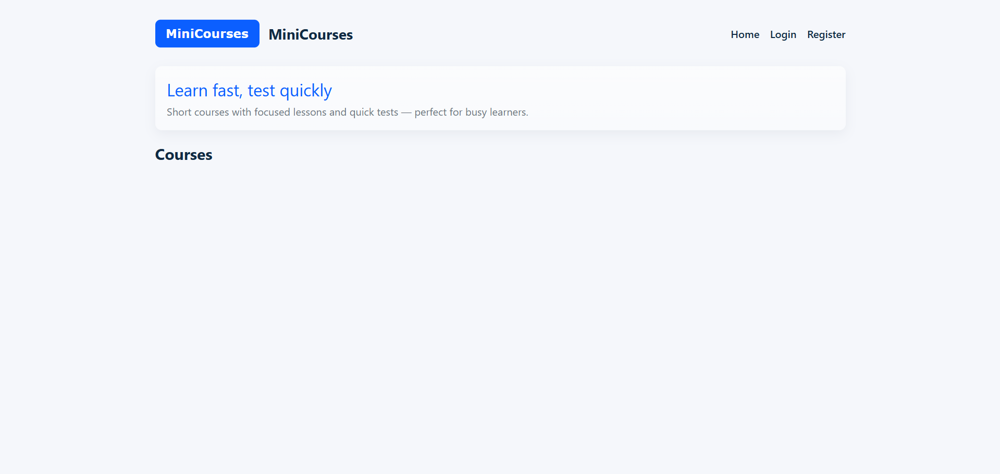
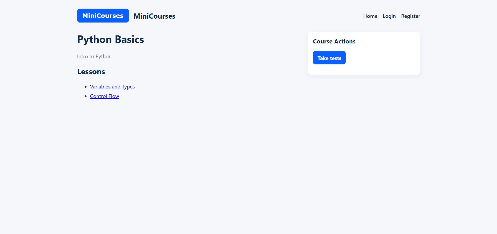
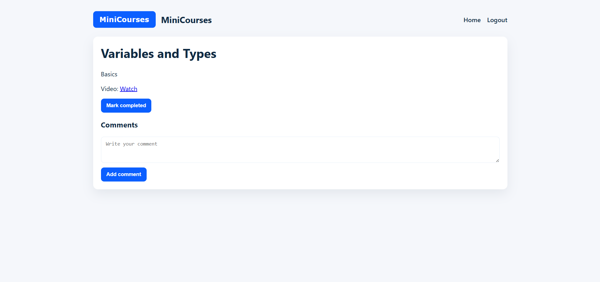
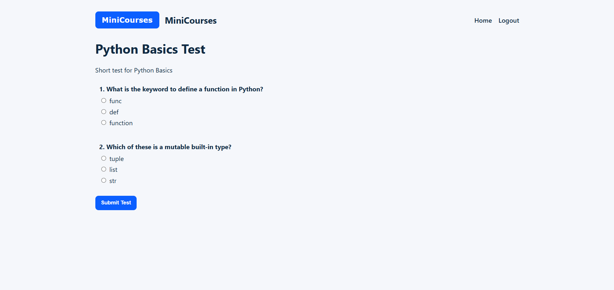

# 3 Разработка программы

## 3.1 Архитектура системы

Платформа «Учусь быстро» реализована по классической клиент-серверной архитектуре с четким разделением на три уровня: уровень представления, уровень бизнес-логики и уровень данных. Архитектура системы представлена на рисунке 3.1.

Рисунок 3.1 – Архитектура системы

Как показано на рисунке 3.1, клиентская часть представлена веб-браузером пользователя, который отправляет HTTP-запросы к серверу и отображает полученные HTML-страницы. Серверная часть реализована на базе веб-фреймворка Flask и включает модули обработки запросов, бизнес-логики и взаимодействия с базой данных. Уровень данных представлен реляционной базой данных SQLite, обеспечивающей постоянное хранение информации.

Взаимодействие между компонентами организовано следующим образом. Пользователь инициирует действие в браузере (переход по ссылке, отправка формы), браузер формирует HTTP-запрос и отправляет его на сервер. Сервер Flask принимает запрос, определяет соответствующий маршрут и передает управление обработчику. Обработчик выполняет необходимую бизнес-логику, взаимодействуя с базой данных через ORM SQLAlchemy. После обработки данных формируется ответ: либо HTML-страница на основе шаблона Jinja2, либо JSON-объект для AJAX-запросов. Сформированный ответ отправляется клиенту, браузер отображает полученную информацию.

Применение паттерна MVC обеспечивает разделение ответственности между компонентами. Модели (models.py) описывают структуру данных и правила их взаимодействия. Представления (templates) определяют способ отображения информации пользователю. Контроллеры (routes.py, auth.py) обрабатывают пользовательские запросы и координируют взаимодействие моделей и представлений.

## 3.2 Выбранный технологический стек и обоснование

Для реализации проекта выбран следующий технологический стек:

**Серверная часть**: Python 3 с веб-фреймворком Flask 2.2. Flask представляет собой легковесный и гибкий фреймворк, идеально подходящий для разработки MVP [4]. Фреймворк предоставляет минимально необходимый функционал для обработки HTTP-запросов, управления маршрутизацией и сессиями, при этом не навязывая жесткой структуры проекта. Выбор Python обусловлен высокой скоростью разработки, читаемостью кода и обширной экосистемой библиотек.

**ORM и работа с базой данных**: SQLAlchemy 3.0. Данная библиотека является стандартом де-факто для объектно-реляционного отображения в Python [3]. SQLAlchemy обеспечивает высокоуровневый API для работы с реляционными базами данных, автоматическое управление транзакциями и миграциями схемы. Интеграция с Flask осуществляется через расширение Flask-SQLAlchemy.

**База данных**: SQLite. Выбор обусловлен простотой развертывания (не требуется отдельный сервер СУБД), достаточной производительностью для MVP и автономностью (база данных хранится в одном файле). SQLite поддерживает основные возможности SQL, внешние ключи и транзакции, что достаточно для реализации требуемой функциональности.

**Шаблонизация**: Jinja2. Шаблонизатор поставляется вместе с Flask и обеспечивает удобный синтаксис для генерации HTML с поддержкой наследования шаблонов, циклов, условий и фильтров.

**Управление паролями**: Werkzeug. Библиотека предоставляет функции generate_password_hash и check_password_hash для безопасного хэширования паролей с использованием алгоритма PBKDF2 [2].

**Тестирование**: pytest 7.0 и pytest-flask. Pytest является современным и удобным фреймворком для написания тестов в Python [5]. Расширение pytest-flask предоставляет фикстуры для тестирования Flask-приложений, включая работу с тестовым клиентом и базой данных.

**Клиентская часть**: HTML, CSS, JavaScript. Пользовательский интерфейс реализован с использованием стандартных веб-технологий без дополнительных фреймворков для упрощения проекта. Стили определены в отдельном CSS-файле, динамическое поведение (AJAX-запросы) реализовано на чистом JavaScript.

Выбранный стек обеспечивает баланс между простотой разработки, производительностью и возможностями расширения системы в будущем.

## 3.3 Описание модулей сервера

Серверная часть приложения организована в виде пакета app со следующей структурой модулей:

**Модуль __init__.py** содержит фабрику приложения create_app. Фабрика создает экземпляр Flask-приложения, загружает конфигурацию, инициализирует расширения и регистрирует blueprints. Использование фабрики приложения является рекомендуемым подходом для организации Flask-проектов [4], так как позволяет легко создавать несколько экземпляров приложения с разными конфигурациями для тестирования и продакшена.

**Модуль config.py** определяет класс Config с параметрами конфигурации приложения. Конфигурация включает секретный ключ для подписи сессий, URI подключения к базе данных и флаги режима работы SQLAlchemy. Параметры могут быть переопределены через переменные окружения, что обеспечивает гибкость развертывания.

**Модуль extensions.py** содержит инициализацию расширений Flask. В данном случае создается экземпляр SQLAlchemy, который затем привязывается к приложению в фабрике. Вынесение расширений в отдельный модуль предотвращает циклические импорты.

**Модуль models.py** содержит определения всех моделей данных системы. Каждая модель представлена классом, наследующим от db.Model. Классы содержат определения столбцов таблиц с указанием типов данных, ограничений и связей между таблицами. Модели User, Course, Lesson, Progress, Comment, Test, Question, Option, Attempt, AttemptAnswer описаны в соответствии с проектом базы данных.

**Модуль routes.py** реализует основные маршруты приложения в виде Blueprint с именем main. Маршруты включают отображение главной страницы со списком курсов, детальную информацию о курсе с уроками, страницу урока с видео и комментариями, функции отметки прогресса, добавления комментариев, прохождения тестов. Также реализован маршрут для предоставления OpenAPI-спецификации в формате JSON.

**Модуль auth.py** реализует функциональность аутентификации и авторизации в виде отдельного Blueprint с именем auth. Модуль содержит обработчики маршрутов регистрации, входа и выхода из системы. При регистрации выполняется валидация данных, проверка уникальности имени пользователя и адреса электронной почты, хэширование пароля. При входе выполняется поиск пользователя и проверка пароля.

Разделение функциональности на модули и blueprints обеспечивает модульность кода и упрощает поддержку и расширение системы.

## 3.4 Описание фронтенда

Клиентская часть приложения представлена набором HTML-шаблонов, стилей CSS и JavaScript-кода для обеспечения интерактивности.

**Система шаблонов** построена на основе базового шаблона base.html, который определяет общую структуру страницы, включая навигационное меню, область для отображения сообщений Flash и подвал. Остальные шаблоны наследуют базовый и переопределяют блок контента. Главная страница приложения представлена на рисунке 3.2.

Рисунок 3.2 – Главная страница с списком курсов

Как видно из рисунка 3.2, главная страница содержит навигационное меню с логотипом, ссылками на регистрацию и вход (для неавторизованных пользователей) или ссылкой на выход (для авторизованных), а также список доступных курсов с кратким описанием.

Шаблон index.html отображает список курсов в виде карточек, каждая из которых содержит название и описание курса. При клике на карточку пользователь переходит к детальной информации о курсе.

Шаблон course.html отображает информацию о курсе и список его уроков. Для каждого урока показывается название и отметка о завершении, если пользователь авторизован и уже прошел урок. Страница курса с уроками показана на рисунке 3.3.

Рисунок 3.3 – Страница курса с уроками

Согласно рисунку 3.3, страница курса содержит название и описание курса, а также список уроков с визуальной индикацией завершенных уроков.

Шаблон lesson.html отображает содержимое урока, включая название, текстовое описание, встроенное видео (если указан URL) и форму для отметки урока как завершенного. Ниже расположен раздел комментариев с формой для добавления нового комментария. Страница урока представлена на рисунке 3.4.

Рисунок 3.4 – Страница урока с видео и комментариями

На рисунке 3.4 показана структура страницы урока с областью видеоконтента, кнопкой отметки завершения и списком комментариев пользователей.

Шаблоны register.html и login.html содержат формы для регистрации и входа соответственно, с полями для ввода учетных данных и кнопками отправки.

Шаблон test.html отображает тест с вопросами и вариантами ответов. Для каждого вопроса предлагается выбор одного из вариантов с помощью радиокнопок. Пример страницы теста показан на рисунке 3.5.

Рисунок 3.5 – Страница прохождения теста

Согласно рисунку 3.5, каждый вопрос теста отображается с набором вариантов ответа в виде радиокнопок, позволяющих выбрать один ответ.

Шаблон test_result.html показывает результаты прохождения теста: количество правильных ответов из общего числа вопросов.

**Стили CSS** определены в файле styles.css и обеспечивают современный и чистый внешний вид интерфейса. Используется flexbox для компоновки элементов, определены стили для карточек курсов, форм, кнопок и навигационного меню.

**JavaScript-код** в файле main.js реализует интерактивные функции, такие как AJAX-запрос для отметки урока как завершенного без перезагрузки страницы. При клике на соответствующую кнопку отправляется POST-запрос на сервер, при успешном ответе обновляется состояние кнопки на странице.

Фронтенд обеспечивает интуитивно понятный интерфейс для работы с образовательным контентом и не требует установки дополнительного программного обеспечения на стороне клиента.

## 3.5 API-спецификация

Система предоставляет набор HTTP-эндпоинтов для взаимодействия клиента с сервером. Спецификация основных маршрутов представлена в таблице 3.1.

Таблица 3.1 – Спецификация API-эндпоинтов

| Эндпоинт | Метод | Описание | Параметры запроса | Формат ответа | Возможные ошибки |
|----------|-------|----------|-------------------|---------------|------------------|
| / | GET | Главная страница | Нет | HTML | Нет |
| /register | GET | Форма регистрации | Нет | HTML | Нет |
| /register | POST | Регистрация пользователя | username, email, password | Redirect или HTML | 400: поля не заполнены; 409: пользователь существует |
| /login | GET | Форма входа | Нет | HTML | Нет |
| /login | POST | Вход в систему | username, password | Redirect или HTML | 401: неверные данные |
| /logout | GET | Выход из системы | Нет | Redirect | Нет |
| /courses/{course_id} | GET | Информация о курсе | course_id в URL | HTML | 404: курс не найден |
| /lessons/{lesson_id} | GET | Информация об уроке | lesson_id в URL | HTML | 404: урок не найден |
| /lessons/{lesson_id} | POST | Отметка завершения | lesson_id в URL | Redirect | 401: требуется авторизация |
| /lessons/{lesson_id}/complete | POST | AJAX отметка завершения | lesson_id в URL | JSON | 401: требуется авторизация; 404: урок не найден |
| /lessons/{lesson_id}/comment | POST | Добавление комментария | lesson_id в URL, content | Redirect | 401: требуется авторизация; 400: пустой комментарий |
| /courses/{course_id}/tests | GET | Список тестов курса | course_id в URL | HTML | 404: курс не найден |
| /tests/{test_id} | GET | Форма теста | test_id в URL | HTML | 404: тест не найден |
| /tests/{test_id} | POST | Отправка ответов теста | test_id в URL, q_{question_id} | HTML | 404: тест не найден |
| /openapi.json | GET | OpenAPI спецификация | Нет | JSON | Нет |
| /swagger | GET | Swagger UI | Нет | HTML | Нет |

Все эндпоинты, требующие аутентификации, проверяют наличие идентификатора пользователя в серверной сессии. При отсутствии авторизации выполняется перенаправление на страницу входа или возвращается ошибка 401 для AJAX-запросов.

Эндпоинты, работающие с конкретными сущностями по идентификатору, возвращают ошибку 404, если сущность не найдена в базе данных.

Для обеспечения безопасности все POST-запросы защищены от CSRF-атак через механизм сессионных токенов Flask.

## 3.6 Модель данных

Модель данных системы реализована в виде девяти связанных таблиц в реляционной базе данных SQLite. Структура таблиц представлена ниже.

**Таблица User**

| Поле | Тип | Ограничения | Описание |
|------|-----|-------------|----------|
| id | Integer | PRIMARY KEY | Уникальный идентификатор |
| username | String(80) | UNIQUE, NOT NULL | Имя пользователя |
| email | String(120) | UNIQUE, NOT NULL | Адрес электронной почты |
| password_hash | String(128) | NOT NULL | Хэш пароля |

Таблица User хранит учетные данные пользователей. Поля username и email имеют ограничение уникальности, обеспечивающее невозможность регистрации с уже существующими данными. Пароль хранится только в виде хэша.

**Таблица Course**

| Поле | Тип | Ограничения | Описание |
|------|-----|-------------|----------|
| id | Integer | PRIMARY KEY | Уникальный идентификатор |
| title | String(200) | NOT NULL | Название курса |
| description | Text | NULL | Описание курса |

Таблица Course содержит информацию о курсах, доступных на платформе.

**Таблица Lesson**

| Поле | Тип | Ограничения | Описание |
|------|-----|-------------|----------|
| id | Integer | PRIMARY KEY | Уникальный идентификатор |
| course_id | Integer | FOREIGN KEY (course.id), NOT NULL | Идентификатор курса |
| title | String(200) | NOT NULL | Название урока |
| video_url | String(255) | NULL | URL видео |
| content | Text | NULL | Текстовое содержание |

Таблица Lesson хранит уроки. Внешний ключ course_id связывает урок с родительским курсом.

**Таблица Progress**

| Поле | Тип | Ограничения | Описание |
|------|-----|-------------|----------|
| id | Integer | PRIMARY KEY | Уникальный идентификатор |
| user_id | Integer | FOREIGN KEY (user.id), NOT NULL | Идентификатор пользователя |
| lesson_id | Integer | FOREIGN KEY (lesson.id), NOT NULL | Идентификатор урока |
| completed | Boolean | DEFAULT False | Флаг завершения |

Таблица Progress фиксирует прогресс пользователей в изучении уроков. Комбинация user_id и lesson_id должна быть уникальной для предотвращения дублирования записей.

**Таблица Comment**

| Поле | Тип | Ограничения | Описание |
|------|-----|-------------|----------|
| id | Integer | PRIMARY KEY | Уникальный идентификатор |
| user_id | Integer | FOREIGN KEY (user.id), NOT NULL | Идентификатор пользователя |
| lesson_id | Integer | FOREIGN KEY (lesson.id), NOT NULL | Идентификатор урока |
| content | Text | NOT NULL | Текст комментария |

Таблица Comment хранит комментарии пользователей к урокам.

**Таблица Test**

| Поле | Тип | Ограничения | Описание |
|------|-----|-------------|----------|
| id | Integer | PRIMARY KEY | Уникальный идентификатор |
| course_id | Integer | FOREIGN KEY (course.id), NOT NULL | Идентификатор курса |
| title | String(200) | NOT NULL | Название теста |
| description | Text | NULL | Описание теста |

Таблица Test содержит информацию о тестах для проверки знаний.

**Таблица Question**

| Поле | Тип | Ограничения | Описание |
|------|-----|-------------|----------|
| id | Integer | PRIMARY KEY | Уникальный идентификатор |
| test_id | Integer | FOREIGN KEY (test.id), NOT NULL | Идентификатор теста |
| text | Text | NOT NULL | Текст вопроса |

Таблица Question хранит вопросы, входящие в состав тестов.

**Таблица Option**

| Поле | Тип | Ограничения | Описание |
|------|-----|-------------|----------|
| id | Integer | PRIMARY KEY | Уникальный идентификатор |
| question_id | Integer | FOREIGN KEY (question.id), NOT NULL | Идентификатор вопроса |
| text | String(300) | NOT NULL | Текст варианта ответа |
| is_correct | Boolean | DEFAULT False | Флаг правильности |

Таблица Option содержит варианты ответов на вопросы тестов с указанием правильности.

**Таблица Attempt**

| Поле | Тип | Ограничения | Описание |
|------|-----|-------------|----------|
| id | Integer | PRIMARY KEY | Уникальный идентификатор |
| user_id | Integer | FOREIGN KEY (user.id), NULL | Идентификатор пользователя |
| test_id | Integer | FOREIGN KEY (test.id), NOT NULL | Идентификатор теста |
| score | Integer | NULL | Количество правильных ответов |
| total | Integer | NULL | Общее количество вопросов |

Таблица Attempt фиксирует попытки прохождения тестов с результатами.

**Таблица AttemptAnswer**

| Поле | Тип | Ограничения | Описание |
|------|-----|-------------|----------|
| id | Integer | PRIMARY KEY | Уникальный идентификатор |
| attempt_id | Integer | FOREIGN KEY (attempt.id), NOT NULL | Идентификатор попытки |
| question_id | Integer | FOREIGN KEY (question.id), NOT NULL | Идентификатор вопроса |
| option_id | Integer | FOREIGN KEY (option.id), NOT NULL | Идентификатор выбранного варианта |

Таблица AttemptAnswer связывает попытки прохождения тестов с конкретными ответами пользователя.

Индексы автоматически создаются для всех первичных ключей и столбцов с ограничением уникальности, что обеспечивает эффективное выполнение запросов поиска и соединения таблиц. Внешние ключи обеспечивают ссылочную целостность данных.

## 3.7 Конфигурация окружения и инструкция по запуску

Для развертывания и запуска приложения необходимо выполнить следующие шаги:

**Предварительные требования**

Система должна иметь установленный интерпретатор Python версии 3.7 или выше. Рекомендуется использовать виртуальное окружение для изоляции зависимостей проекта.

**Установка зависимостей**

1. Создать виртуальное окружение: python -m venv .venv
2. Активировать виртуальное окружение:
   - Windows: .venv\Scripts\activate
   - Linux/Mac: source .venv/bin/activate
3. Установить зависимости: pip install -r requirements.txt

Файл requirements.txt содержит список необходимых пакетов: Flask, Flask-SQLAlchemy, pytest, pytest-flask и Werkzeug с указанием минимальных версий.

**Инициализация базы данных**

Перед первым запуском необходимо создать базу данных и наполнить её демонстрационными данными. Для этого выполняется скрипт: python db_init.py

Скрипт создает файл базы данных kotkovets.db в корневой директории проекта, инициализирует все таблицы согласно определениям моделей и добавляет демонстрационные данные: несколько курсов, уроков, тестов с вопросами и одного пользователя для тестирования.

**Конфигурация приложения**

Приложение поддерживает настройку через переменные окружения:

- SECRET_KEY — секретный ключ для подписи сессий (по умолчанию dev-secret-key)
- DATABASE_URL — URI подключения к базе данных (по умолчанию sqlite:///kotkovets.db)
- FLASK_APP — точка входа приложения (должна быть установлена в run.py)

Для Windows переменная устанавливается командой: set FLASK_APP=run.py

Для Linux/Mac: export FLASK_APP=run.py

**Запуск приложения**

После выполнения всех предыдущих шагов приложение запускается командой: flask run

Сервер разработки Flask запускается на локальном адресе http://127.0.0.1:5000/. Приложение доступно в браузере по указанному адресу.

**Запуск тестов**

Для проверки корректности работы системы выполняется команда: pytest

Фреймворк pytest автоматически обнаруживает и выполняет все тестовые функции в директории tests, выводя результаты проверок.

**Структура проекта**

Проект имеет следующую структуру директорий и файлов:

- app/ — пакет приложения
  - __init__.py — фабрика приложения
  - models.py — модели данных
  - routes.py — основные маршруты
  - auth.py — аутентификация
  - config.py — конфигурация
  - extensions.py — расширения
  - templates/ — HTML-шаблоны
  - static/ — статические файлы (CSS, JS)
- tests/ — тестовые модули
- run.py — точка входа приложения
- db_init.py — скрипт инициализации БД
- requirements.txt — зависимости проекта

Такая организация обеспечивает четкое разделение компонентов и упрощает навигацию по коду.
