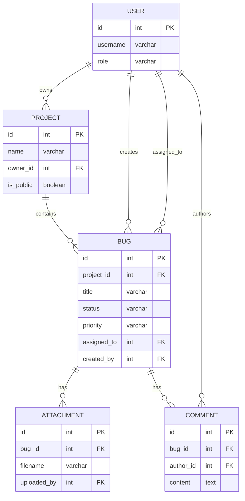

# Вариант 11 — Ключевые сущности, связи и API (эскиз)

Сущности (основные)

- User
  - id: UUID
  - username: string (unique)
  - password_hash: string
  - role: enum [admin, manager, developer, user]

- Project
  - id: UUID
  - name: string
  - description: string
  - owner_id: reference -> User.id
  - is_public: boolean

- Bug
  - id: UUID
  - project_id: reference -> Project.id
  - title: string
  - description: text
  - status: enum [new, in_progress, testing, done, closed]
  - priority: enum [low, medium, high, critical]
  - assigned_to: reference -> User.id (nullable)
  - created_by: reference -> User.id
  - created_at: datetime
  - updated_at: datetime

- Attachment
  - id: UUID
  - bug_id: reference -> Bug.id
  - filename: string
  - file_path: string
  - uploaded_by: reference -> User.id
  - uploaded_at: datetime

- Comment
  - id: UUID
  - bug_id: reference -> Bug.id
  - author_id: reference -> User.id
  - content: text
  - created_at: datetime

Связи (ER-эскиз)

- User 1..* Project (пользователь владеет проектами)
- Project 1..* Bug (проект содержит баги)
- User 1..* Bug (пользователь создаёт баги)
- Bug 1..* Attachment (баг имеет вложения)
- Bug 1..* Comment (баг имеет комментарии)

Обязательные поля и ограничения (кратко)

- unique(User.username)
- Project.owner_id → User.id (FK, not null)
- Bug.project_id → Project.id (FK, not null)
- Bug.created_by → User.id (FK, not null)
- Attachment.bug_id → Bug.id (FK, not null)
- Comment.bug_id → Bug.id (FK, not null)

API — верхнеуровневые ресурсы и операции

- /users
  - GET /users (admin)
  - POST /users (admin)
  - GET /users/{id}
  - PUT /users/{id}
  - DELETE /users/{id}

- /projects
  - GET /projects (list, filter by owner)
  - POST /projects
  - GET /projects/{id}
  - PUT /projects/{id}
  - DELETE /projects/{id}

- /bugs
  - GET /bugs (filter by project/status/priority/assignee)
  - POST /bugs
  - GET /bugs/{id}
  - PUT /bugs/{id}
  - DELETE /bugs/{id}

- /attachments
  - POST /attachments (upload file)
  - GET /attachments?bug_id=
  - GET /attachments/{id}
  - DELETE /attachments/{id}

- /comments
  - GET /comments?bug_id=
  - POST /comments
  - PUT /comments/{id}
  - DELETE /comments/{id}

Дополнительно (бонусы)

- Webhooks для интеграций (заглушка)
- Документация API (OpenAPI/Swagger)
- Тесты: unit + интеграционные для фильтров и доски
---

## Подробные операции API, схемы и поведение

Общие принципы

- Ответы в формате: `{ "status": "ok" | "error", "data"?: ..., "error"?: {code, message, fields?} }`
- Пагинация: `limit` и `offset` (по умолчанию limit=50).
- Аутентификация: `Authorization: Bearer <jwt>`; роли: `admin`, `manager`, `developer`, `user`.

Примеры ошибок (JSON)

```json
{
  "status": "error",
  "error": { "code": "validation_failed", "message": "Validation failed", "fields": { "title": "required" } }
}
```

Auth

- POST `/auth/register` — `{email, password, name}` → `201 {id, email, name, role}`
- POST `/auth/login` — `{email, password}` → `200 {accessToken, refreshToken, user}`
- POST `/auth/refresh` — `{refreshToken}` → `200 {accessToken}`

Users

- GET `/users?limit=&offset=` — Admin
- GET `/users/{id}` — Admin или self
- POST `/users` — Admin (payload: `{username,email,password,role?}`)
- PUT `/users/{id}` — Admin или self (частичное обновление)
- DELETE `/users/{id}` — Admin

Projects

- GET `/projects?ownerId=&isPublic=&limit=&offset=` — список
- POST `/projects` — Admin или Manager (payload: `{name,description,ownerId,isPublic?}`)
- GET `/projects/{id}` — детали, включает краткий список багов
- PUT `/projects/{id}` — Admin или owner
- DELETE `/projects/{id}` — Admin

Bugs

- GET `/bugs?projectId=&status=&priority=&assignedTo=&createdBy=&limit=&offset=` — список с фильтрами
- POST `/bugs` — все роли (payload: `{projectId, title, description, priority?, status?}`)
- GET `/bugs/{id}` — детали бага
- PUT `/bugs/{id}` — Admin, Manager, Developer (ограниченно)
- DELETE `/bugs/{id}` — Admin, Manager

Attachments

- POST `/attachments` — загрузка файла
  - Payload: multipart/form-data с `bugId` и `file`
  - Response: `201 {id, filename, url}`

- GET `/attachments?bugId=` — список вложений для бага
- GET `/attachments/{id}` — скачивание файла
- DELETE `/attachments/{id}` — Admin, автор вложения

Comments

- GET `/comments?bugId=&limit=&offset=` — список комментариев
- POST `/comments` — все роли (payload: `{bugId, content}`)
- PUT `/comments/{id}` — автор или Admin
- DELETE `/comments/{id}` — автор или Admin

Board (доска багов)

- GET `/projects/{id}/board` — возвращает баги, сгруппированные по статусам для Kanban-доски

Webhooks (бонус, заглушка)

- POST `/webhooks` — создать webhook
- GET `/webhooks` — список webhooks
- DELETE `/webhooks/{id}` — удалить webhook

---

## ERD (диаграмма сущностей)

Mermaid-диаграмма (если рендер поддерживается):



ASCII-эскиз (если mermaid не рендерится):

```text
User 1---* Project 1---* Bug 1---* Attachment
                          |
                          *---* Comment
User ----* Bug (создатель и исполнитель)
```

---

AC — критерии приёмки для функционала фильтров и доски (MVP)

- AC1: GET `/bugs?status=in_progress` возвращает только баги со статусом "В работе".
- AC2: GET `/projects/{id}/board` возвращает баги, сгруппированные по статусам (new, in_progress, testing, done, closed).
- AC3: Доска корректно отображает баги с возможностью фильтрации по приоритету и назначенному разработчику.
