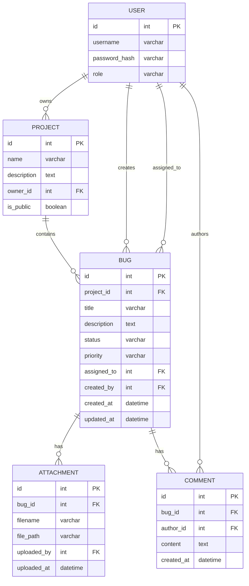

# Вариант 11 — ERD (диаграмма сущностей) — Баг-трекер «Не баг, а фича?»

Файл содержит: 1) mermaid-диаграмму ERD; 2) ASCII-эскиз; 3) минимальный SQL DDL-скетч для создания таблиц.

## Mermaid ERD



## ASCII-эскиз

```
User 1---* Project 1---* Bug 1---* Attachment
                          |
                          *---* Comment
User ----* Bug (создатель и исполнитель)
```

## Минимальный SQL DDL (пример, PostgreSQL)

```sql
CREATE TABLE users (
	id UUID PRIMARY KEY,
	username TEXT UNIQUE NOT NULL,
	password_hash TEXT NOT NULL,
	role TEXT NOT NULL CHECK (role IN ('admin','manager','developer','user'))
);

CREATE TABLE projects (
	id UUID PRIMARY KEY,
	name TEXT NOT NULL,
	description TEXT,
	owner_id UUID NOT NULL REFERENCES users(id) ON DELETE CASCADE,
	is_public BOOLEAN DEFAULT false
);

CREATE TABLE bugs (
	id UUID PRIMARY KEY,
	project_id UUID NOT NULL REFERENCES projects(id) ON DELETE CASCADE,
	title TEXT NOT NULL,
	description TEXT,
	status TEXT NOT NULL DEFAULT 'new',
	priority TEXT NOT NULL DEFAULT 'medium',
	assigned_to UUID REFERENCES users(id),
	created_by UUID NOT NULL REFERENCES users(id),
	created_at TIMESTAMP WITH TIME ZONE DEFAULT now(),
	updated_at TIMESTAMP WITH TIME ZONE DEFAULT now()
);

CREATE TABLE attachments (
	id UUID PRIMARY KEY,
	bug_id UUID NOT NULL REFERENCES bugs(id) ON DELETE CASCADE,
	filename TEXT NOT NULL,
	file_path TEXT NOT NULL,
	uploaded_by UUID NOT NULL REFERENCES users(id),
	uploaded_at TIMESTAMP WITH TIME ZONE DEFAULT now()
);

CREATE TABLE comments (
	id UUID PRIMARY KEY,
	bug_id UUID NOT NULL REFERENCES bugs(id) ON DELETE CASCADE,
	author_id UUID NOT NULL REFERENCES users(id),
	content TEXT NOT NULL,
	created_at TIMESTAMP WITH TIME ZONE DEFAULT now()
);
```
