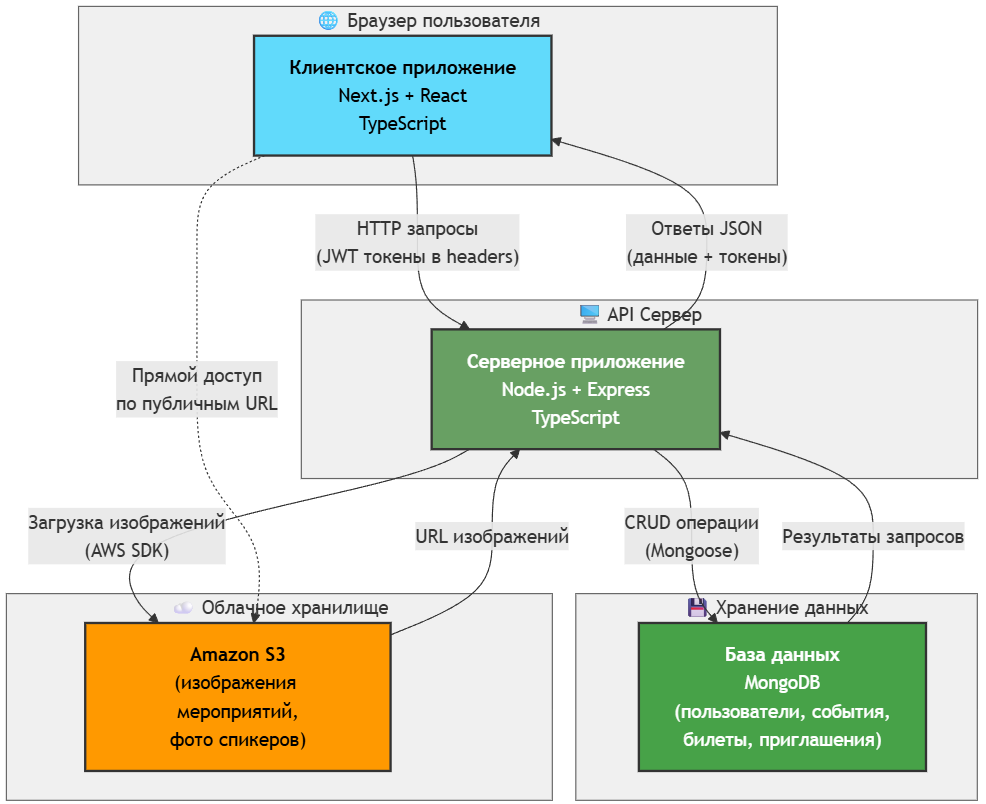

# 5 Разработка программы

## 5.1 Архитектура системы

Система реализована по классической трёхуровневой архитектуре «клиент-сервер» с разделением на уровень представления, уровень бизнес-логики и уровень данных. Архитектура показана на рисунке 5.1.

Рисунок 5.1 – Архитектура системы

Как видно из рисунка 5.1, система состоит из трёх основных компонентов. Клиентская часть реализована как одностраничное приложение на базе Next.js, работающее в браузере пользователя. Серверная часть представляет собой REST API, реализованное на Node.js с использованием фреймворка Express. Уровень данных обеспечивается документоориентированной базой данных MongoDB.

Взаимодействие между компонентами осуществляется по протоколу HTTP с использованием формата JSON для обмена данными. Клиент отправляет запросы к серверному API, который обрабатывает их, взаимодействует с базой данных и возвращает структурированные ответы. Аутентификация реализована с помощью JWT-токенов, передаваемых в HTTP-only cookies.

Разделение фронтенда и бэкенда позволяет разрабатывать и масштабировать их независимо друг от друга. Фронтенд может быть развёрнут на статическом хостинге или CDN, а бэкенд на серверах приложений с возможностью горизонтального масштабирования.

## 5.2 Выбранный технологический стек

Выбор технологий для реализации системы основан на современных подходах к веб-разработке с учётом требований к производительности, безопасности и удобству разработки [4].

### 5.2.1 Серверная часть

На стороне сервера используется платформа Node.js версии восемнадцать и выше, которая обеспечивает высокую производительность благодаря асинхронной модели выполнения и событийно-ориентированной архитектуре. Для создания HTTP-сервера и маршрутизации применяется фреймворк Express версии пять, предоставляющий минималистичный и гибкий инструментарий для построения веб-приложений.

Взаимодействие с базой данных MongoDB реализовано через ODM-библиотеку Mongoose версии восемь, которая предоставляет схемную валидацию, типизацию данных и удобные методы для работы с коллекциями. Mongoose упрощает определение моделей данных и обеспечивает дополнительный уровень валидации перед сохранением в базу.

Для обеспечения безопасности применяются следующие библиотеки: bcrypt версии шесть для хеширования паролей с использованием адаптивного алгоритма, устойчивого к атакам перебора; jsonwebtoken версии девять для генерации и верификации JWT-токенов; sanitize-html версии два для очистки HTML-контента от потенциально опасных конструкций.

Обработка контента в формате Markdown выполняется библиотекой markdown-it версии четырнадцать с поддержкой подсветки синтаксиса через highlight.js версии одиннадцать. Для работы с загружаемыми файлами используется multer версии два, а обработка изображений осуществляется библиотекой sharp версии ноль точка тридцать четыре.

Интеграция с облачным хранилищем Amazon S3 реализована через AWS SDK версии три для загрузки и получения файлов изображений. Для управления переменными окружения применяется dotenv версии семнадцать.

### 5.2.2 Клиентская часть

Фронтенд построен на базе фреймворка Next.js версии шестнадцать, который обеспечивает серверный рендеринг, статическую генерацию страниц и оптимизированную маршрутизацию [5]. Использование Next.js улучшает производительность приложения и индексацию поисковыми системами.

Пользовательский интерфейс реализован с помощью библиотеки React версии девятнадцать, предоставляющей компонентный подход к разработке интерфейсов. Для стилизации применяется Tailwind CSS версии четыре, который предлагает utility-first подход и обеспечивает консистентный дизайн с минимальным объёмом CSS-кода.

Управление формами осуществляется через react-hook-form версии семь, обеспечивающую эффективную валидацию и обработку пользовательского ввода с минимальным количеством перерисовок. Глобальное состояние приложения управляется с помощью Zustand версии пять, предоставляющего простой и производительный механизм управления состоянием.

Для UI-компонентов используется библиотека Headless UI версии два, предоставляющая доступные и настраиваемые компоненты без предопределённых стилей. Иконки реализованы через lucide-react версии ноль точка пятьсот пятьдесят четыре.

### 5.2.3 База данных

В качестве системы управления базой данных выбрана MongoDB, документоориентированная NoSQL-база данных, которая хорошо подходит для хранения слабоструктурированных данных и обеспечивает гибкость схемы. MongoDB позволяет хранить вложенные документы и массивы, что упрощает модель данных системы и снижает необходимость в сложных JOIN-операциях.

Основные преимущества MongoDB для данного проекта включают: простоту работы с JSON-подобными документами, что естественно для JavaScript-экосистемы; высокую производительность чтения благодаря индексации; возможность горизонтального масштабирования через шардирование; встроенную поддержку репликации для обеспечения отказоустойчивости.

## 5.3 Структура серверного приложения

Серверная часть организована по модульному принципу с разделением ответственности между компонентами.

### 5.3.1 Точка входа и конфигурация

Файл index.ts служит точкой входа в приложение. Здесь инициализируется Express-приложение, подключаются middleware для обработки CORS, парсинга JSON-тела запросов и работы с cookies. Настроена политика CORS с явным указанием разрешённых источников: localhost для локальной разработки и домен Vercel для продакшн-окружения. Установлен флаг credentials для поддержки передачи cookies между доменами.

Подключается middleware логирования для записи информации о всех входящих запросах. Регистрируются маршруты для клиентской и административной частей API. В конце цепочки обработки добавлен обработчик несуществующих маршрутов, возвращающий стандартизированную ошибку.

После конфигурации приложения выполняется подключение к базе данных MongoDB с использованием строки подключения из переменной окружения. При успешном подключении запускается HTTP-сервер на порту, указанном в конфигурации.

### 5.3.2 Модели данных

Модели определены в директории models с использованием схем Mongoose. Каждая модель экспортирует схему и статические методы для выполнения операций с данными.

Модель User включает статические методы signup и signin для регистрации и входа обычных пользователей, getUser для получения информации о пользователе, adminSignin для входа администраторов с проверкой роли, createUser для создания пользователей администратором с возможностью указания роли, patchUser для редактирования данных пользователя, deleteUser для удаления учётной записи и resetPassword для сброса пароля с проверкой на совпадение со старым.

Модель Event содержит методы createEvent для создания события с полной валидацией всех параметров, patchEvent для частичного обновления полей события и deleteEvent для удаления мероприятия.

Модель Speaker предоставляет методы createSpeaker для создания профиля спикера, patchSpeaker для обновления информации с поддержкой частичных изменений вложенных объектов и deleteSpeaker для удаления спикера.

Модель Attendee реализует методы registerToEvent для регистрации пользователя на событие с проверкой на повторную регистрацию и unregisterFromEvent для отмены регистрации.

Модель Ticket включает методы createTicket для создания билета с генерацией и валидацией восьмизначного кода и unregisterAttendeeFromEvent для удаления билета при отмене регистрации.

Модель Invitation содержит методы createInvitation для создания приглашения с проверками на самоприглашение и дублирование, и deleteInvitation для удаления приглашения.

### 5.3.3 Контроллеры

Контроллеры организованы в директориях admin и client в соответствии с типом пользователей, имеющих доступ к функционалу.

Контроллеры клиентской части обрабатывают запросы обычных пользователей: получение списка событий, детальной информации о событии, регистрацию и вход пользователей, регистрацию на события, получение списка билетов, создание и получение приглашений, проверку работоспособности системы.

Контроллеры административной части предоставляют расширенный функционал: создание, редактирование и удаление событий, управление спикерами, создание, редактирование и удаление пользователей, сброс паролей пользователей, вход администраторов с проверкой роли.

Каждый контроллер принимает объект запроса и объект ответа, извлекает необходимые параметры, вызывает соответствующие методы моделей, обрабатывает возможные ошибки и возвращает структурированный JSON-ответ с полями status, message, data и code.

### 5.3.4 Маршруты

Маршруты определены в директории routes с разделением на admin и client. Каждый файл маршрута создаёт экземпляр Express Router, привязывает HTTP-методы к соответствующим контроллерам и применяет необходимые middleware.

Клиентские маршруты включают GET и POST для `/api/health`, POST для `/api/user/signup` и `/api/user/signin`, GET для `/api/user/me` с middleware requireAuth, GET для `/api/events` с опциональной аутентификацией, GET для `/api/events/:id` с requireAuth, POST для `/api/tickets` с requireAuth для регистрации на событие, GET для `/api/tickets` с requireAuth для получения билетов пользователя, POST для `/api/invitations` с requireAuth для создания приглашения.

Административные маршруты защищены комбинацией middleware requireAuth и checkAdmin: POST для `/api/admin/signin`, GET, POST, PATCH и DELETE для `/api/admin/events`, GET, POST, PATCH и DELETE для `/api/admin/speakers`, GET, POST, PATCH и DELETE для `/api/admin/users`, POST для `/api/admin/users/:id/reset-password`.

### 5.3.5 Middleware

Middleware выполняют сквозную функциональность приложения.

Middleware logger записывает в консоль метод HTTP-запроса, путь и временную метку для каждого входящего запроса, что помогает отслеживать активность системы.

Middleware requireAuth извлекает JWT-токен из cookies, верифицирует его подпись и срок действия, извлекает идентификатор пользователя и добавляет его в объект запроса. При отсутствии или невалидности токена возвращает ошибку с кодом четыреста один.

Middleware checkAdmin используется после requireAuth для проверки роли пользователя. Выполняет запрос к базе данных для получения роли и сравнивает её со значением admin. При несовпадении возвращает ошибку маршрут не найден для сокрытия административных endpoint от посторонних.

Middleware optionalAuth аналогичен requireAuth, но не прерывает выполнение при отсутствии токена, позволяя маршрутам работать как для авторизованных, так и для неавторизованных пользователей с различным набором возвращаемых данных.

### 5.3.6 Утилиты

Вспомогательные функции вынесены в директорию utils.

Модуль hash содержит функции hashPassword для хеширования пароля с использованием bcrypt с настраиваемым количеством раундов и comparePassword для сравнения открытого пароля с хешем.

Модуль is-blank-field предоставляет функцию проверки на пустое значение, учитывающую null, undefined, пустые строки и массивы.

Утилиты для работы с JWT инкапсулируют логику генерации токенов с учётом секретного ключа и времени жизни из переменных окружения.

### 5.3.7 Константы

Константы для кодов HTTP-статусов, статусов ответов и сообщений об ошибках вынесены в отдельные модули в директории constants. Это обеспечивает централизованное управление сообщениями и упрощает локализацию в будущем.

Объект HTTP_STATUS содержит именованные константы для кодов HTTP: OK двести, CREATED двести один, BAD_REQUEST четыреста, UNAUTHORIZED четыреста один, FORBIDDEN четыреста три, NOT_FOUND четыреста четыре, INTERNAL_SERVER_ERROR пятьсот.

Объект RESPONSE_STATUS определяет статусы ответов: SUCCESS для успешных операций и ERROR для ошибок.

Объекты с сообщениями об ошибках разделены по категориям: COMMON_ERRORS для общих ошибок, USER_ERRORS для ошибок работы с пользователями, EVENTS_ERRORS для событий, SPEAKERS_ERRORS для спикеров, TICKET_ERRORS для билетов, INVITATION_ERRORS для приглашений, AUTH_ERRORS для аутентификации.

## 5.4 Структура клиентского приложения

Клиентская часть построена с использованием файловой маршрутизации Next.js версии тринадцать и выше, где структура директорий в папке app определяет маршруты приложения.

### 5.4.1 Организация маршрутов

Корневая страница расположена в файле page.tsx в директории app и отображает список всех доступных мероприятий. Для неавторизованных пользователей показывается базовая информация с кнопками входа и регистрации. Авторизованные пользователи видят расширенную информацию и могут переходить к деталям события.

Маршруты для обычных пользователей организованы в группе (web): /login для входа в систему, /register для регистрации новых пользователей, /events/[id] для просмотра детальной информации о событии с возможностью регистрации, /tickets для отображения списка билетов пользователя, /invitations для управления приглашениями.

Административные маршруты сгруппированы в (admin): /admin для главной панели администратора со списком всех событий и кнопками управления, /admin/events/create для создания нового события с формой ввода всех параметров, /admin/events/[id] для редактирования существующего события, /admin/speakers для управления списком спикеров с возможностью создания, редактирования и удаления, /admin/users для управления пользователями системы.

### 5.4.2 Компоненты и модули

Переиспользуемые компоненты вынесены в директорию module. Каждый модуль включает основной компонент и связанные элементы в поддиректории element.

Модуль event-page содержит компоненты для отображения страницы события: компонент info для отображения информации о мероприятии, включая вложенный компонент speaker для отображения карточки спикера, компонент invite-modal для модального окна отправки приглашения, компонент content для рендеринга HTML-контента описания события.

Модуль event-page-admin реализует интерфейс редактирования события для администраторов: компонент speaker-list для отображения и выбора спикеров, компонент speaker-item для отдельной карточки спикера в списке, компонент confirm-modal для подтверждения деструктивных действий.

Общие UI-компоненты включают формы ввода, кнопки, модальные окна, карточки событий, навигационное меню. Использование компонентного подхода обеспечивает консистентность интерфейса и упрощает поддержку кода.

### 5.4.3 Управление состоянием

Глобальное состояние приложения управляется через Zustand stores. Основные stores включают:

Store пользователя хранит информацию об аутентифицированном пользователе, предоставляет методы для входа, выхода и обновления данных профиля. При монтировании приложения проверяется наличие токена и загружается информация о пользователе.

Store событий управляет списком мероприятий и детальной информацией о выбранном событии. Предоставляет методы для загрузки событий, создания, обновления и удаления через вызовы API.

Store UI управляет состоянием интерфейса: открытые модальные окна, уведомления, индикаторы загрузки.

### 5.4.4 Взаимодействие с API

Взаимодействие с серверным API инкапсулировано в отдельные модули с функциями для каждого endpoint. Все запросы используют нативный fetch API с настройками для передачи credentials и обработки JSON.

Функции API обрабатывают ошибки и преобразуют ответы сервера в типизированные объекты. Для методов, требующих аутентификации, токен автоматически включается в запросы через cookies.

Базовые URL для клиентского и административного API настраиваются через переменные окружения NEXT_PUBLIC_API_BASE_URL и NEXT_PUBLIC_API_ADMIN_BASE_URL, что позволяет легко переключаться между окружениями разработки и продакшн.

## 5.5 Спецификация API

Система предоставляет REST API для взаимодействия клиента с сервером. Все endpoint возвращают структурированные JSON-ответы с полями status, message, data и code. В таблице 5.1 представлены основные endpoint клиентской части API.

Таблица 5.1 – Endpoint клиентской части API

| Endpoint | Метод | Описание | Авторизация | Тело запроса | Ответ при успехе |
|----------|-------|----------|-------------|--------------|------------------|
| /api/health | GET | Проверка работоспособности | Нет | Нет | Статус OK |
| /api/user/signup | POST | Регистрация пользователя | Нет | email, password, name | Данные пользователя |
| /api/user/signin | POST | Вход пользователя | Нет | email, password | Данные пользователя |
| /api/user/me | GET | Получение текущего пользователя | Да | Нет | Данные пользователя |
| /api/events | GET | Список событий | Опционально | Нет | Массив событий |
| /api/events/:id | GET | Детали события | Да | Нет | Данные события |
| /api/tickets | POST | Регистрация на событие | Да | event_id | Данные билета |
| /api/tickets | GET | Список билетов пользователя | Да | Нет | Массив билетов |
| /api/invitations | POST | Создание приглашения | Да | user_invited, event | Данные приглашения |
| /api/invitations | GET | Список приглашений | Да | Нет | Массив приглашений |

В таблице 5.2 представлены endpoint административной части API.

Таблица 5.2 – Endpoint административной части API

| Endpoint | Метод | Описание | Авторизация | Тело запроса | Ответ при успехе |
|----------|-------|----------|-------------|--------------|------------------|
| /api/admin/signin | POST | Вход администратора | Нет | email, password | Данные администратора |
| /api/admin/events | GET | Список всех событий | Админ | Нет | Массив событий |
| /api/admin/events | POST | Создание события | Админ | title, cover, content, capacity, venue, speakers, startsAt, endsAt | Данные события |
| /api/admin/events/:id | PATCH | Редактирование события | Админ | Частичные данные | Обновлённое событие |
| /api/admin/events/:id | DELETE | Удаление события | Админ | Нет | Удалённое событие |
| /api/admin/speakers | GET | Список спикеров | Админ | Нет | Массив спикеров |
| /api/admin/speakers | POST | Создание спикера | Админ | name, bio, contacts, photo | Данные спикера |
| /api/admin/speakers/:id | PATCH | Редактирование спикера | Админ | Частичные данные | Обновлённый спикер |
| /api/admin/speakers/:id | DELETE | Удаление спикера | Админ | Нет | Удалённый спикер |
| /api/admin/users | GET | Список пользователей | Админ | Нет | Массив пользователей |
| /api/admin/users | POST | Создание пользователя | Админ | email, password, name, role | Данные пользователя |
| /api/admin/users/:id | PATCH | Редактирование пользователя | Админ | email, name, role | Обновлённый пользователь |
| /api/admin/users/:id | DELETE | Удаление пользователя | Админ | Нет | Удалённый пользователь |
| /api/admin/users/:id/reset-password | POST | Сброс пароля | Админ | password | Подтверждение |

Все административные endpoint требуют наличия валидного JWT-токена и роли администратора. При отсутствии авторизации возвращается код четыреста один, при недостаточных правах — код четыреста четыре.

Коды ответов при ошибках стандартизированы: четыреста для ошибок валидации, четыреста один для проблем аутентификации, четыреста три для проблем авторизации, четыреста четыре для отсутствующих ресурсов, пятьсот для внутренних ошибок сервера.

## 5.6 Модель данных в MongoDB

База данных содержит шесть основных коллекций, структура которых представлена в таблице 5.3.

Таблица 5.3 – Коллекция users

| Поле | Тип | Описание | Ограничения |
|------|-----|----------|-------------|
| _id | ObjectId | Уникальный идентификатор | Автогенерируемый |
| email | String | Электронная почта | Обязательное, уникальное |
| password | String | Хешированный пароль | Обязательное |
| name | String | Имя пользователя | Необязательное |
| role | String | Роль пользователя | Enum: user, admin; по умолчанию user |
| createdAt | Date | Дата создания | Автоматическое |
| updatedAt | Date | Дата обновления | Автоматическое |

В таблице 5.4 представлена структура коллекции events.

Таблица 5.4 – Коллекция events

| Поле | Тип | Описание | Ограничения |
|------|-----|----------|-------------|
| _id | ObjectId | Уникальный идентификатор | Автогенерируемый |
| title | String | Название события | Обязательное |
| cover | Object | Обложка события | Необязательное |
| cover.name | String | Имя файла обложки | Необязательное |
| cover.alt | String | Альтернативный текст | Необязательное |
| content | Object | Контент события | Необязательное |
| content.md | String | Markdown-контент | Необязательное |
| content.html | String | HTML-контент | Необязательное |
| capacity | Number | Максимальная вместимость | По умолчанию 100 |
| venue | String | Место проведения | Необязательное |
| speakers | Array[ObjectId] | Ссылки на спикеров | Ссылки на speakers |
| startsAt | Date | Дата начала | Обязательное |
| endsAt | Date | Дата окончания | Обязательное |
| createdAt | Date | Дата создания | Автоматическое |
| updatedAt | Date | Дата обновления | Автоматическое |

Структура коллекции speakers представлена в таблице 5.5.

Таблица 5.5 – Коллекция speakers

| Поле | Тип | Описание | Ограничения |
|------|-----|----------|-------------|
| _id | ObjectId | Уникальный идентификатор | Автогенерируемый |
| name | String | Имя спикера | Обязательное |
| bio | String | Биография | Обязательное |
| contacts | Object | Контактные данные | Необязательное |
| contacts.telegram | String | Telegram | Необязательное |
| contacts.phone | String | Телефон | Необязательное |
| contacts.email | String | Email | Необязательное |
| photo | Object | Фотография | Необязательное |
| photo.name | String | Имя файла | Необязательное |
| photo.alt | String | Альтернативный текст | Необязательное |
| createdAt | Date | Дата создания | Автоматическое |
| updatedAt | Date | Дата обновления | Автоматическое |

В таблице 5.6 представлена структура коллекции attendees.

Таблица 5.6 – Коллекция attendees

| Поле | Тип | Описание | Ограничения |
|------|-----|----------|-------------|
| _id | ObjectId | Уникальный идентификатор | Автогенерируемый |
| user_id | ObjectId | Ссылка на пользователя | Обязательное, ссылка на users |
| event_id | ObjectId | Ссылка на событие | Обязательное, ссылка на events |
| createdAt | Date | Дата регистрации | Автоматическое |
| updatedAt | Date | Дата обновления | Автоматическое |

Структура коллекции tickets представлена в таблице 5.7.

Таблица 5.7 – Коллекция tickets

| Поле | Тип | Описание | Ограничения |
|------|-----|----------|-------------|
| _id | ObjectId | Уникальный идентификатор | Автогенерируемый |
| atendee_id | ObjectId | Ссылка на участника | Обязательное, ссылка на attendees |
| user_id | ObjectId | Ссылка на пользователя | Обязательное, ссылка на users |
| event | ObjectId | Ссылка на событие | Обязательное, ссылка на events |
| code | Number | Код билета | Обязательное, 8 цифр |
| createdAt | Date | Дата создания | Автоматическое |
| updatedAt | Date | Дата обновления | Автоматическое |

В таблице 5.8 представлена структура коллекции invitations.

Таблица 5.8 – Коллекция invitations

| Поле | Тип | Описание | Ограничения |
|------|-----|----------|-------------|
| _id | ObjectId | Уникальный идентификатор | Автогенерируемый |
| user_invited | ObjectId | Приглашённый пользователь | Обязательное, ссылка на users |
| invited_by | ObjectId | Пригласивший пользователь | Обязательное, ссылка на users |
| event | ObjectId | Ссылка на событие | Обязательное, ссылка на events |
| createdAt | Date | Дата создания | Автоматическое |
| updatedAt | Date | Дата обновления | Автоматическое |

Для оптимизации производительности созданы индексы на следующих полях: поле email в коллекции users с уникальным ограничением для быстрого поиска пользователей при аутентификации, комбинация полей user_id и event_id в коллекции attendees для предотвращения дублирования регистраций, поле startsAt в коллекции events для сортировки событий по дате начала.

MongoDB автоматически создаёт индекс на поле _id для каждой коллекции, обеспечивая быстрый доступ по первичному ключу.

## 5.7 Конфигурация окружения и инструкция по запуску

Для корректной работы системы необходимо настроить переменные окружения для серверной и клиентской частей.

### 5.7.1 Переменные окружения бэкенда

Серверная часть требует следующих переменных окружения, которые должны быть определены в файле .env в директории backend:

Переменная MONGO_URI содержит строку подключения к MongoDB в формате mongodb плюс srv двоеточие две косые черты имя пользователя двоеточие пароль собака хост косая черта имя базы данных.

Переменная PORT определяет порт для HTTP-сервера, рекомендуемое значение три тысячи один.

Переменная JWT_SECRET содержит секретный ключ для подписи JWT-токенов, должна быть случайной строкой достаточной длины.

Переменная JWT_EXPIRES_IN определяет срок действия токенов, например семь дней или одна неделя.

Опциональные переменные для интеграции с AWS S3: AWS_ACCESS_KEY_ID для идентификатора ключа доступа, AWS_SECRET_ACCESS_KEY для секретного ключа доступа, AWS_REGION для региона хранилища, S3_BUCKET_NAME для имени бакета.

### 5.7.2 Переменные окружения фронтенда

Клиентская часть использует следующие переменные в файле .env.local в директории frontend:

Переменная NEXT_PUBLIC_API_BASE_URL содержит базовый URL серверного API для обычных пользователей, например http двоеточие две косые черты localhost двоеточие три тысячи один косая черты api.

Переменная NEXT_PUBLIC_API_ADMIN_BASE_URL содержит базовый URL административного API, например http двоеточие две косые черты localhost двоеточие три тысячи один косая черты api косая черта admin.

Переменная NODE_ENV определяет окружение выполнения: development для разработки или production для продакшн.

Переменная NEXT_PUBLIC_S3_PUBLIC_URL содержит публичный URL для доступа к файлам в S3.

### 5.7.3 Процесс установки и запуска

Для развёртывания системы необходимо выполнить следующие шаги.

Первый шаг — клонирование репозитория с исходным кодом проекта. Второй шаг — установка зависимостей для бэкенда путём перехода в директорию backend и выполнения команды npm install. Третий шаг — создание файла .env в директории backend и заполнение всех необходимых переменных окружения.

Четвёртый шаг — установка зависимостей фронтенда путём перехода в директорию frontend и выполнения команды npm install. Пятый шаг — создание файла .env.local в директории frontend с настройками подключения к API.

Шестой шаг — запуск бэкенда в режиме разработки командой npm run dev в директории backend. Сервер запустится на порту, указанном в переменной PORT. Седьмой шаг — запуск фронтенда командой npm run dev в директории frontend. Клиентское приложение станет доступно по адресу http двоеточие две косые черты localhost двоеточие три тысячи.

Для продакшн-развёртывания необходимо выполнить сборку фронтенда командой npm run build, после чего запустить его командой npm start. Бэкенд может быть развёрнут на любом Node.js хостинге с поддержкой Express-приложений.

### 5.7.4 Требования к системе

Для работы приложения требуется Node.js версии восемнадцать или выше. Рекомендуется использовать версию двадцать для обеспечения совместимости со всеми зависимостями. Необходим доступ к работающему экземпляру MongoDB, который может быть локальным или облачным через MongoDB Atlas.

Для полного функционала работы с изображениями требуется настроенный бакет Amazon S3 и соответствующие учётные данные. Без этого система будет работать, но функции загрузки изображений будут недоступны.

Минимальные системные требования для запуска в режиме разработки: два гигабайта оперативной памяти, процессор с двумя ядрами, пять гигабайт свободного дискового пространства для установки зависимостей.
