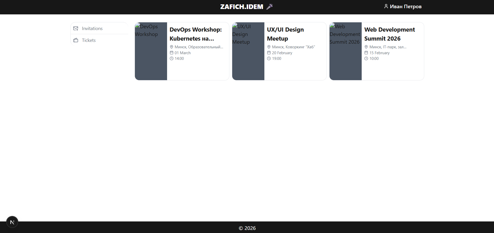
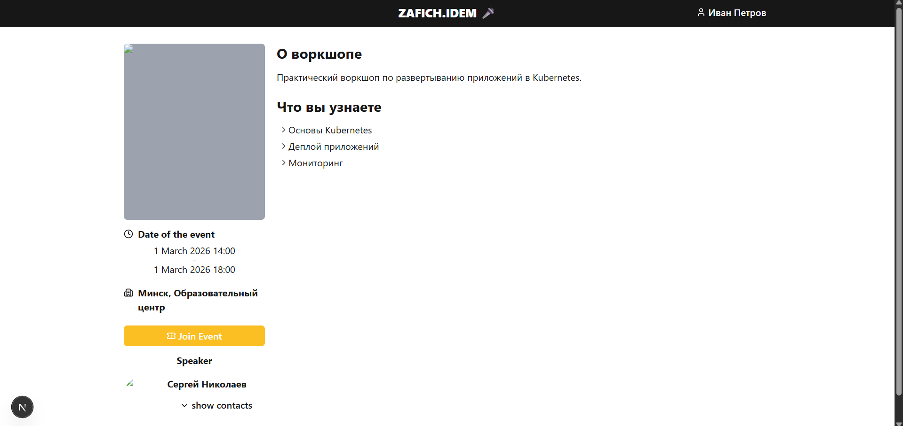
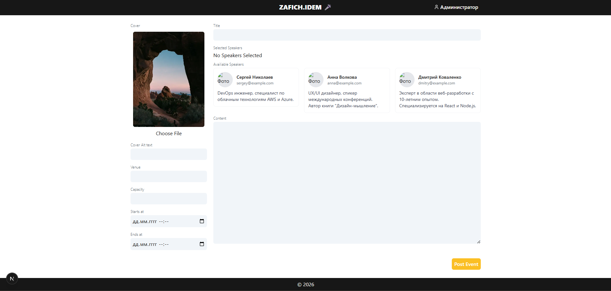
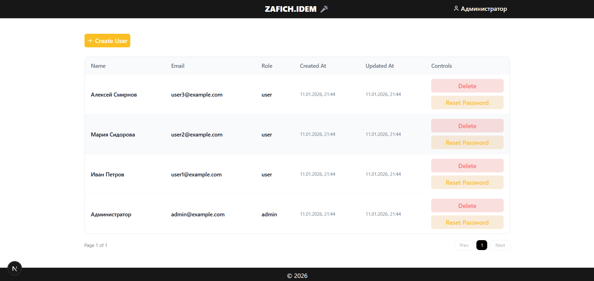

# 5 Разработка программы

## 5.1 Архитектура системы

Разработанная система построена по классической трёхзвенной архитектуре клиент-сервер, которая обеспечивает разделение ответственности между компонентами и упрощает масштабирование [1].

Архитектура системы состоит из трёх основных уровней. Уровень представления реализован в виде клиентского веб-приложения на базе Next.js, которое выполняется в браузере пользователя. Уровень бизнес-логики представлен серверным приложением на Node.js с фреймворком Express, обрабатывающим HTTP-запросы и реализующим бизнес-правила. Уровень данных включает базу данных MongoDB для хранения всей информации системы. Дополнительно используется внешнее хранилище Amazon S3 для размещения статических файлов, таких как изображения обложек событий и фотографии спикеров.

Взаимодействие между компонентами осуществляется по протоколу HTTP с использованием архитектурного стиля REST. Клиентское приложение отправляет запросы к API сервера, передавая данные в формате JSON. Сервер обрабатывает запросы, выполняет необходимые операции с базой данных и возвращает результаты также в формате JSON. Аутентификация осуществляется с помощью JWT-токенов, которые передаются через HTTP-only cookies для обеспечения безопасности.

Архитектура системы показана на рисунке 5.1.

Рисунок 5.1 – Архитектура системы

Как видно из рисунка 5.1, компоненты системы образуют многоуровневую структуру с чётким разделением зон ответственности. Клиентское приложение взаимодействует только с API сервера, не имея прямого доступа к базе данных. Сервер выступает посредником, обеспечивая валидацию данных, проверку прав доступа и выполнение бизнес-логики перед обращением к хранилищу данных.

## 5.2 Выбор технологического стека и его обоснование

Выбор технологий для реализации системы основан на требованиях к функциональности, производительности, безопасности и удобству разработки.

**Серверная часть.** В качестве платформы выполнения выбран Node.js версии 18 и выше. Эта платформа обеспечивает высокую производительность за счёт асинхронной модели обработки запросов и событийно-ориентированной архитектуры, что критично для веб-приложений с множественными одновременными подключениями [6]. Использование JavaScript на сервере позволяет разработчикам применять единый язык программирования на всём стеке, что упрощает разработку и поддержку кода.

Для построения REST API выбран фреймворк Express версии 5. Express предоставляет минималистичный и гибкий набор инструментов для создания веб-серверов, включая систему маршрутизации, middleware для обработки запросов и встроенную поддержку различных форматов данных. Фреймворк обладает обширной экосистемой дополнительных модулей и активным сообществом разработчиков.

В качестве базы данных используется MongoDB версии 8. Выбор обусловлен гибкостью документо-ориентированной модели данных, которая позволяет хранить вложенные структуры без необходимости создания множественных связанных таблиц. MongoDB обеспечивает высокую производительность операций чтения и записи, поддерживает горизонтальное масштабирование и имеет встроенные механизмы индексации [2]. Для взаимодействия с базой данных применяется библиотека Mongoose, которая предоставляет схемную валидацию данных, механизм моделей и удобный API для выполнения запросов.

Для аутентификации используется библиотека jsonwebtoken, реализующая спецификацию JWT. Токены обеспечивают stateless-аутентификацию, при которой сервер не хранит информацию о сессиях, что упрощает масштабирование системы [3]. Хэширование паролей выполняется с помощью библиотеки bcrypt, которая применяет криптографически стойкий алгоритм с настраиваемым количеством раундов для защиты от атак перебора.

Для обработки пользовательского контента применяется библиотека markdown-it для конвертации Markdown в HTML с подсветкой синтаксиса через модуль highlight.js. Санитизация HTML выполняется библиотекой sanitize-html для предотвращения XSS-атак путём фильтрации потенциально опасных тегов и атрибутов [5].

Работа с файлами организована с использованием библиотек multer для обработки загрузки файлов, sharp для оптимизации изображений и AWS SDK для взаимодействия с хранилищем Amazon S3. Управление переменными окружения обеспечивает библиотека dotenv. Настройка CORS выполняется с помощью соответствующего middleware для разрешения запросов с клиентского домена.

**Клиентская часть.** Фронтенд реализован с использованием фреймворка Next.js версии 16, построенного на основе React. Next.js предоставляет серверный рендеринг, автоматическую маршрутизацию на основе файловой структуры, оптимизацию производительности и встроенную поддержку TypeScript [7]. Использование серверных компонентов React улучшает производительность за счёт уменьшения объёма кода, передаваемого клиенту.

В качестве языка программирования применяется TypeScript, который добавляет статическую типизацию к JavaScript. Это позволяет выявлять ошибки на этапе разработки, улучшает читаемость кода и облегчает рефакторинг. Для управления формами используется библиотека react-hook-form, обеспечивающая эффективную валидацию и минимизацию повторных рендеров. Управление глобальным состоянием реализовано с помощью библиотеки zustand, которая предоставляет простой API для создания хранилищ состояния.

Стилизация компонентов выполнена с использованием фреймворка Tailwind CSS, который применяет utility-first подход с предопределёнными классами для быстрой вёрстки адаптивных интерфейсов. Библиотека Headless UI предоставляет доступные компоненты без предустановленных стилей для создания модальных окон и других интерактивных элементов. Иконки импортируются из библиотеки lucide-react.

Выбранный технологический стек обеспечивает высокую производительность, безопасность, удобство разработки и поддержки системы.

## 5.3 Структура серверной части

Серверное приложение организовано по модульному принципу с разделением кода на логические компоненты в соответствии с их назначением.

Главный файл index.ts выполняет инициализацию приложения. Загружаются переменные окружения из файла конфигурации. Создаётся экземпляр Express-приложения и настраиваются глобальные middleware. Middleware cors настроен на разрешение запросов с клиентского домена с поддержкой передачи cookies. Middleware express.json обеспечивает автоматический парсинг тел запросов в формате JSON. Middleware cookie-parser извлекает cookies из заголовков запросов. Middleware logger регистрирует информацию о каждом входящем запросе для целей мониторинга и отладки.

После настройки middleware подключаются маршруты API. Клиентские маршруты доступны по префиксу /api и включают endpoints для проверки работоспособности, управления пользователями, событиями, приглашениями и билетами. Административные маршруты доступны по префиксу /api/admin и включают endpoints для аутентификации администраторов, управления пользователями, спикерами и событиями. Для всех несуществующих маршрутов настроен обработчик, возвращающий статус 404 с соответствующим сообщением об ошибке.

Устанавливается соединение с базой данных MongoDB с использованием строки подключения из переменных окружения. После успешного подключения запускается HTTP-сервер на порту, указанном в конфигурации. В случае ошибки подключения к базе данных выводится сообщение об ошибке.

**Директория models** содержит определения схем и моделей данных для всех сущностей системы. Каждая модель описывает структуру документов в соответствующей коллекции MongoDB, правила валидации полей и статические методы для выполнения операций с данными. Модель User определяет схему пользователя с полями для имени, электронной почты, пароля и роли, а также методы signup, signin, adminSignin, createUser, patchUser, deleteUser и resetPassword. Модель Event описывает структуру события с вложенными схемами для обложки и контента, а также методы createEvent, patchEvent и deleteEvent. Модель Speaker содержит схему спикера с вложенными объектами контактов и фотографии, методы createSpeaker, patchSpeaker и deleteSpeaker. Модель Attendee описывает связь пользователя с событием и методы registerToEvent и unregisterFromEvent. Модель Ticket определяет структуру билета и методы createTicket и unregisterAtendeeFromEvent. Модель Invitation содержит схему приглашения и методы createInvitation и deleteInvitation.

**Директория controllers** содержит обработчики бизнес-логики для каждого endpoint. Контроллеры разделены на две поддиректории: client для клиентских операций и admin для административных. Клиентские контроллеры включают health.controller для проверки работоспособности, user.controller для регистрации и входа пользователей, events.controller для просмотра списка событий и деталей, получения информации об участниках, регистрации и отмены регистрации, ticket.controller для получения списка билетов пользователя, invitations.controller для создания приглашений и получения списка. Административные контроллеры включают users.controller для полного управления пользователями, events.controller для создания, редактирования и удаления событий, speaker.controller для управления спикерами.

**Директория routes** содержит определения маршрутов и связывает URL-пути с соответствующими контроллерами. Маршруты также разделены на client и admin. Каждый файл маршрутов создаёт экземпляр Express Router, определяет пути с указанием HTTP-методов и привязывает их к функциям контроллеров. Для защищённых маршрутов применяются middleware аутентификации и авторизации, проверяющие наличие и валидность JWT-токена, а также соответствие роли пользователя требованиям endpoint.

**Директория middlewares** содержит функции промежуточной обработки запросов. Middleware auth.middleware извлекает JWT-токен из cookies, верифицирует его с помощью секретного ключа, декодирует payload и добавляет информацию о пользователе в объект запроса для использования в контроллерах. Middleware admin.middleware выполняет аналогичные действия с дополнительной проверкой роли администратора. Middleware logger.middleware регистрирует метод, путь и временную метку каждого запроса. Middleware для обработки загрузки файлов настраивает multer для временного хранения файлов в памяти перед отправкой в S3.

**Директория utils** содержит вспомогательные функции общего назначения. Модуль hash.ts предоставляет функции hashPassword и comparePassword для работы с bcrypt. Модуль jwt.ts содержит функции signToken и verifyToken для генерации и проверки JWT-токенов. Модуль markdown.ts реализует функцию преобразования Markdown в HTML с подсветкой синтаксиса и санитизацией. Модули для генерации уникальных кодов билетов и имён файлов обеспечивают создание случайных значений с проверкой уникальности. Модуль для работы с массивами нормализует входные данные.

**Директория types** содержит определения TypeScript-интерфейсов для всех сущностей данных и типов запросов. Это обеспечивает строгую типизацию и автодополнение в редакторе кода.

**Директория constants** содержит константы приложения, включая HTTP-статусы, коды ответов, сообщения об ошибках и другие фиксированные значения, используемые в различных частях приложения.

## 5.4 Структура клиентской части

Клиентское приложение организовано в соответствии с архитектурой Next.js App Router, которая использует файловую систему для определения маршрутов.

Главный файл page.tsx в корне директории app является точкой входа в приложение. Он перенаправляет пользователей на страницу логина или главную страницу в зависимости от состояния аутентификации. Файл layout.tsx определяет общую структуру HTML-документа, подключает глобальные стили и настраивает метаданные страницы.

**Директория (web)** содержит маршруты для обычных пользователей. Группирующие скобки используются для организации файлов без влияния на URL-пути. Страница login содержит форму входа и регистрации с валидацией полей. Страница register аналогична странице login и предназначена для новых пользователей. Страница events/[id] отображает детальную информацию о конкретном событии с возможностью регистрации и отправки приглашений. Страница tickets показывает список билетов текущего пользователя с информацией о событиях. Страница invitations отображает полученные приглашения с возможностью их удаления.

**Директория (admin)** содержит маршруты для администраторов. Главная страница admin отображает панель управления с навигацией по административным разделам. Страница admin/users предоставляет таблицу всех пользователей с возможностями создания, редактирования и удаления учётных записей. Страница admin/speakers содержит список спикеров с функциями добавления, редактирования и удаления. Страница admin/events/create предназначена для создания нового события с заполнением всех необходимых полей. Страница admin/events/[id] позволяет редактировать существующее событие с предзагруженными данными.

**Директория module** содержит переиспользуемые модули и компоненты. Каждый модуль представляет собой самодостаточный блок функциональности со своей структурой папок. Модуль event-page включает компоненты для отображения детальной информации о событии, включая элементы info для общей информации, content для описания, invite-modal для модального окна приглашений. Модуль event-page-admin содержит компоненты для административного редактирования события, включая speaker-list для управления списком спикеров и confirm-modal для подтверждения действий. Модуль login-page предоставляет форму входа с валидацией. Модуль user-edit включает компоненты для административного управления пользователями, в том числе users-list для табличного отображения и edit-user-modal для модального окна редактирования.

Каждый модуль организован по структуре, включающей основной файл компонента с расширением module.tsx, файл services.tsx с бизнес-логикой и API-вызовами, поддиректорию element для вложенных компонентов, файл index.ts для экспорта публичного API модуля.

**Директория shared** содержит общие компоненты, используемые в различных частях приложения. Сюда входят компоненты кнопок, полей ввода, модальных окон, карточек событий, навигационных элементов. Каждый компонент типизирован с использованием TypeScript и принимает пропсы для настройки внешнего вида и поведения.

**Директория api** содержит модули для взаимодействия с серверным API. Каждый модуль соответствует группе связанных endpoints и предоставляет функции для выполнения HTTP-запросов. Модуль events.api включает функции для получения списка событий, детальной информации, регистрации и отмены регистрации. Модуль users.api содержит функции для регистрации, входа и управления пользователями. Модуль tickets.api предоставляет функции для получения билетов. Модуль invitations.api включает функции для создания и удаления приглашений. Все запросы выполняются с использованием нативного Fetch API с автоматическим включением cookies для аутентификации.

**Директория stores** содержит хранилища глобального состояния, созданные с помощью zustand. Хранилище auth хранит информацию об аутентифицированном пользователе и его роли. Хранилище events содержит кэшированный список событий. Каждое хранилище предоставляет методы для обновления состояния и селекторы для извлечения данных.

Структура клиентского приложения обеспечивает модульность, переиспользование кода и упрощает навигацию по проекту.

## 5.5 Спецификация API

API системы предоставляет набор endpoints для выполнения операций с данными. Все endpoints возвращают данные в формате JSON. Для защищённых endpoints требуется наличие валидного JWT-токена в cookie с именем token.

В таблице 5.1 представлена спецификация клиентских endpoints API системы.

Таблица 5.1 – Клиентские endpoints API

| Endpoint | Метод | Описание | Тело запроса | Ответ | Ошибки |
|----------|-------|----------|--------------|-------|--------|
| /api/health | GET | Проверка работоспособности сервера | — | `{ status: "ok" }` | — |
| /api/user/signup | POST | Регистрация нового пользователя | `{ email, password, name }` | `{ status, data: { user } }` | 400: недостающие поля, короткий пароль; 409: email занят |
| /api/user/signin | POST | Вход пользователя | `{ email, password }` | `{ status, data: { user } }`, cookie с токеном | 400: недостающие поля; 401: неверные данные |
| /api/user/me | GET | Получение данных текущего пользователя | — | `{ status, data: { user } }` | 401: не авторизован |
| /api/events | GET | Получение списка событий | query: `page, limit, search` | `{ status, data: { events, pagination } }` | — |
| /api/events/:id | GET | Получение детальной информации о событии | — | `{ status, data: { event } }` | 404: событие не найдено |
| /api/events/:id/attendees | GET | Получение списка участников события | — | `{ status, data: { attendees } }` | 404: событие не найдено |
| /api/events/:id/register | POST | Регистрация на событие | — | `{ status, data: { ticket } }` | 400: нет мест; 409: уже зарегистрирован; 401: не авторизован |
| /api/events/:id/unregister | DELETE | Отмена регистрации | — | `{ status, data: { deleted } }` | 404: не зарегистрирован; 401: не авторизован |
| /api/tickets | GET | Получение списка билетов пользователя | — | `{ status, data: { tickets } }` | 401: не авторизован |
| /api/invitations | POST | Создание приглашения | `{ user_invited, event }` | `{ status, data: { invitation } }` | 400: недостающие поля, самоприглашение; 409: уже приглашён; 401: не авторизован |
| /api/invitations | GET | Получение списка приглашений | — | `{ status, data: { invitations } }` | 401: не авторизован |
| /api/invitations/:id | DELETE | Удаление приглашения | — | `{ status, data: { deleted } }` | 404: не найдено; 401: не авторизован |

В таблице 5.2 представлена спецификация административных endpoints API системы.

Таблица 5.2 – Административные endpoints API

| Endpoint | Метод | Описание | Тело запроса | Ответ | Ошибки |
|----------|-------|----------|--------------|-------|--------|
| /api/admin/signin | POST | Вход администратора | `{ email, password }` | `{ status, data: { user } }`, cookie с токеном | 400: недостающие поля; 401: неверные данные; 403: не администратор |
| /api/admin/users | GET | Получение списка всех пользователей | query: `page, limit` | `{ status, data: { users, pagination } }` | 401: не авторизован; 403: не администратор |
| /api/admin/users | POST | Создание пользователя | `{ email, password, name, role }` | `{ status, data: { user } }` | 400: недостающие поля, короткий пароль; 409: email занят; 401/403: не авторизован |
| /api/admin/users/:id | PATCH | Редактирование пользователя | `{ email, name, role }` | `{ status, data: { user } }` | 400: недостающие поля; 404: не найден; 409: email занят; 401/403: не авторизован |
| /api/admin/users/:id | DELETE | Удаление пользователя | — | `{ status, data: { deleted } }` | 404: не найден; 401/403: не авторизован |
| /api/admin/users/:id/reset-password | PATCH | Сброс пароля пользователя | `{ password }` | `{ status, data: { user } }` | 400: недостающие поля, короткий пароль; 404: не найден; 401/403: не авторизован |
| /api/admin/speakers | GET | Получение списка спикеров | query: `page, limit` | `{ status, data: { speakers, pagination } }` | 401/403: не авторизован |
| /api/admin/speakers | POST | Создание спикера | `{ name, bio, contacts, photo }` | `{ status, data: { speaker } }` | 400: недостающие поля; 401/403: не авторизован |
| /api/admin/speakers/:id | PATCH | Редактирование спикера | `{ name, bio, contacts, photo }` | `{ status, data: { speaker } }` | 400: недостающие поля; 404: не найден; 401/403: не авторизован |
| /api/admin/speakers/:id | DELETE | Удаление спикера | — | `{ status, data: { deleted } }` | 404: не найден; 401/403: не авторизован |
| /api/admin/events | GET | Получение списка событий | query: `page, limit` | `{ status, data: { events, pagination } }` | 401/403: не авторизован |
| /api/admin/events | POST | Создание события | `{ title, cover, content, capacity, venue, speakers, startsAt, endsAt }` | `{ status, data: { event } }` | 400: недостающие поля, некорректные даты/вместимость; 401/403: не авторизован |
| /api/admin/events/:id | PATCH | Редактирование события | частичный объект события | `{ status, data: { event } }` | 400: некорректные данные; 404: не найдено; 401/403: не авторизован |
| /api/admin/events/:id | DELETE | Удаление события | — | `{ status, data: { deleted } }` | 404: не найдено; 401/403: не авторизован |

Все успешные ответы имеют структуру с полем status со значением success и полем data, содержащим запрошенные или изменённые данные. Ответы с ошибками содержат поле status со значением error, поле message с описанием ошибки и поле code с HTTP-статусом.

## 5.6 Модель данных и индексация

Модель данных системы реализована в виде коллекций MongoDB, каждая из которых хранит документы определённого типа.

**Коллекция users** содержит документы пользователей. Структура документа включает поля: _id типа ObjectId, уникальный идентификатор; name типа String, имя пользователя, может быть null; email типа String, уникальный адрес электронной почты, обязательное поле; password типа String, хэшированный пароль, обязательное поле; role типа String с возможными значениями user или admin, по умолчанию user; createdAt типа Date, временная метка создания; updatedAt типа Date, временная метка последнего обновления. На поле email создан уникальный индекс для обеспечения уникальности адресов и ускорения поиска пользователей при аутентификации.

**Коллекция events** содержит документы событий. Структура включает: _id типа ObjectId; title типа String, название события, обязательное поле; cover типа вложенного объекта с полями name (String) и alt (String) для информации об обложке; content типа вложенного объекта с полями md (String) для Markdown-текста и html (String) для преобразованного HTML; capacity типа Number, вместимость, по умолчанию 100; venue типа String, место проведения; speakers типа массива ObjectId со ссылками на документы спикеров; startsAt типа Date, дата и время начала, обязательное поле; endsAt типа Date, дата и время окончания, обязательное поле; createdAt и updatedAt типа Date. Индексы создаются на полях startsAt для сортировки и фильтрации по времени проведения и на поле title для поиска событий по названию.

**Коллекция speakers** содержит документы спикеров. Структура: _id типа ObjectId; name типа String, имя спикера, обязательное поле; bio типа String, биография, обязательное поле; contacts типа вложенного объекта с полями telegram (String), phone (String) и email (String); photo типа вложенного объекта с полями name (String) и alt (String); createdAt и updatedAt типа Date. Индекс на поле name ускоряет поиск спикеров по имени.

**Коллекция attendees** содержит документы участников. Структура: _id типа ObjectId; user_id типа ObjectId со ссылкой на пользователя, обязательное поле; event_id типа ObjectId со ссылкой на событие, обязательное поле; createdAt и updatedAt типа Date. Создан составной уникальный индекс на пару полей user_id и event_id для предотвращения дублирующих регистраций и ускорения проверки наличия регистрации. Также созданы отдельные индексы на каждое из полей для ускорения запросов списка участников события и списка событий пользователя.

**Коллекция tickets** содержит документы билетов. Структура: _id типа ObjectId; atendee_id типа ObjectId со ссылкой на участника, обязательное поле; user_id типа ObjectId со ссылкой на пользователя, обязательное поле; event типа ObjectId со ссылкой на событие, обязательное поле; code типа Number, восьмизначный уникальный код, обязательное поле; createdAt и updatedAt типа Date. Создан уникальный индекс на поле code для обеспечения уникальности кодов билетов. Индекс на поле user_id ускоряет получение списка билетов пользователя. Индекс на atendee_id обеспечивает быстрый поиск билета по участнику при отмене регистрации.

**Коллекция invitations** содержит документы приглашений. Структура: _id типа ObjectId; user_invited типа ObjectId со ссылкой на приглашённого пользователя, обязательное поле; invited_by типа ObjectId со ссылкой на отправителя, обязательное поле; event типа ObjectId со ссылкой на событие, обязательное поле; createdAt и updatedAt типа Date. Создан составной уникальный индекс на комбинацию полей user_invited, invited_by и event для предотвращения дублирующих приглашений. Индекс на поле user_invited ускоряет получение списка приглашений для пользователя.

Использование индексов критично для обеспечения производительности системы при работе с большими объёмами данных. Уникальные индексы дополнительно обеспечивают целостность данных на уровне базы.

## 5.7 Безопасность и обработка ошибок

Система реализует несколько уровней защиты для обеспечения безопасности данных и предотвращения несанкционированного доступа.

**Аутентификация и авторизация.** Пароли пользователей хэшируются с использованием bcrypt с коэффициентом сложности 10 раундов перед сохранением в базу данных. При успешной аутентификации генерируется JWT-токен, содержащий идентификатор пользователя и роль. Токен подписывается секретным ключом, хранящимся в переменных окружения, и имеет ограниченное время жизни, после которого требуется повторная аутентификация. Токен передаётся клиенту через HTTP-only cookie, что предотвращает доступ к нему из JavaScript-кода и защищает от XSS-атак [3].

Middleware аутентификации проверяет наличие токена в каждом запросе к защищённым endpoints, верифицирует подпись токена и извлекает данные пользователя. При отсутствии токена или его недействительности возвращается ошибка с кодом 401. Административные endpoints дополнительно проверяют роль пользователя через специальный middleware. При несоответствии роли возвращается ошибка с кодом 403.

**Защита от инъекций.** Использование Mongoose для работы с базой данных обеспечивает автоматическую защиту от NoSQL-инъекций за счёт параметризации запросов. Все пользовательские вводы валидируются на уровне схем данных. Санитизация HTML-контента выполняется библиотекой sanitize-html, которая фильтрует потенциально опасные теги и атрибуты, предотвращая XSS-атаки [5]. Разрешены только безопасные теги для форматирования текста и вставки изображений.

**CORS и заголовки безопасности.** Middleware cors настроен на разрешение запросов только с определённых доменов, указанных в конфигурации. Включена поддержка передачи credentials для работы с cookies. Это предотвращает выполнение запросов к API с неавторизованных доменов.

**Обработка ошибок.** Все контроллеры обёрнуты в конструкции try-catch для перехвата исключений. При возникновении ошибки формируется структурированный ответ с полями status, message и code. Код HTTP-ответа соответствует типу ошибки: 400 для ошибок валидации, 401 для ошибок аутентификации, 403 для ошибок авторизации, 404 для отсутствующих ресурсов, 409 для конфликтов уникальности, 500 для внутренних ошибок сервера. Сообщения об ошибках не раскрывают внутреннюю структуру системы.

Валидация данных выполняется на нескольких уровнях. На уровне схем Mongoose определены требования к типам полей, обязательности и формату. В статических методах моделей выполняется дополнительная бизнес-валидация, например проверка соотношения дат начала и окончания события. В контроллерах проверяется наличие необходимых данных в запросе.

Логирование запросов позволяет отслеживать активность в системе и выявлять подозрительное поведение. Middleware logger регистрирует метод, путь и время каждого запроса.

## 5.8 Конфигурация окружения и инструкция по запуску

Для работы системы необходимо настроить переменные окружения и установить зависимости.

**Требования к окружению.** Для запуска системы необходимо наличие Node.js версии 18 или выше и пакетного менеджера npm. Требуется доступ к экземпляру MongoDB версии 4 или выше. Для хранения изображений необходим аккаунт Amazon Web Services с настроенным сервисом S3.

**Настройка серверной части.** В директории backend необходимо создать файл .env с переменными окружения. Переменная MONGO_URI содержит строку подключения к MongoDB в формате mongodb://host:port/database или mongodb+srv для MongoDB Atlas. Переменная PORT указывает порт, на котором будет запущен HTTP-сервер, например 3001. Переменная JWT_SECRET содержит секретный ключ для подписи токенов, должна быть достаточно длинной и случайной. Переменная JWT_EXPIRES_IN определяет время жизни токенов, например 7d для семи дней. Переменные для AWS SDK включают AWS_REGION для региона S3, AWS_ACCESS_KEY_ID и AWS_SECRET_ACCESS_KEY для аутентификации, AWS_S3_BUCKET_NAME для имени бакета.

Установка зависимостей выполняется командой npm install в директории backend. Запуск сервера в режиме разработки с автоматической перезагрузкой при изменении файлов осуществляется командой npm run dev. Сервер будет доступен по адресу http://localhost:PORT, где PORT — значение из переменных окружения.

**Настройка клиентской части.** В директории frontend создаётся файл .env.local с переменными для клиента. Переменная NEXT_PUBLIC_API_BASE_URL содержит базовый URL API для клиентских запросов, например http://localhost:3001/api. Переменная NEXT_PUBLIC_API_ADMIN_BASE_URL содержит базовый URL для административных запросов, например http://localhost:3001/api/admin. Переменная NODE_ENV определяет режим работы со значением development или production. Переменная NEXT_PUBLIC_S3_PUBLIC_URL содержит публичный URL бакета S3 для отображения изображений.

Установка зависимостей выполняется командой npm install в директории frontend. Запуск клиента в режиме разработки осуществляется командой npm run dev. Приложение будет доступно по адресу http://localhost:3000.

**Инициализация данных.** После первого запуска рекомендуется создать учётную запись администратора для доступа к административной панели. Это можно сделать через прямое добавление записи в коллекцию users с указанием роли admin и хэшированным паролем, либо через временный endpoint для регистрации администратора.

Система готова к использованию после запуска обоих компонентов и создания административной учётной записи. Пользователи могут регистрироваться через веб-интерфейс, администраторы получают доступ к панели управления после аутентификации.

Главная страница системы для обычных пользователей показана на рисунке 5.2.

Рисунок 5.2 – Главная страница с списком событий

На главной странице отображается список всех доступных событий с основной информацией: обложкой, названием, временем проведения и местом. Пользователи могут кликнуть на карточку события для просмотра детальной информации.

Детальная страница события показана на рисунке 5.3.

Рисунок 5.3 – Страница детальной информации о событии

Согласно рисунку 5.3, страница содержит полное описание события в формате HTML, информацию о спикерах с их фотографиями и биографиями, а также кнопки для регистрации на мероприятие и отправки приглашений другим пользователям. Если пользователь уже зарегистрирован, отображается кнопка отмены регистрации.

Административная панель управления событиями показана на рисунке 5.4.

Рисунок 5.4 – Административная панель создания события

Как видно из рисунка 5.4, форма создания события включает поля для всех необходимых данных: название, загрузка обложки, редактор описания с поддержкой Markdown, поля для даты и времени начала и окончания, место проведения, вместимость и возможность выбора спикеров из существующего списка. После заполнения всех обязательных полей администратор может создать событие.

Страница управления пользователями показана на рисунке 5.5.

Рисунок 5.5 – Административная панель управления пользователями

Согласно рисунку 5.5, таблица содержит список всех пользователей с отображением имени, электронной почты и роли. Доступны кнопки для редактирования данных пользователя, сброса пароля и удаления учётной записи. Также присутствует кнопка для создания нового пользователя.
