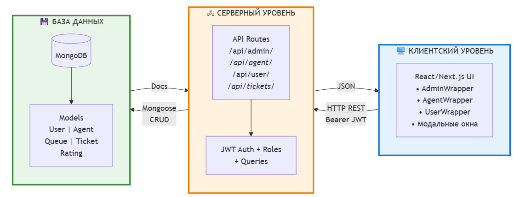
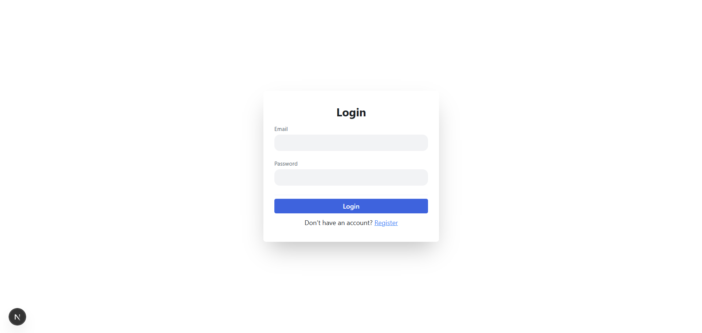
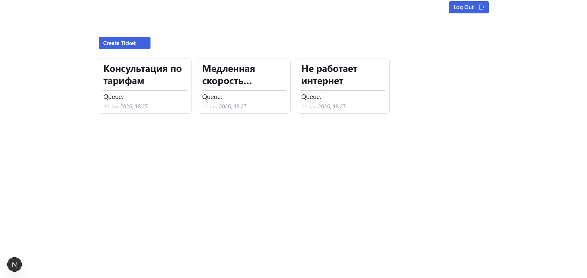
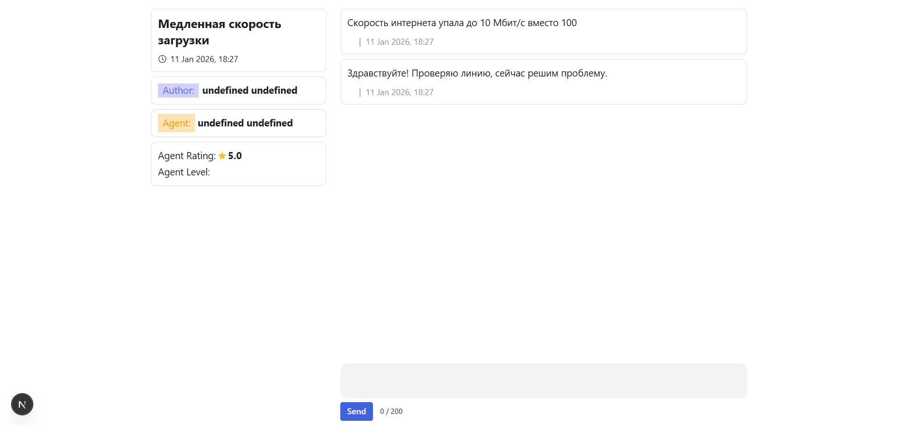
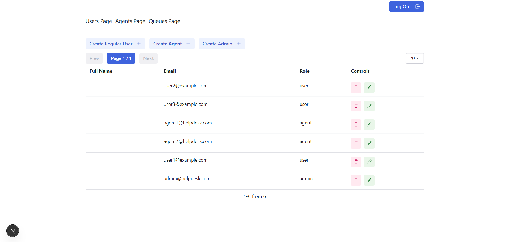

# 5 Разработка программы

Данный раздел описывает архитектуру разработанной системы, выбранные технологии, структуру модулей и интерфейс программирования приложения.

## 5.1 Архитектура системы

Система построена по архитектуре клиент-сервер с единой кодовой базой, объединяющей frontend и backend компоненты. Архитектурное решение основано на фреймворке Next.js [1], который предоставляет возможности полнофункционального веб-приложения с серверным рендерингом и API-маршрутами в рамках одного проекта.

На рисунке 5.1 представлена общая архитектура системы.

Рисунок 5.1 – Архитектура системы

Как видно из рисунка 5.1, система включает три основных уровня: клиентский уровень, серверный уровень и уровень хранения данных. Клиентский уровень реализован в виде одностраничного приложения на основе библиотеки React [8] и выполняется в браузере пользователя. Серверный уровень обрабатывает HTTP-запросы, выполняет бизнес-логику, аутентификацию и взаимодействие с базой данных. Уровень хранения данных представлен документо-ориентированной базой данных MongoDB [2].

Взаимодействие между клиентом и сервером осуществляется по протоколу HTTP с использованием REST API [9]. Клиентское приложение отправляет запросы к серверным endpoint, передавая данные в формате JSON. Сервер обрабатывает запросы, выполняет необходимые операции с базой данных и возвращает результаты в формате JSON. Для защищённых endpoint клиент включает в запросы JWT-токен в заголовке Authorization.

Архитектура Next.js обеспечивает несколько преимуществ для разработки полнофункционального веб-приложения. Использование единой кодовой базы упрощает разработку и поддержку проекта. Встроенная система маршрутизации на основе файловой структуры обеспечивает понятную организацию кода. Возможность серверного рендеринга улучшает производительность загрузки страниц. API-маршруты позволяют реализовать backend-логику без необходимости создания отдельного серверного приложения.

Клиентская часть организована по компонентному принципу. Пользовательский интерфейс разбит на переиспользуемые компоненты React, каждый из которых отвечает за отображение определённой части интерфейса. Состояние приложения управляется с использованием библиотеки Zustand [10], обеспечивающей централизованное хранилище данных и реактивное обновление интерфейса при изменении состояния.

Серверная часть организована в виде набора API-маршрутов, каждый из которых обрабатывает определённый тип запросов. Маршруты сгруппированы по функциональным областям: административные операции, операции пользователей, операции агентов, работа с тикетами и оценками. Каждый маршрут включает логику валидации входных данных, авторизации, обработки бизнес-логики и формирования ответа.

Взаимодействие с базой данных осуществляется через объектно-документное отображение с использованием библиотеки Mongoose [6]. Mongoose предоставляет схемы данных, валидацию, типизацию и удобный API для выполнения операций с MongoDB. Определение схем моделей обеспечивает структурированность данных и автоматическую валидацию при сохранении документов.

## 5.2 Выбор технологического стека

Выбор технологий для реализации системы обусловлен требованиями к функциональности, производительности и удобству разработки.

В качестве основной платформы выбран Node.js версии 20 и выше [11]. Node.js представляет среду выполнения JavaScript на сервере, построенную на движке V8. Использование JavaScript как на клиенте, так и на сервере обеспечивает единообразие кодовой базы и позволяет разработчикам применять одни и те же языковые конструкции на всех уровнях приложения. Node.js обеспечивает высокую производительность за счёт асинхронной неблокирующей модели ввода-вывода и эффективен для приложений с интенсивным сетевым взаимодействием.

Фреймворк Next.js версии 16 выбран для построения веб-приложения [1]. Next.js расширяет возможности React дополнительными функциями для production-окружения: серверным рендерингом, статической генерацией, оптимизацией изображений, встроенной системой маршрутизации и API-маршрутами. Использование Next.js позволяет создавать быстрые и SEO-оптимизированные веб-приложения с минимальной конфигурацией.

Библиотека React версии 19 используется для построения пользовательского интерфейса [8]. React предоставляет декларативный подход к созданию интерактивных интерфейсов на основе компонентов. Виртуальный DOM обеспечивает эффективное обновление интерфейса при изменении данных. Обширная экосистема библиотек и инструментов React упрощает разработку сложных интерфейсов.

База данных MongoDB выбрана для хранения данных системы [2]. MongoDB представляет документо-ориентированную NoSQL базу данных, хранящую данные в формате BSON (бинарный JSON). Гибкая схема данных позволяет легко адаптировать структуру документов при изменении требований. Поддержка встроенных документов и массивов обеспечивает естественное представление иерархических данных, таких как сообщения внутри тикетов. Хорошая интеграция с Node.js через драйверы и библиотеку Mongoose упрощает взаимодействие с базой данных.

Библиотека Mongoose версии 8 используется для объектно-документного отображения [6]. Mongoose предоставляет уровень абстракции над нативным драйвером MongoDB, включая определение схем, валидацию данных, middleware для операций с документами и типизацию. Использование схем обеспечивает структурированность и согласованность данных в коллекциях.

Для аутентификации применяется библиотека jsonwebtoken [3], реализующая стандарт JSON Web Token. JWT обеспечивает stateless-аутентификацию, где сервер не хранит информацию о сессиях пользователей. Токен содержит закодированную информацию о пользователе и подписан секретным ключом сервера, что предотвращает подделку.

Хеширование паролей выполняется библиотекой bcryptjs [7], реализующей алгоритм bcrypt. Bcrypt является стандартом для безопасного хеширования паролей и включает автоматическую генерацию соли, защиту от rainbow table атак и настраиваемую сложность вычислений.

Для построения пользовательского интерфейса применяется библиотека компонентов Radix UI [12], предоставляющая набор доступных и настраиваемых компонентов. Стилизация выполнена с использованием фреймворка Tailwind CSS [13], реализующего подход utility-first для быстрого создания адаптивных интерфейсов.

Управление состоянием клиентского приложения осуществляется библиотекой Zustand [10], предоставляющей минималистичное API для создания глобального хранилища состояния. Zustand обеспечивает простоту использования по сравнению с более сложными решениями и хорошо интегрируется с React hooks.

Для работы с датами и временем используется библиотека Day.js [14], предоставляющая лёгкий API для парсинга, валидации, манипуляции и форматирования дат.

## 5.3 Структура серверных модулей

Серверная часть приложения организована в директории app/api с использованием файловой системы маршрутизации Next.js. Каждая директория в app/api соответствует сегменту URL, а файлы route.js содержат обработчики HTTP-методов для соответствующих endpoint.

Модуль административных операций с пользователями расположен в app/api/admin/users и реализует CRUD-операции. Обработчик GET получает список всех пользователей с поддержкой пагинации через параметры page и limit. Обработчик POST создаёт нового пользователя с указанными данными после валидации и хеширования пароля. Динамический маршрут app/api/admin/users/[id] обрабатывает операции с конкретным пользователем: GET возвращает данные пользователя по идентификатору, PATCH выполняет частичное обновление полей, DELETE удаляет пользователя из системы. Все операции доступны только администраторам.

Модуль административных операций с агентами расположен в app/api/admin/agents и имеет аналогичную структуру. При создании агента выполняется проверка существования связанного пользователя и создание документа Agent с указанными level и capacity. Обновление и удаление агентов также требуют административных прав.

Модуль административных операций с очередями расположен в app/api/admin/queue. Операции включают получение списка очередей, создание новой очереди с указанием названия, обновление названия существующей очереди и удаление очереди. Удаление очереди проверяет отсутствие связанных с ней тикетов для предотвращения нарушения целостности данных.

Модуль операций агента расположен в app/api/agent. Маршрут GET app/api/agent возвращает информацию о текущем агенте. Маршрут GET app/api/agent/tickets возвращает список тикетов, доступных агенту для обработки, включая незанятые тикеты в его очередях и тикеты, назначенные на него. Маршрут POST app/api/agent/tickets/[id]/claim реализует принятие тикета агентом с проверкой вместимости. Маршрут POST app/api/agent/tickets/[id]/close выполняет закрытие тикета с установкой флага isClose.

Модуль операций пользователя расположен в app/api/user. Маршрут POST app/api/user/register реализует регистрацию с созданием пользователя с ролью user. Маршрут POST app/api/user/login выполняет аутентификацию с проверкой пароля и генерацией токена. Маршрут GET app/api/user/tickets возвращает список тикетов текущего пользователя. Маршрут POST app/api/user/tickets создаёт новый тикет с начальным сообщением.

Модуль операций с тикетами расположен в app/api/tickets. Динамический маршрут app/api/tickets/[id] реализует GET для получения детальной информации о тикете с проверкой прав доступа. Маршрут POST app/api/tickets/[id]/messages добавляет новое сообщение в тикет с определением отправителя на основе роли. Маршрут GET app/api/tickets/[id]/rating возвращает оценки, связанные с тикетом. Маршрут GET app/api/tickets/[id]/stream реализует потоковую передачу обновлений тикета для реализации real-time функциональности.

Модуль операций с очередями app/api/queues предоставляет GET-endpoint для получения списка всех очередей, доступный всем аутентифицированным пользователям для выбора очереди при создании тикета.

Модуль операций с оценками app/api/ratings реализует POST для создания новой оценки с валидацией, что тикет закрыт и имеет назначенного агента, и GET для получения списка оценок с фильтрацией по агенту или пользователю в зависимости от роли.

Все серверные модули используют middleware-функции для проверки аутентификации и авторизации. Функции извлекают токен из заголовка, декодируют его, проверяют роль пользователя и прикрепляют данные пользователя к объекту запроса. При ошибках аутентификации или авторизации возвращаются соответствующие HTTP-коды статуса и сообщения об ошибках.

## 5.4 Структура клиентских модулей

Клиентская часть приложения организована в директории app с использованием файловой системы маршрутизации Next.js для страниц. Компоненты интерфейса расположены в директории components, модальные окна в директории modals, функции запросов к API в директории queries, модели данных в директории models, вспомогательные функции в директории lib, хранилище состояния в директории store.

Страница входа в систему расположена в app/login/page.jsx и реализует форму с полями email и password. При отправке формы выполняется запрос к endpoint аутентификации. При успешном входе токен сохраняется в localStorage, и пользователь перенаправляется на главную страницу. При ошибке отображается информативное сообщение.

На рисунке 5.2 показана страница входа в систему.

Рисунок 5.2 – Страница входа в систему

Согласно рисунку 5.2, интерфейс входа содержит поля для ввода учётных данных, кнопку отправки формы и ссылку на страницу регистрации.

Страница регистрации расположена в app/register/page.jsx и включает дополнительные поля firstname и lastname. Логика аналогична странице входа с запросом к endpoint регистрации.

Главная страница приложения расположена в app/page.jsx и отображает различное содержимое в зависимости от роли пользователя. Для обычного пользователя отображается список его тикетов с возможностью создания нового тикета. Для агента отображается список доступных и назначенных тикетов. Для администратора отображается панель выбора управляемой сущности.

На рисунке 5.3 представлена главная страница пользователя со списком тикетов.

Рисунок 5.3 – Главная страница пользователя

Как видно из рисунка 5.3, интерфейс отображает список тикетов в виде карточек с информацией о заголовке, очереди, статусе и времени создания.

Страница детального просмотра тикета расположена в app/ticket/[id]/page.jsx и отображает полную информацию о тикете, включая все сообщения в виде ленты. Пользователь и агент могут отправлять новые сообщения через форму внизу страницы. Агент видит кнопки для принятия или закрытия тикета в зависимости от его статуса. Пользователь видит возможность оставить оценку после закрытия тикета.

На рисунке 5.4 показана страница тикета с историей сообщений.

Рисунок 5.4 – Страница тикета с сообщениями

Согласно рисунку 5.4, сообщения отображаются в хронологическом порядке с указанием отправителя и времени создания.

Административные страницы расположены в app/admin и включают страницы управления пользователями, агентами и очередями. Каждая страница отображает список сущностей в табличном виде с кнопками создания, редактирования и удаления.

На рисунке 5.5 представлена административная панель управления пользователями.

Рисунок 5.5 – Административная панель управления пользователями

Как видно из рисунка 5.5, интерфейс включает таблицу пользователей с информацией об имени, email и роли, а также кнопки для выполнения операций.

Компоненты интерфейса организованы по принципу переиспользуемости. Компонент Input реализует стилизованное текстовое поле. Компонент Select реализует выпадающий список. Компонент MyButton реализует кнопку с различными вариантами стилизации. Компонент Header реализует навигационную панель с информацией о текущем пользователе и кнопкой выхода. Компонент AuthGuard реализует защиту маршрутов с проверкой аутентификации и перенаправлением на страницу входа при отсутствии токена.

Модальные окна реализуют формы для создания и редактирования сущностей. Компонент CreateTicketModal отображает форму создания тикета с выбором очереди и вводом заголовка и сообщения. Компонент CreateFeedback отображает форму оставления оценки с выбором балла и вводом комментария. Административные модальные окна реализуют формы создания и редактирования пользователей, агентов и очередей.

Функции запросов к API организованы в директории queries и инкапсулируют логику выполнения HTTP-запросов. Функции добавляют токен из localStorage в заголовки запросов, обрабатывают ответы и ошибки, возвращают данные или выбрасывают исключения. Использование отдельных функций запросов обеспечивает единообразие обработки API-взаимодействия и упрощает тестирование.

Хранилище состояния реализовано с использованием Zustand и содержит глобальное состояние приложения, включая информацию о текущем пользователе, списки тикетов, очередей и других сущностей. Компоненты подписываются на изменения состояния и автоматически обновляются при его изменении.

## 5.5 Спецификация API

API системы реализует архитектурный стиль REST [9] с использованием HTTP-методов для выполнения операций над ресурсами. Все запросы и ответы используют формат JSON. Защищённые endpoint требуют наличия JWT-токена в заголовке Authorization в формате Bearer.

Таблица 5.1 содержит спецификацию endpoint аутентификации и регистрации.

Таблица 5.1 – API аутентификации

| Endpoint | Метод | Request Body | Response | Ошибки |
|----------|-------|--------------|----------|--------|
| /user/register | POST | {firstname, lastname, email, password} | 201: {token, firstname, lastname, role, email} | 400: валидация, 409: email существует |
| /user/login | POST | {email, password} | 200: {token, firstname, lastname, role, email} | 401: неверные credentials |

Таблица 5.2 содержит спецификацию административных endpoint для управления пользователями.

Таблица 5.2 – API управления пользователями

| Endpoint | Метод | Request Body | Response | Ошибки |
|----------|-------|--------------|----------|--------|
| /admin/users | GET | Параметры: page, limit | 200: {users: [...], pagination} | 401, 403 |
| /admin/users | POST | {firstname, lastname, email, password, role} | 201: {user} | 400, 401, 403 |
| /admin/users/{id} | GET | - | 200: {user} | 401, 403, 404 |
| /admin/users/{id} | PATCH | Частичные поля | 200: {user} | 400, 401, 403, 404 |
| /admin/users/{id} | DELETE | - | 204 | 401, 403, 404 |

Таблица 5.3 содержит спецификацию административных endpoint для управления агентами.

Таблица 5.3 – API управления агентами

| Endpoint | Метод | Request Body | Response | Ошибки |
|----------|-------|--------------|----------|--------|
| /admin/agents | GET | Параметры: page, limit | 200: {agents: [...], pagination} | 401, 403 |
| /admin/agents | POST | {firstname, lastname, email, password, level, capacity} | 201: {agent, user} | 400, 401, 403 |
| /admin/agents/{id} | GET | - | 200: {agent} | 401, 403, 404 |
| /admin/agents/{id} | PATCH | Частичные поля | 200: {agent} | 400, 401, 403, 404 |
| /admin/agents/{id} | DELETE | - | 204 | 401, 403, 404 |

Таблица 5.4 содержит спецификацию административных endpoint для управления очередями.

Таблица 5.4 – API управления очередями

| Endpoint | Метод | Request Body | Response | Ошибки |
|----------|-------|--------------|----------|--------|
| /admin/queue | GET | - | 200: {queues: [...]} | 401, 403 |
| /admin/queue | POST | {title} | 201: {queue} | 400, 401, 403 |
| /admin/queue/{id} | PATCH | {title} | 200: {queue} | 400, 401, 403, 404 |
| /admin/queue/{id} | DELETE | - | 204 | 401, 403, 404, 409 |

Таблица 5.5 содержит спецификацию endpoint операций агента.

Таблица 5.5 – API операций агента

| Endpoint | Метод | Request Body | Response | Ошибки |
|----------|-------|--------------|----------|--------|
| /agent | GET | - | 200: {agent} | 401, 403 |
| /agent/tickets | GET | - | 200: {tickets: [...]} | 401, 403 |
| /agent/tickets/{id}/claim | POST | - | 200: {ticket} | 401, 403, 404, 409 |
| /agent/tickets/{id}/close | POST | - | 200: {ticket} | 401, 403, 404 |

Таблица 5.6 содержит спецификацию endpoint операций с тикетами.

Таблица 5.6 – API операций с тикетами

| Endpoint | Метод | Request Body | Response | Ошибки |
|----------|-------|--------------|----------|--------|
| /user/tickets | GET | - | 200: {tickets: [...]} | 401 |
| /user/tickets | POST | {title, queue, message} | 201: {ticket} | 400, 401 |
| /tickets/{id} | GET | - | 200: {ticket} | 401, 403, 404 |
| /tickets/{id}/messages | POST | {text} | 200: {message} | 400, 401, 403, 404, 409 |
| /tickets/{id}/rating | GET | - | 200: {ratings: [...]} | 401, 403, 404 |

Таблица 5.7 содержит спецификацию endpoint операций с оценками и очередями.

Таблица 5.7 – API оценок и очередей

| Endpoint | Метод | Request Body | Response | Ошибки |
|----------|-------|--------------|----------|--------|
| /ratings | POST | {ticketId, score, comment} | 201: {rating} | 400, 401, 404, 409 |
| /ratings | GET | Параметры: agentId или userId | 200: {ratings: [...]} | 401 |
| /queues | GET | - | 200: {queues: [...]} | 401 |

Формат ответов при успешном выполнении операции включает поле status со значением ok и поле data с данными ресурса или массивом ресурсов. При возникновении ошибки возвращается соответствующий HTTP-код статуса, поле status со значением error и поле message с описанием ошибки. Для ошибок валидации дополнительно возвращается поле fields с детализацией проблем по каждому полю.

Код статуса 400 используется для ошибок валидации входных данных. Код 401 возвращается при отсутствии или невалидности токена аутентификации. Код 403 используется для ошибок авторизации при попытке выполнить операцию, не соответствующую роли пользователя. Код 404 возвращается при запросе несуществующего ресурса. Код 409 используется для конфликтов, таких как попытка создания пользователя с существующим email или превышение вместимости агента.

## 5.6 Конфигурация и запуск системы

Для развёртывания и запуска системы необходимо выполнить последовательность действий по подготовке окружения, установке зависимостей и конфигурации параметров.

Требования к окружению включают установленную платформу Node.js версии 20 или выше [11] и установленную базу данных MongoDB версии 4 или выше [2]. MongoDB может быть установлена локально или использоваться через облачный сервис MongoDB Atlas. Система разработана и протестирована на операционных системах семейства Linux и macOS, но также совместима с Windows.

Установка зависимостей выполняется менеджером пакетов npm, входящим в состав Node.js. Команда npm install читает файл package.json и устанавливает все указанные зависимости в директорию node_modules. Процесс установки может занять несколько минут в зависимости от скорости интернет-соединения.

Конфигурация подключения к базе данных осуществляется через переменные окружения. Необходимо создать файл .env.local в корневой директории проекта и указать строку подключения к MongoDB в формате MONGODB_URI. Для локальной установки MongoDB строка подключения имеет вид mongodb://localhost:27017/helpdesk, где helpdesk является названием базы данных. Дополнительно необходимо указать секретный ключ для подписи JWT-токенов в переменной JWT_SECRET.

Запуск в режиме разработки выполняется командой npm run dev, которая запускает сервер разработки Next.js с поддержкой горячей перезагрузки модулей. Сервер по умолчанию прослушивает порт 3000, и приложение становится доступным по адресу http://localhost:3000. В режиме разработки изменения в исходном коде автоматически применяются без перезапуска сервера, что ускоряет процесс разработки.

Для production-развёртывания необходимо выполнить сборку приложения командой npm run build. Процесс сборки выполняет оптимизацию кода, минификацию, генерацию статических страниц и подготовку assets. После завершения сборки приложение запускается командой npm start, которая запускает production-сервер Next.js. Production-сервер обеспечивает более высокую производительность и оптимизацию по сравнению с сервером разработки.

Инициализация базы данных выполняется автоматически при первом запуске приложения через Mongoose. Схемы моделей применяются к коллекциям при первом обращении. Для создания начальных данных, таких как административный пользователь или тестовые очереди, может использоваться скрипт инициализации или ручное создание через административный интерфейс после первого запуска.

Для обеспечения безопасности в production-окружении необходимо использовать сложный и уникальный JWT_SECRET, обеспечить HTTPS-соединение для защиты передаваемых данных, настроить firewall для ограничения доступа к базе данных и регулярно обновлять зависимости для устранения уязвимостей.

Мониторинг работы приложения может осуществляться через логи, генерируемые сервером Next.js и MongoDB. Для production-окружения рекомендуется настроить централизованное логирование и системы мониторинга производительности.
