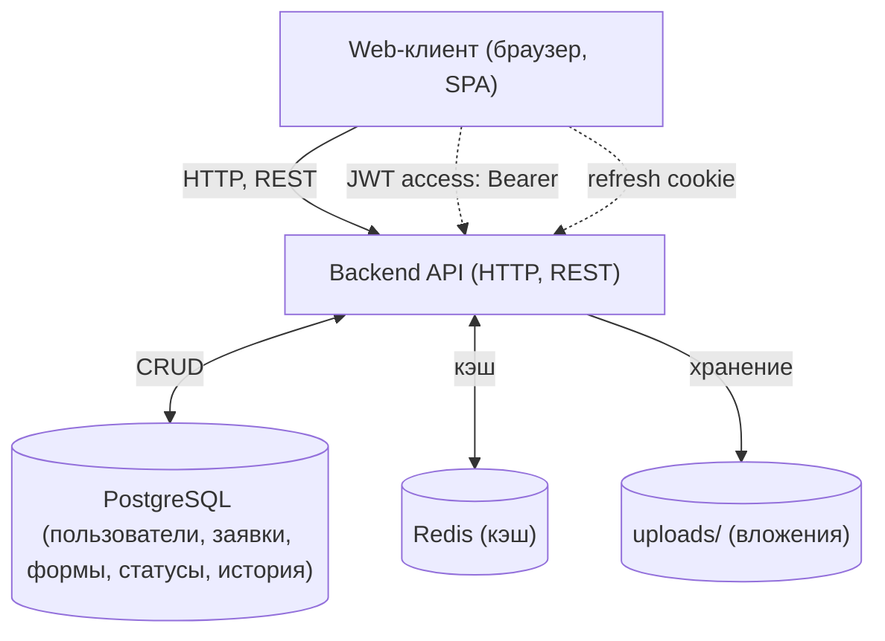

# Рисунок 3.1 – Общая архитектура системы (Mermaid)

```mermaid
flowchart TB
  U["Web-клиент (браузер, SPA)"]
  API["Backend API (HTTP, REST)"]
  DB[("PostgreSQL (пользователи, заявки, формы, статусы, история)")]
  R[("Redis (кэш)")]
  FS[("uploads/ (вложения)")]

  U -->|"HTTP, REST"| API
  API <-->|"CRUD"| DB
  API <-->|"кэш"| R
  API -->|"хранение"| FS
  U -.->|"JWT access: Bearer"| API
  U -.->|"refresh cookie"| API
```
