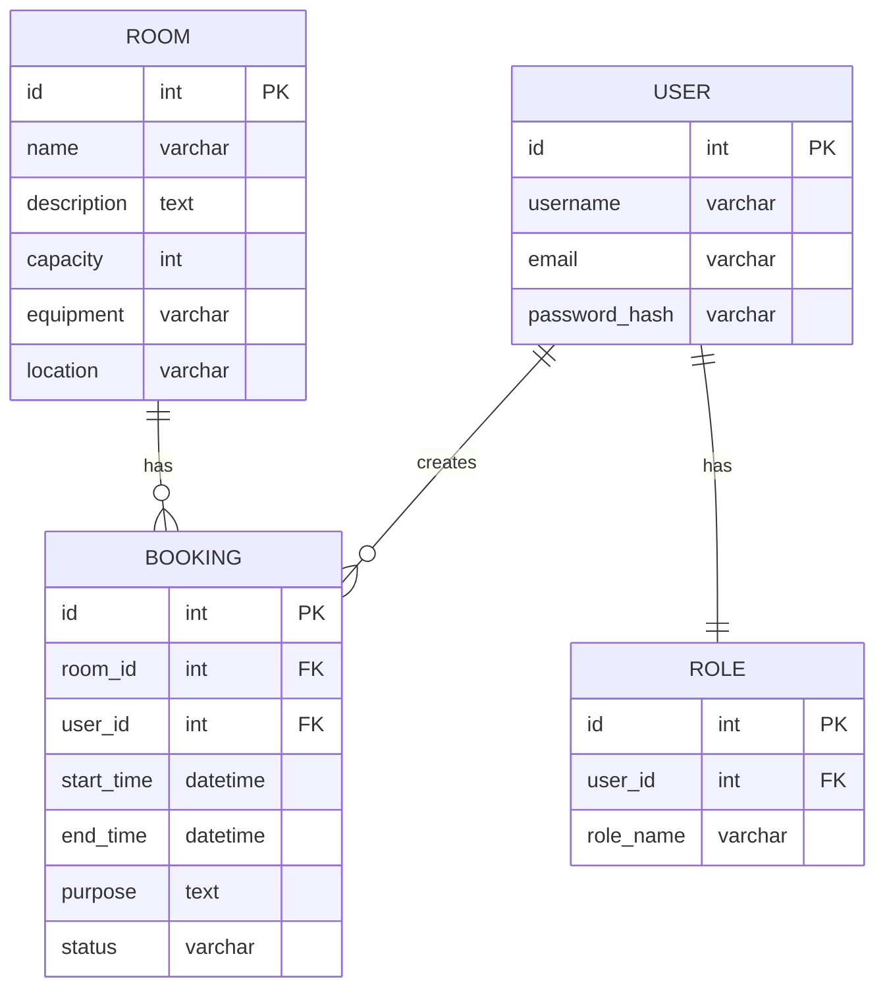

# Вариант 02 — Ключевые сущности, связи и API (эскиз)

Сущности (основные)

- User
  - id: UUID
  - username: string (unique)
  - email: string (unique)
  - password_hash: string
  - role: enum [admin, teacher, student]

- Room
  - id: UUID
  - name: string
  - description: string
  - capacity: number
  - equipment: string
  - location: string

- Booking
  - id: UUID
  - room_id: reference -> Room.id
  - user_id: reference -> User.id
  - start_time: datetime
  - end_time: datetime
  - purpose: string
  - status: enum [active, cancelled]

- Role
  - id: UUID
  - user_id: reference -> User.id
  - role_name: enum [admin, teacher, student]

Связи (ER-эскиз)

- User 1..* Booking (пользователь создаёт бронирования)
- Room 1..* Booking (аудитория имеет бронирования)
- User 1..1 Role (пользователь имеет роль)

Обязательные поля и ограничения (кратко)

- unique(User.username)
- unique(User.email)
- unique(Room.name)
- Booking.room_id → Room.id (FK, not null)
- Booking.user_id → User.id (FK, not null)
- Booking.start_time < Booking.end_time
- Role.user_id → User.id (FK, not null)

API — верхнеуровневые ресурсы и операции

- /users
  - GET /users (admin)
  - POST /users (admin)
  - GET /users/{id}
  - PUT /users/{id}
  - DELETE /users/{id}

- /rooms
  - GET /rooms (list, filter by capacity/equipment)
  - POST /rooms (admin)
  - GET /rooms/{id}
  - PUT /rooms/{id} (admin)
  - DELETE /rooms/{id} (admin)

- /bookings
  - GET /bookings (filter by room/user/date)
  - POST /bookings (create with conflict check)
  - GET /bookings/{id}
  - PUT /bookings/{id} (reschedule)
  - DELETE /bookings/{id} (cancel)

- /schedule
  - GET /schedule?roomId=&date=&from=&to= (view schedule)
  - GET /schedule/conflicts?roomId=&start=&end= (check conflicts)

Дополнительно (бонусы)

- GET /bookings/{id}/export/ical — экспорт в iCal формат
- POST /bookings/bulk — массовое создание бронирований
- WebSocket /ws/bookings — уведомления о новых/изменённых бронированиях
- Документация API (OpenAPI/Swagger)
- Тесты: unit + интеграционные для логики конфликтов

---

## Подробные операции API, схемы и поведение

Общие принципы

- Ответы в формате: `{ "status": "ok" | "error", "data"?: ..., "error"?: {code, message, fields?} }`
- Пагинация: `limit` и `offset` (по умолчанию limit=50).
- Аутентификация: `Authorization: Bearer <jwt>`; роли: `admin`, `teacher`, `student`.

Примеры ошибок (JSON)

```json
{
  "status": "error",
  "error": { "code": "validation_failed", "message": "Validation failed", "fields": { "room_id": "required" } }
}
```

Auth

- POST `/auth/register` — `{email, password, username, role?}` → `201 {id, email, username, role}`
- POST `/auth/login` — `{email, password}` → `200 {accessToken, refreshToken, user}`
- POST `/auth/refresh` — `{refreshToken}` → `200 {accessToken}`

Users

- GET `/users?limit=&offset=` — Admin
- GET `/users/{id}` — Admin или self
- POST `/users` — Admin (payload: `{username,email,password,role?}`)
- PUT `/users/{id}` — Admin или self (частичное обновление)
- DELETE `/users/{id}` — Admin

Rooms

- GET `/rooms?capacity=&equipment=&location=&limit=&offset=` — список
- POST `/rooms` — Admin (payload: `{name,description,capacity,equipment,location}`)
- GET `/rooms/{id}` — детали аудитории
- PUT `/rooms/{id}` — Admin
- DELETE `/rooms/{id}` — Admin

Bookings (создание и управление)

- POST `/bookings` — создание бронирования

  - Payload (пример):

  ```json
  {
    "roomId": "room-uuid-1",
    "startTime": "2025-12-20T10:00:00Z",
    "endTime": "2025-12-20T12:00:00Z",
    "purpose": "Лекция по математике"
  }
  ```

  - Response: `201 {id, roomId, userId, startTime, endTime, purpose, status}` или `409 {error: "conflict", conflicts: [...]}`
  - Проверка: система проверяет конфликты перед созданием.

- GET `/bookings?roomId=&userId=&date=&status=&limit=&offset=` — список бронирований
- GET `/bookings/{id}` — детали бронирования
- PUT `/bookings/{id}` — перенос бронирования (payload: `{startTime?, endTime?}`)
- DELETE `/bookings/{id}` — отмена бронирования

Schedule и конфликты

- GET `/schedule?roomId=&date=&from=&to=` — расписание аудитории
  - Response: список бронирований с информацией о занятости

- GET `/schedule/conflicts?roomId=&startTime=&endTime=` — проверка конфликтов
  - Response: `{hasConflicts: boolean, conflicts: [{id, startTime, endTime, user}]}`

Export

- GET `/bookings/{id}/export/ical` — экспорт бронирования в формат iCalendar

Statistics (Admin/Teacher)

- GET `/statistics/rooms/{id}?from=&to=` — статистика использования аудитории
- GET `/statistics/users/{id}?from=&to=` — статистика бронирований пользователя

WebSocket (опционально)

- `ws://host/bookings?token=...` — события: `booking_created`, `booking_updated`, `booking_cancelled`.

---

## ERD (диаграмма сущностей)

Mermaid-диаграмма (если рендер поддерживается):



ASCII-эскиз (если mermaid не рендерится):

```text
User 1---* Booking *---1 Room
  |
  1
  |
Role
```

---

AC — критерии приёмки для функционала Booking (MVP)

- AC1: При создании Booking, система проверяет конфликты по room_id и времени; если конфликт есть, возвращает 409 с описанием.
- AC2: GET `/bookings?roomId=` возвращает все бронирования для указанной аудитории, отсортированные по времени.
- AC3: DELETE `/bookings/{id}` отменяет бронирование (устанавливает status='cancelled') и добавляет запись в audit log (кто и когда).
- AC4: Студент не может забронировать аудиторию более чем на 2 часа; преподаватель — до 4 часов.
