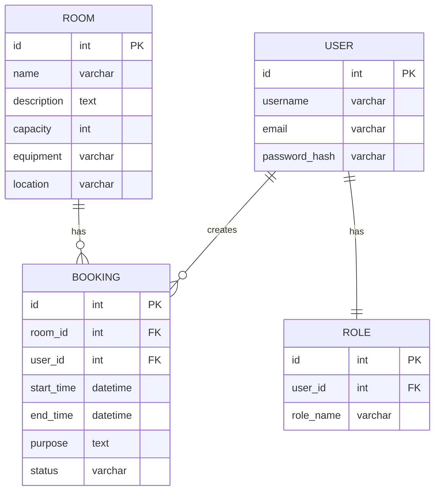

# Вариант 02 — ERD (диаграмма сущностей) — Бронь аудиторий «Не занято?»

Файл содержит: 1) mermaid-диаграмму ERD; 2) ASCII-эскиз; 3) минимальный SQL DDL-скетч для создания таблиц.

## Mermaid ERD



## ASCII-эскиз

```text
User 1---* Booking *---1 Room
  |
  1
  |
Role
```

## Минимальный SQL DDL (пример, PostgreSQL)

```sql
CREATE TABLE users (
 id UUID PRIMARY KEY,
 username TEXT UNIQUE NOT NULL,
 email TEXT UNIQUE NOT NULL,
 password_hash TEXT NOT NULL
);

CREATE TABLE roles (
 id UUID PRIMARY KEY,
 user_id UUID NOT NULL REFERENCES users(id) ON DELETE CASCADE,
 role_name TEXT NOT NULL CHECK (role_name IN ('admin','teacher','student'))
);

CREATE TABLE rooms (
 id UUID PRIMARY KEY,
 name TEXT UNIQUE NOT NULL,
 description TEXT,
 capacity INTEGER NOT NULL,
 equipment TEXT,
 location TEXT NOT NULL
);

CREATE TABLE bookings (
 id UUID PRIMARY KEY,
 room_id UUID NOT NULL REFERENCES rooms(id) ON DELETE CASCADE,
 user_id UUID NOT NULL REFERENCES users(id) ON DELETE CASCADE,
 start_time TIMESTAMP WITH TIME ZONE NOT NULL,
 end_time TIMESTAMP WITH TIME ZONE NOT NULL,
 purpose TEXT NOT NULL,
 status TEXT NOT NULL CHECK (status IN ('active','cancelled')) DEFAULT 'active',
 created_at TIMESTAMP WITH TIME ZONE DEFAULT now(),
 CHECK (start_time < end_time)
);

CREATE INDEX idx_bookings_room_time ON bookings(room_id, start_time, end_time);
CREATE INDEX idx_bookings_user ON bookings(user_id);
```
