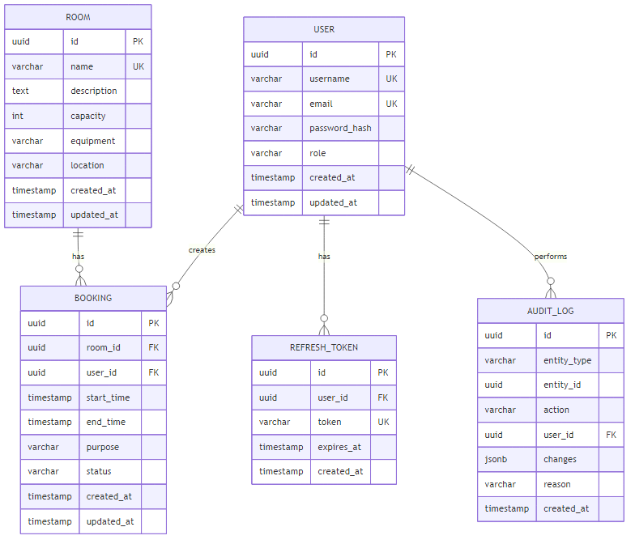

# 2 Разработка алгоритмов

## 2.1 Описание сущностей и связей

Информационная модель системы бронирования аудиторий построена на основе пяти основных сущностей, связанных отношениями один ко многим. Центральными элементами модели являются пользователи, аудитории и бронирования, дополненные вспомогательными сущностями для обеспечения безопасности и аудита действий.

Сущность «Пользователь» характеризуется следующими атрибутами. Уникальный идентификатор представлен значением типа UUID для обеспечения глобальной уникальности в распределённых системах. Имя пользователя представляет собой строку длиной от трёх до пятидесяти символов, используемую для отображения в интерфейсе. Адрес электронной почты служит логином для входа в систему и должен соответствовать стандартному формату адресов электронной почты. Пароль хранится в виде хеша, полученного применением алгоритма bcrypt с фактором стоимости двенадцать [2]. Роль определяет набор прав доступа и принимает одно из трёх значений перечисления: администратор, преподаватель или студент. Временные метки создания и обновления фиксируют момент создания учётной записи и время последнего изменения данных.

Сущность «Аудитория» включает уникальный идентификатор типа UUID, название аудитории в виде строки длиной до ста символов, текстовое описание произвольной длины, вместимость в виде целого положительного числа, текстовое описание оборудования, строковое представление расположения и временные метки создания и обновления. Название аудитории должно быть уникальным в рамках системы для исключения неоднозначности при выборе помещения.

Сущность «Бронирование» содержит уникальный идентификатор, ссылки на идентификаторы аудитории и пользователя, время начала и окончания в формате временной метки с учётом часового пояса, текстовое описание цели использования аудитории длиной до пятисот символов, статус бронирования и временные метки создания и обновления. Статус принимает значение активного или отменённого бронирования. Время начала должно быть строго меньше времени окончания, а длительность не должна превышать четырёх часов для обеспечения справедливого распределения ресурсов.

Сущность «Токен обновления» предназначена для поддержания сеанса пользователя без повторного ввода учётных данных. Она включает уникальный идентификатор, ссылку на пользователя, хешированное значение токена, время истечения действия токена, время отзыва токена при его компрометации или выходе из системы, идентификатор заменяющего токена при ротации и временную метку создания. Хеширование значения токена перед сохранением в базе данных предотвращает его использование злоумышленником в случае несанкционированного доступа к данным.

Сущность «Журнал аудита» фиксирует все критические операции в системе для обеспечения возможности анализа действий пользователей и выявления инцидентов безопасности. Она содержит уникальный идентификатор, тип сущности из перечисления пользователь, аудитория или бронирование, идентификатор изменённой сущности, тип действия из перечисления создание, обновление, отмена или удаление, идентификатор пользователя, выполнившего операцию, данные об изменениях в формате JSON, текстовую причину действия и временную метку создания записи.

Связи между сущностями определяются следующим образом. Один пользователь может создать множество бронирований, при этом каждое бронирование связано ровно с одним пользователем. Одна аудитория может иметь множество бронирований в различные временные периоды, каждое бронирование относится к одной аудитории. Один пользователь может обладать множеством токенов обновления для поддержки одновременных сеансов на различных устройствах, каждый токен принадлежит одному пользователю. Один пользователь может быть автором множества записей в журнале аудита, каждая запись связана с одним пользователем.

Диаграмма сущностей и связей представлена на рисунке 2.1.


Рисунок 2.1 – Диаграмма сущностей и связей

На рисунке 2.1 показаны основные сущности системы и отношения между ними. Центральная роль принадлежит сущностям «Пользователь», «Аудитория» и «Бронирование», образующим треугольник связей. Вспомогательные сущности «Токен обновления» и «Журнал аудита» связаны с пользователем и обеспечивают функциональность безопасности и мониторинга.

Для обеспечения целостности данных при удалении записей применяется каскадное удаление. При удалении пользователя автоматически удаляются все его бронирования, токены обновления и записи в журнале аудита. При удалении аудитории удаляются все связанные с ней бронирования. Это гарантирует отсутствие ссылок на несуществующие сущности в базе данных.

## 2.2 Алгоритм проверки конфликтов бронирований

Ключевым элементом логики системы является алгоритм проверки конфликтов при создании или переносе бронирования. Конфликт возникает, если для одной аудитории существует активное бронирование, временной интервал которого пересекается с запрашиваемым интервалом. Алгоритм должен обнаружить все такие пересечения и предоставить пользователю информацию о занятых слотах времени.

Входными данными алгоритма являются идентификатор аудитории, время начала и время окончания запрашиваемого бронирования. Для переноса существующего бронирования дополнительным входным параметром служит идентификатор изменяемого бронирования, который необходимо исключить из проверки, чтобы бронирование не конфликтовало само с собой.

Алгоритм проверки конфликтов выполняется следующим образом. На первом шаге выполняется запрос к базе данных для получения списка всех активных бронирований выбранной аудитории, временные интервалы которых пересекаются с запрашиваемым интервалом. Условие пересечения двух интервалов формулируется как отрицание условия их непересечения. Два интервала не пересекаются, если первый заканчивается до начала второго или второй заканчивается до начала первого. Следовательно, интервалы пересекаются, если конец первого интервала больше начала второго и начало первого интервала меньше конца второго.

На втором шаге полученный список конфликтующих бронирований анализируется. Если список пуст, конфликтов не обнаружено и запрос может быть выполнен. Если список содержит одну или более записей, создание или перенос бронирования отклоняется. Системой формируется ответ с кодом ошибки конфликта и перечнем конфликтующих бронирований, включающим их идентификаторы, время начала и окончания, идентификатор пользователя.

Для оптимизации производительности запроса к базе данных применяется составной индекс по полям идентификатора аудитории, времени начала, времени окончания и статуса бронирования. Это позволяет базе данных эффективно отфильтровать записи по аудитории и статусу, а затем применить условие пересечения временных интервалов без полного сканирования таблицы.

Псевдокод алгоритма проверки конфликтов представлен ниже.

```
Функция ПроверитьКонфликты(roomId, startTime, endTime, исключитьBookingId)
  конфликты := ВыполнитьЗапрос(
    "SELECT id, start_time, end_time, user_id 
     FROM bookings 
     WHERE room_id = roomId 
       AND status = 'active' 
       AND NOT (end_time <= startTime OR start_time >= endTime)
       AND id != исключитьBookingId"
  )
  
  Если конфликты.Пусто()
    Вернуть { успех: истина }
  Иначе
    Вернуть { успех: ложь, конфликты: конфликты }
  Конец Если
Конец Функции
```

## 2.3 Алгоритм создания бронирования

Процесс создания бронирования включает несколько этапов валидации и проверок перед фактическим сохранением данных в базу. Последовательное выполнение этапов обеспечивает соответствие создаваемого бронирования всем требованиям системы.

На первом этапе выполняется валидация входных данных. Проверяется корректность формата идентификатора аудитории как UUID, существование аудитории в базе данных, корректность формата временных меток начала и окончания, соблюдение условия, что время начала строго меньше времени окончания, наличие и длина текста цели использования аудитории от одного до пятисот символов.

На втором этапе проверяется соответствие длительности бронирования ограничениям роли пользователя. Вычисляется разность между временем окончания и временем начала. Для пользователей с ролью студента длительность не должна превышать двух часов, для преподавателей — четырёх часов, для администраторов ограничение не применяется. При превышении лимита запрос отклоняется с указанием допустимой длительности для роли пользователя.

На третьем этапе выполняется проверка конфликтов с существующими активными бронированиями выбранной аудитории с применением алгоритма, описанного в предыдущем подразделе. При обнаружении конфликтов запрос отклоняется с предоставлением информации о конфликтующих бронированиях.

На четвёртом этапе создаётся запись бронирования в базе данных с заполнением всех атрибутов: идентификатор генерируется как новое значение UUID, устанавливаются ссылки на аудиторию и пользователя, копируются время начала и окончания, цель использования, статус устанавливается как активный, временные метки создания и обновления заполняются текущим временем.

На пятом этапе создаётся запись в журнале аудита с типом сущности «бронирование», идентификатором созданного бронирования, действием «создание», идентификатором пользователя и временной меткой создания записи. Данные об изменениях включают все атрибуты нового бронирования.

После успешного выполнения всех этапов система возвращает пользователю данные созданного бронирования с кодом успешного выполнения операции.

## 2.4 Алгоритм переноса бронирования

Перенос бронирования на другое время требует выполнения проверок, аналогичных созданию нового бронирования, с дополнительной верификацией прав пользователя на изменение данного бронирования.

На первом этапе система проверяет существование бронирования с указанным идентификатором в базе данных. Если бронирование не найдено, запрос отклоняется с соответствующим кодом ошибки.

На втором этапе проверяются права пользователя на изменение бронирования. Пользователь может переносить только собственные бронирования, за исключением администраторов, которые могут изменять любые бронирования. Если идентификатор текущего пользователя совпадает с идентификатором создателя бронирования или текущий пользователь имеет роль администратора, проверка считается пройденной. В противном случае запрос отклоняется с кодом ошибки недостаточных прав доступа.

На третьем этапе выполняется валидация новых временных параметров. Проверяется корректность формата временных меток, соблюдение условия, что новое время начала меньше нового времени окончания, соответствие длительности ограничениям роли создателя бронирования.

На четвёртом этапе выполняется проверка конфликтов с применением алгоритма проверки конфликтов. При этом из проверки исключается идентификатор изменяемого бронирования, чтобы оно не считалось конфликтующим само с собой. При обнаружении конфликтов с другими бронированиями запрос отклоняется.

На пятом этапе обновляются атрибуты бронирования в базе данных. Устанавливаются новые значения времени начала и окончания, обновляется временная метка обновления записи. Остальные атрибуты остаются неизменными.

На шестом этапе создаётся запись в журнале аудита с типом сущности «бронирование», идентификатором изменённого бронирования, действием «обновление», идентификатором пользователя, выполнившего операцию, и данными об изменениях в формате JSON, содержащими старые и новые значения времени начала и окончания.

После успешного выполнения всех этапов система возвращает обновлённые данные бронирования с кодом успешного выполнения операции.

## 2.5 Алгоритм отмены бронирования

Отмена бронирования изменяет его статус на отменённый, что приводит к исключению этого бронирования из проверки конфликтов при создании новых бронирований. Алгоритм включает проверку прав доступа и фиксацию действия в журнале аудита.

На первом этапе система проверяет существование бронирования с указанным идентификатором. Если бронирование не найдено, запрос отклоняется.

На втором этапе проверяются права пользователя на отмену бронирования. Пользователь может отменять только собственные бронирования, администраторы могут отменять любые бронирования. При отмене чужого бронирования администратор обязан указать причину действия в виде текстовой строки длиной от десяти до пятисот символов. Если администратор не указал причину, запрос отклоняется.

На третьем этапе обновляется статус бронирования в базе данных. Статус устанавливается как отменённый, обновляется временная метка обновления записи.

На четвёртом этапе создаётся запись в журнале аудита с типом сущности «бронирование», идентификатором отменённого бронирования, действием «отмена», идентификатором пользователя, причиной отмены, если она указана, и временной меткой создания записи.

После успешного выполнения всех этапов система возвращает код успешного выполнения операции без дополнительных данных.

## 2.6 Схема аутентификации и авторизации

Система применяет механизм аутентификации на основе веб-токенов JSON для обеспечения безопасного доступа к ресурсам без необходимости хранения состояния сеанса на сервере [3]. Процесс аутентификации включает две фазы: вход в систему с получением токенов и проверку токена доступа при выполнении защищённых операций.

При входе в систему пользователь предоставляет адрес электронной почты и пароль. Система выполняет поиск пользователя в базе данных по адресу электронной почты. Если пользователь не найден, возвращается ошибка неверных учётных данных. Для найденного пользователя система сравнивает предоставленный пароль с сохранённым хешем пароля с использованием функции проверки bcrypt. При несовпадении возвращается ошибка неверных учётных данных.

При успешной проверке учётных данных система генерирует два токена. Токен доступа включает идентификатор пользователя, адрес электронной почты, имя пользователя и роль в качестве полезной нагрузки. Токен подписывается секретным ключом с применением алгоритма HMAC-SHA256 и имеет срок действия пятнадцать минут. Токен обновления представляет собой случайную строку, которая хешируется перед сохранением в базе данных. Срок действия токена обновления составляет семь дней.

Токен доступа возвращается клиенту в теле ответа и сохраняется в памяти клиентского приложения. Токен обновления сохраняется в защищённом cookie с атрибутами HttpOnly, Secure и SameSite для предотвращения доступа к нему из JavaScript и защиты от атак межсайтовой подделки запросов.

При выполнении защищённых операций клиент включает токен доступа в заголовок Authorization запроса с префиксом Bearer. Серверное промежуточное программное обеспечение извлекает токен из заголовка, проверяет его подпись и срок действия. При успешной проверке данные пользователя из токена становятся доступными для обработчиков запросов. При истечении срока действия токена или неверной подписи запрос отклоняется с кодом ошибки отсутствия авторизации.

Когда срок действия токена доступа истекает, клиентское приложение автоматически отправляет запрос на обновление токена, включая токен обновления в cookie. Сервер извлекает токен обновления из cookie, вычисляет его хеш и ищет соответствующую запись в базе данных. Если запись найдена, токен не отозван и не истёк, сервер генерирует новый токен доступа и возвращает его клиенту. Старый токен обновления может быть заменён новым для повышения безопасности.

При выходе из системы клиент отправляет запрос на завершение сеанса, включая токен обновления. Сервер помечает соответствующую запись в базе данных как отозванную путём установки временной метки отзыва. Это предотвращает дальнейшее использование токена обновления для получения новых токенов доступа.

Авторизация выполняется на основе роли пользователя, извлечённой из токена доступа. Для каждого защищённого маршрута определяется минимальная требуемая роль или список допустимых ролей. Промежуточное программное обеспечение сравнивает роль текущего пользователя с требованиями маршрута. Если роль пользователя соответствует требованиям, запрос передаётся обработчику. В противном случае запрос отклоняется с кодом ошибки недостаточных прав доступа.
