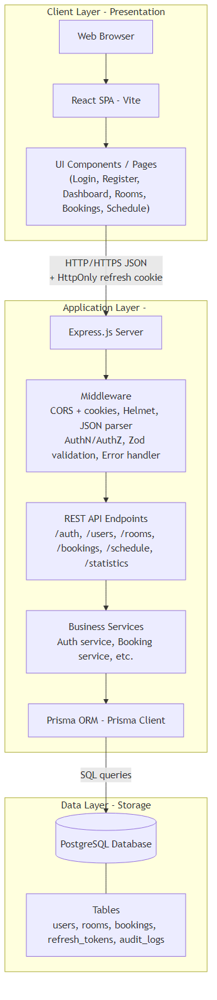
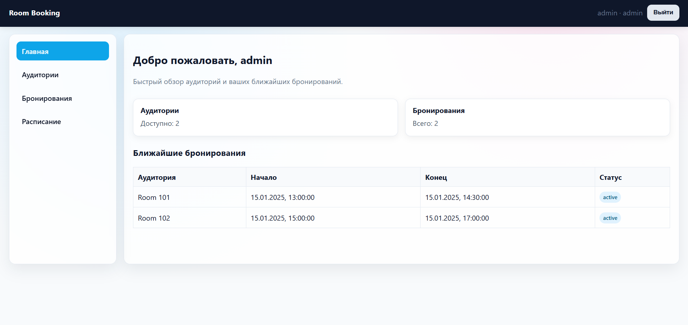
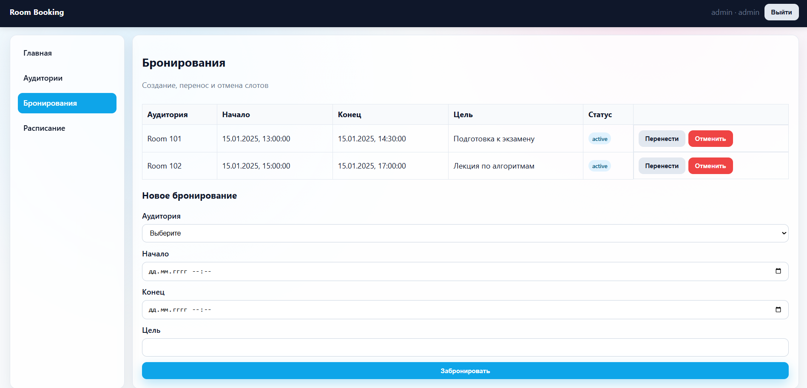
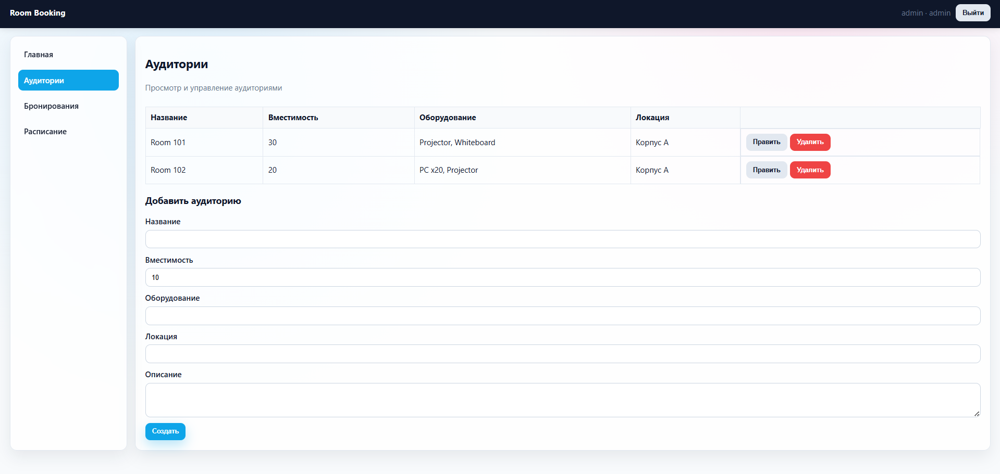

# 3 Разработка программы

## 3.1 Архитектура системы

Система бронирования аудиторий реализована в виде трёхзвенной архитектуры клиент-сервер с выделенным уровнем хранения данных. Архитектура обеспечивает разделение ответственности между компонентами, упрощает сопровождение и масштабирование системы.

Уровень представления реализован в виде одностраничного веб-приложения, выполняющегося в браузере пользователя. Приложение взаимодействует с сервером посредством асинхронных HTTP-запросов в формате JSON. Логика представления включает отображение пользовательского интерфейса, обработку действий пользователя, валидацию данных на стороне клиента, управление состоянием приложения и маршрутизацией между страницами.

Уровень бизнес-логики представлен серверным приложением, обрабатывающим запросы клиентов и реализующим логику предметной области. Сервер отвечает за аутентификацию и авторизацию пользователей, валидацию входных данных, выполнение бизнес-правил, таких как проверка конфликтов бронирований и ограничений длительности, взаимодействие с базой данных, формирование ответов в формате JSON.

Уровень хранения данных реализован системой управления реляционными базами данных PostgreSQL. База данных обеспечивает надёжное хранение информации о пользователях, аудиториях, бронированиях, токенах обновления и записях журнала аудита. Применение реляционной модели гарантирует целостность данных, поддержку транзакций и эффективное выполнение запросов с использованием индексов [4].

Взаимодействие между компонентами осуществляется по протоколу HTTP. Клиентское приложение отправляет запросы к серверу на определённые маршруты с использованием методов GET, POST, PUT и DELETE. Сервер обрабатывает запросы, выполняет необходимые операции с базой данных и возвращает клиенту ответы с кодами состояния HTTP и данными в формате JSON.

Архитектура системы показана на рисунке 3.1.

Рисунок 3.1 – Архитектура системы

Как видно из рисунка 3.1, компоненты системы организованы в три уровня с чётким разделением ответственности. Клиентское приложение взаимодействует исключительно с серверным приложением через программный интерфейс REST API, не имея прямого доступа к базе данных. Это обеспечивает безопасность данных и централизованное применение бизнес-правил.

## 3.2 Выбранный технологический стек и обоснование

Для реализации клиентской части выбрана библиотека React версии восемнадцать. React обеспечивает декларативный подход к построению пользовательских интерфейсов, эффективное обновление отображения при изменении данных благодаря виртуальному DOM, модульность и повторное использование компонентов [5]. Применение React позволяет создать отзывчивый интерфейс с хорошей производительностью.

В качестве инструмента сборки клиентского приложения используется Vite. Vite обеспечивает быстрый запуск сервера разработки благодаря использованию нативных модулей ES, мгновенную горячую замену модулей для ускорения процесса разработки, оптимизированную сборку продакшн-версии с применением Rollup. По сравнению с традиционными инструментами сборки Vite значительно сокращает время, необходимое для запуска и перезагрузки приложения в процессе разработки.

Для управления формами применяется библиотека React Hook Form. Она предоставляет простой программный интерфейс для регистрации полей форм, валидации данных, обработки отправки форм. React Hook Form минимизирует количество повторных рендеров компонентов, что положительно влияет на производительность приложения.

Маршрутизация между страницами реализована с использованием библиотеки React Router версии шесть. React Router обеспечивает декларативное определение маршрутов, динамическую маршрутизацию, защиту маршрутов на основе условий, таких как аутентификация пользователя.

Для валидации данных как на клиенте, так и на сервере применяется библиотека Zod. Zod позволяет определить схемы валидации с использованием выразительного синтаксиса, автоматически выводит типы TypeScript из схем, обеспечивает согласованность валидации на обоих уровнях приложения.

Серверная часть реализована на платформе Node.js версии восемнадцать с использованием фреймворка Express. Express предоставляет минималистичный и гибкий программный интерфейс для создания веб-серверов, поддерживает промежуточное программное обеспечение для обработки запросов, обладает обширной экосистемой пакетов [6]. Выбор Express обусловлен его широким распространением, хорошей документацией и наличием множества готовых решений для типичных задач.

Для взаимодействия с базой данных применяется объектно-реляционное отображение Prisma. Prisma обеспечивает типобезопасный клиент для работы с базой данных, автоматическую генерацию миграций на основе декларативной схемы, поддержку транзакций и оптимизированных запросов. Применение Prisma упрощает работу с базой данных, снижает вероятность ошибок благодаря проверке типов на этапе компиляции.

Для хеширования паролей используется библиотека bcrypt. Bcrypt реализует адаптивную функцию хеширования, устойчивую к атакам перебора благодаря настраиваемому фактору стоимости. Применение bcrypt является рекомендуемой практикой для безопасного хранения паролей [7].

Аутентификация и авторизация реализованы с использованием библиотеки jsonwebtoken для генерации и проверки токенов JWT. JWT обеспечивают компактный и безопасный способ передачи информации между сторонами в виде объекта JSON, подписанного криптографически.

Для обеспечения безопасности HTTP-заголовков применяется библиотека Helmet. Helmet устанавливает различные HTTP-заголовки для защиты приложения от распространённых веб-уязвимостей, таких как межсайтовый скриптинг, перехват кликов, определение типа контента браузером.

Управление политиками совместного использования ресурсов между источниками осуществляется с помощью библиотеки cors. Библиотека позволяет настроить разрешённые источники запросов, методы HTTP, заголовки, поддержку учётных данных в запросах.

Для разбора cookie используется библиотека cookie-parser. Она извлекает cookie из заголовков запросов и делает их доступными в виде объектов JavaScript, упрощая работу с токенами обновления, хранящимися в защищённых cookie.

В качестве системы управления базами данных выбрана PostgreSQL версии четырнадцать или выше. PostgreSQL является свободной объектно-реляционной системой управления базами данных, обеспечивающей высокую надёжность, соответствие стандартам SQL, поддержку транзакций, индексов, ограничений целостности, хранимых процедур, триггеров. PostgreSQL хорошо подходит для приложений, требующих строгой согласованности данных и сложных запросов.

Применение TypeScript для разработки как клиентской, так и серверной частей обеспечивает статическую типизацию, что снижает количество ошибок на этапе разработки, улучшает поддержку средств разработки, упрощает рефакторинг кода. TypeScript является надмножеством JavaScript, что позволяет использовать всю экосистему JavaScript при сохранении преимуществ типизации.

## 3.3 Описание модулей серверного приложения

Серверное приложение организовано в виде набора модулей, каждый из которых отвечает за определённую область функциональности. Разделение на модули упрощает навигацию по коду, тестирование и поддержку системы.

Модуль маршрутизации определяет конечные точки программного интерфейса приложения и связывает их с обработчиками запросов. Маршруты организованы по ресурсам: аутентификация, пользователи, аудитории, бронирования, расписание, статистика. Каждая группа маршрутов определена в отдельном файле и подключается к основному приложению с использованием механизма роутеров Express.

Модуль промежуточного программного обеспечения содержит функции, выполняющиеся в процессе обработки запроса до достижения конечного обработчика или после него. Промежуточное программное обеспечение для аутентификации извлекает токен доступа из заголовка Authorization, проверяет его подпись и срок действия, извлекает данные пользователя и добавляет их в объект запроса. Промежуточное программное обеспечение для авторизации проверяет соответствие роли пользователя требованиям маршрута. Промежуточное программное обеспечение для обработки ошибок перехватывает исключения, возникающие в обработчиках, и формирует стандартизированные ответы об ошибках.

Модуль сервисов содержит бизнес-логику приложения, не зависящую от деталей транспортного уровня. Сервис аутентификации реализует функции регистрации, входа, обновления токенов и выхода из системы. Сервис пользователей обеспечивает создание, чтение, обновление и удаление записей пользователей. Сервис аудиторий управляет данными об аудиториях. Сервис бронирований реализует создание, чтение, обновление и отмену бронирований с применением проверки конфликтов и ограничений длительности. Сервис расписания предоставляет информацию о занятости аудиторий. Сервис статистики вычисляет показатели использования аудиторий и активности пользователей.

Модуль библиотеки содержит вспомогательные функции и утилиты. Функции для работы с токенами JWT включают генерацию, проверку и извлечение данных из токенов. Функции для работы с паролями обеспечивают хеширование и проверку паролей с использованием bcrypt. Функции валидации данных определяют схемы Zod для различных типов входных данных. Функции для работы с журналом аудита создают записи о выполненных операциях.

Клиент Prisma инициализируется в отдельном модуле и экспортируется для использования в сервисах. Это обеспечивает единую точку доступа к базе данных и упрощает конфигурацию подключения.

Конфигурация приложения загружается из переменных окружения с использованием библиотеки dotenv. Это позволяет изменять параметры работы приложения, такие как адрес базы данных, секретные ключи для подписи токенов, разрешённые источники запросов, без изменения кода.

Главный модуль приложения выполняет инициализацию сервера Express, подключение промежуточного программного обеспечения для разбора JSON, cookie, настройки CORS и Helmet, регистрацию маршрутов, обработчика ошибок и запуск сервера на указанном порту.

## 3.4 Описание клиентского приложения

Клиентское приложение построено с использованием компонентного подхода. Каждый компонент представляет собой независимую единицу пользовательского интерфейса с собственной логикой и стилями. Компоненты могут быть вложены друг в друга для построения сложных интерфейсов из простых элементов.

Корневой компонент приложения настраивает контекст аутентификации, маршрутизацию и общую структуру страниц. Контекст аутентификации хранит информацию о текущем пользователе и токене доступа, предоставляет функции для входа, выхода и обновления токена. Использование контекста позволяет любому компоненту получить доступ к данным аутентификации без необходимости передачи их через пропсы.

Компоненты страниц соответствуют различным маршрутам приложения. Страница входа предоставляет форму для ввода адреса электронной почты и пароля. После успешной аутентификации пользователь перенаправляется на главную страницу. Страница регистрации позволяет создать новую учётную запись. Главная страница отображает список аудиторий и расписание. Страница создания бронирования содержит форму для выбора аудитории, даты, времени и цели использования. Страница списка бронирований отображает бронирования текущего пользователя с возможностью отмены и переноса. Страница администрирования доступна только пользователям с ролью администратора и предоставляет интерфейсы для управления аудиториями, пользователями и просмотра статистики.

Пример главной страницы с отображением списка аудиторий представлен на рисунке 3.2.

Рисунок 3.2 – Главная страница со списком аудиторий

Согласно рисунку 3.2, интерфейс главной страницы включает навигационное меню в верхней части, область фильтров для поиска аудиторий по параметрам и список аудиторий с кратким описанием. Каждая карточка аудитории содержит название, вместимость, оборудование и кнопку для просмотра расписания или создания бронирования.

Компоненты форм используют библиотеку React Hook Form для управления состоянием полей, валидации данных и обработки отправки. Валидация выполняется с использованием схем Zod, что обеспечивает согласованность с валидацией на сервере. При наличии ошибок валидации под соответствующими полями отображаются сообщения об ошибках.

Страница создания бронирования показана на рисунке 3.3.

Рисунок 3.3 – Страница создания бронирования

Как видно из рисунка 3.3, форма создания бронирования включает выпадающий список для выбора аудитории, поля для ввода даты и времени начала и окончания, текстовое поле для описания цели использования и кнопку отправки. При выборе времени система может отображать информацию о занятых слотах для предотвращения конфликтов.

Модуль взаимодействия с программным интерфейсом сервера инкапсулирует логику выполнения HTTP-запросов. Для каждого ресурса определены функции, выполняющие запросы к соответствующим конечным точкам. Функции принимают необходимые параметры, формируют запросы с включением токена доступа в заголовок Authorization, обрабатывают ответы и ошибки. При получении ответа с кодом отсутствия авторизации функция автоматически пытается обновить токен доступа и повторить исходный запрос. Это обеспечивает прозрачное обновление токена без участия пользователя.

Пользовательские хуки обеспечивают повторное использование логики между компонентами. Хук useAuth предоставляет доступ к контексту аутентификации. Хук useApi выполняет асинхронные запросы к серверу и управляет состоянием загрузки, данных и ошибок.

Стили компонентов определены в отдельных файлах CSS. Применение CSS-модулей или других подходов к изоляции стилей предотвращает конфликты имён классов между компонентами.

## 3.5 Спецификация программного интерфейса приложения

Программный интерфейс приложения реализован в соответствии с принципами архитектуры REST. Ресурсы идентифицируются уникальными URI, операции над ресурсами выполняются с использованием стандартных методов HTTP, представление ресурсов передаётся в формате JSON.

Таблица 3.1 содержит перечень конечных точек для работы с аутентификацией.

Таблица 3.1 – Конечные точки аутентификации

| Метод | Путь | Описание | Требуемая роль |
|-------|------|----------|----------------|
| POST | /auth/register | Регистрация нового пользователя | Без аутентификации |
| POST | /auth/login | Вход в систему | Без аутентификации |
| POST | /auth/refresh | Обновление токена доступа | Токен обновления в cookie |
| POST | /auth/logout | Выход из системы | Токен обновления в cookie |

Конечная точка регистрации принимает объект JSON с полями email, password и username. Поля email и username должны быть уникальными. Пароль должен содержать не менее восьми символов. При успешной регистрации возвращается объект с данными пользователя и код 201. При нарушении ограничений уникальности возвращается код 409 с описанием конфликта.

Конечная точка входа принимает объект JSON с полями email и password. При успешной аутентификации возвращается объект, содержащий токен доступа и данные пользователя. Токен обновления устанавливается в защищённом cookie. При неверных учётных данных возвращается код 401.

Конечная точка обновления токена извлекает токен обновления из cookie, проверяет его валидность и возвращает новый токен доступа. При недействительном токене обновления возвращается код 401.

Конечная точка выхода отзывает токен обновления, полученный из cookie, и возвращает код 204.

Таблица 3.2 содержит конечные точки для работы с пользователями.

Таблица 3.2 – Конечные точки управления пользователями

| Метод | Путь | Описание | Требуемая роль |
|-------|------|----------|----------------|
| GET | /users | Получение списка пользователей | Администратор |
| GET | /users/:id | Получение данных пользователя | Администратор или владелец |
| POST | /users | Создание пользователя | Администратор |
| PUT | /users/:id | Обновление данных пользователя | Администратор или владелец |
| DELETE | /users/:id | Удаление пользователя | Администратор |

Конечная точка получения списка пользователей поддерживает параметры запроса limit и offset для пагинации. Возвращается массив объектов пользователей и общее количество записей.

Конечная точка получения данных пользователя возвращает объект с идентификатором, именем пользователя, адресом электронной почты, ролью и временными метками. Хеш пароля не включается в ответ.

Конечная точка создания пользователя принимает объект JSON с полями username, email, password и опциональным полем role. При отсутствии роли устанавливается значение по умолчанию student.

Конечная точка обновления данных пользователя позволяет изменить username, email и role. Изменение пароля выполняется отдельной конечной точкой с дополнительными проверками безопасности.

Конечная точка удаления пользователя выполняет каскадное удаление связанных данных и возвращает код 204.

Таблица 3.3 содержит конечные точки для работы с аудиториями.

Таблица 3.3 – Конечные точки управления аудиториями

| Метод | Путь | Описание | Требуемая роль |
|-------|------|----------|----------------|
| GET | /rooms | Получение списка аудиторий | Любая |
| GET | /rooms/:id | Получение данных аудитории | Любая |
| POST | /rooms | Создание аудитории | Администратор |
| PUT | /rooms/:id | Обновление данных аудитории | Администратор |
| DELETE | /rooms/:id | Удаление аудитории | Администратор |

Конечная точка получения списка аудиторий поддерживает фильтрацию по параметрам capacity, equipment и location. Все пользователи могут просматривать аудитории без аутентификации.

Конечная точка создания аудитории принимает объект JSON с полями name, description, capacity, equipment и location. Поля name, capacity и location являются обязательными.

Таблица 3.4 содержит конечные точки для работы с бронированиями.

Таблица 3.4 – Конечные точки управления бронированиями

| Метод | Путь | Описание | Требуемая роль |
|-------|------|----------|----------------|
| GET | /bookings | Получение списка бронирований | Любая |
| GET | /bookings/:id | Получение данных бронирования | Любая |
| POST | /bookings | Создание бронирования | Аутентифицированный |
| PUT | /bookings/:id | Перенос бронирования | Владелец или администратор |
| DELETE | /bookings/:id | Отмена бронирования | Владелец или администратор |

Конечная точка получения списка бронирований поддерживает фильтрацию по roomId, userId, date и status. Без аутентификации возвращается только публичная информация.

Конечная точка создания бронирования принимает объект JSON с полями roomId, startTime, endTime и purpose. Система выполняет проверку конфликтов и ограничений длительности. При конфликте возвращается код 409 с массивом конфликтующих бронирований.

Конечная точка переноса бронирования принимает новые значения startTime и endTime. Выполняются те же проверки, что при создании, за исключением изменяемого бронирования.

Конечная точка отмены бронирования изменяет статус на cancelled. Администратор должен указать причину отмены в теле запроса.

Таблица 3.5 содержит конечные точки для работы с расписанием и статистикой.

Таблица 3.5 – Конечные точки расписания и статистики

| Метод | Путь | Описание | Требуемая роль |
|-------|------|----------|----------------|
| GET | /schedule | Получение расписания | Любая |
| GET | /schedule/conflicts | Проверка конфликтов | Любая |
| GET | /statistics/rooms/:id | Статистика использования аудитории | Администратор |
| GET | /statistics/users/:id | Статистика бронирований пользователя | Администратор или владелец |

Конечная точка получения расписания принимает параметры roomId, date, from и to для фильтрации бронирований. Возвращается массив объектов бронирований с информацией о времени, пользователе и цели.

Конечная точка проверки конфликтов принимает параметры roomId, startTime и endTime. Возвращается объект с булевым полем hasConflicts и массивом конфликтующих бронирований.

Конечная точка статистики аудитории возвращает объект с полями totalBookings, totalHours, utilizationPercent и topUsers за указанный период.

Конечная точка статистики пользователя возвращает объект с полями totalBookings, totalHours и favoriteRooms за указанный период.

Пример интерфейса администрирования со статистикой показан на рисунке 3.4.

Рисунок 3.4 – Административная панель со статистикой

Согласно рисунку 3.4, административная панель отображает сводную статистику по использованию аудиторий в виде таблицы и диаграмм. Администратор может выбрать период для анализа и получить детализированную информацию по каждой аудитории.

Все конечные точки возвращают ответы в унифицированном формате. Успешные ответы содержат поле status со значением ok и поле data с результатом операции. Ответы с ошибками содержат поле status со значением error и поле error с объектом, включающим код ошибки, сообщение и опциональное поле fields с описанием ошибок валидации для конкретных полей.

## 3.6 Модель данных и схема базы данных

Модель данных реализована в виде пяти связанных таблиц в базе данных PostgreSQL. Схема базы данных определена с использованием декларативного синтаксиса Prisma и автоматически преобразуется в миграции SQL.

Таблица users содержит данные о пользователях системы.

Таблица 3.6 – Структура таблицы users

| Поле | Тип | Ограничения | Описание |
|------|-----|-------------|----------|
| id | UUID | PRIMARY KEY | Уникальный идентификатор |
| username | VARCHAR(50) | UNIQUE NOT NULL | Имя пользователя |
| email | VARCHAR(255) | UNIQUE NOT NULL | Адрес электронной почты |
| passwordHash | VARCHAR(255) | NOT NULL | Хеш пароля |
| role | ENUM | NOT NULL DEFAULT student | Роль пользователя |
| createdAt | TIMESTAMP | NOT NULL DEFAULT now() | Дата создания |
| updatedAt | TIMESTAMP | NOT NULL | Дата обновления |

Перечисление role включает значения admin, teacher и student. Для полей username и email созданы уникальные индексы.

Таблица rooms содержит данные об аудиториях.

Таблица 3.7 – Структура таблицы rooms

| Поле | Тип | Ограничения | Описание |
|------|-----|-------------|----------|
| id | UUID | PRIMARY KEY | Уникальный идентификатор |
| name | VARCHAR(100) | UNIQUE NOT NULL | Название аудитории |
| description | TEXT | NULL | Описание |
| capacity | INTEGER | NOT NULL CHECK > 0 | Вместимость |
| equipment | TEXT | NULL | Оборудование |
| location | VARCHAR(255) | NOT NULL | Расположение |
| createdAt | TIMESTAMP | NOT NULL DEFAULT now() | Дата создания |
| updatedAt | TIMESTAMP | NOT NULL | Дата обновления |

Поле name имеет уникальное ограничение. Для поля capacity установлено ограничение положительного значения.

Таблица bookings содержит данные о бронированиях.

Таблица 3.8 – Структура таблицы bookings

| Поле | Тип | Ограничения | Описание |
|------|-----|-------------|----------|
| id | UUID | PRIMARY KEY | Уникальный идентификатор |
| roomId | UUID | FOREIGN KEY NOT NULL | Ссылка на аудиторию |
| userId | UUID | FOREIGN KEY NOT NULL | Ссылка на пользователя |
| startTime | TIMESTAMPTZ | NOT NULL | Время начала |
| endTime | TIMESTAMPTZ | NOT NULL | Время окончания |
| purpose | VARCHAR(500) | NOT NULL | Цель использования |
| status | ENUM | NOT NULL DEFAULT active | Статус |
| createdAt | TIMESTAMP | NOT NULL DEFAULT now() | Дата создания |
| updatedAt | TIMESTAMP | NOT NULL | Дата обновления |

Перечисление status включает значения active и cancelled. Установлено ограничение CHECK для проверки условия startTime меньше endTime. Внешние ключи roomId и userId ссылаются на таблицы rooms и users соответственно с политикой каскадного удаления. Создан составной индекс по полям roomId, startTime, endTime и status для оптимизации запросов проверки конфликтов.

Таблица refresh_tokens содержит данные о токенах обновления.

Таблица 3.9 – Структура таблицы refresh_tokens

| Поле | Тип | Ограничения | Описание |
|------|-----|-------------|----------|
| id | UUID | PRIMARY KEY | Уникальный идентификатор |
| userId | UUID | FOREIGN KEY NOT NULL | Ссылка на пользователя |
| tokenHash | VARCHAR(500) | UNIQUE NOT NULL | Хеш токена |
| expiresAt | TIMESTAMP | NOT NULL | Время истечения |
| revokedAt | TIMESTAMP | NULL | Время отзыва |
| replacedByTokenId | VARCHAR(500) | NULL | Заменяющий токен |
| createdAt | TIMESTAMP | NOT NULL DEFAULT now() | Дата создания |

Поле tokenHash имеет уникальное ограничение. Внешний ключ userId ссылается на таблицу users с политикой каскадного удаления. Созданы индексы по полям userId и expiresAt для ускорения запросов.

Таблица audit_logs содержит записи журнала аудита.

Таблица 3.10 – Структура таблицы audit_logs

| Поле | Тип | Ограничения | Описание |
|------|-----|-------------|----------|
| id | UUID | PRIMARY KEY | Уникальный идентификатор |
| entityType | ENUM | NOT NULL | Тип сущности |
| entityId | UUID | NOT NULL | Идентификатор сущности |
| action | ENUM | NOT NULL | Действие |
| userId | UUID | FOREIGN KEY NOT NULL | Ссылка на пользователя |
| changes | JSONB | NULL | Изменения |
| reason | TEXT | NULL | Причина действия |
| createdAt | TIMESTAMP | NOT NULL DEFAULT now() | Дата создания |

Перечисление entityType включает значения user, room и booking. Перечисление action включает значения created, updated, cancelled и deleted. Созданы индексы по полям entityType и entityId, userId, createdAt для ускорения запросов к журналу.

Для автоматического обновления поля updatedAt при изменении записей в таблицах users, rooms и bookings используются триггеры базы данных. Триггер вызывает функцию, устанавливающую значение updatedAt в текущее время перед каждым обновлением записи.

## 3.7 Конфигурация окружения и инструкция по запуску

Для развёртывания системы в локальном окружении разработки требуется установить Node.js версии восемнадцать или выше и PostgreSQL версии четырнадцать или выше. Система организована в виде монорепозитория с использованием рабочих пространств npm.

Структура проекта включает корневую директорию с файлом package.json, определяющим рабочие пространства, и поддиректорию apps, содержащую серверное и клиентское приложения. Каждое приложение имеет собственный файл package.json с зависимостями и скриптами.

Процесс развёртывания начинается с клонирования репозитория из системы контроля версий. Затем выполняется установка зависимостей командой npm install из корневой директории. Благодаря использованию рабочих пространств npm автоматически установит зависимости для обоих приложений.

Конфигурация серверного приложения задаётся переменными окружения. В директории apps/backend необходимо скопировать файл .env.example в .env и заполнить следующие переменные. Переменная DATABASE_URL содержит строку подключения к базе данных PostgreSQL в формате postgresql://пользователь:пароль@хост:порт/база. Переменная CORS_ORIGIN указывает разрешённые источники запросов, например http://localhost:5173 для клиентского приложения в режиме разработки. Переменные JWT_ACCESS_SECRET и JWT_REFRESH_SECRET содержат секретные ключи для подписи токенов, рекомендуется использовать случайные строки длиной не менее тридцати двух символов. Переменные JWT_ACCESS_TTL и JWT_REFRESH_TTL определяют время жизни токенов, например 15m для токена доступа и 7d для токена обновления.

После настройки переменных окружения необходимо выполнить миграции базы данных. Из директории apps/backend выполняется команда npm run prisma:migrate для применения миграций и создания таблиц. Опционально можно выполнить команду npm run prisma:seed для заполнения базы данных демонстрационными данными.

Запуск системы в режиме разработки выполняется командой npm run dev из корневой директории. Скрипт использует утилиту concurrently для одновременного запуска серверного и клиентского приложений. Серверное приложение запускается на порту 3001, клиентское приложение — на порту 5173. После запуска приложение доступно в браузере по адресу http://localhost:5173.

Для проверки работоспособности серверного приложения можно выполнить запрос к конечной точке health. Запрос GET к http://localhost:3001/health должен вернуть ответ с полем status и значением ok.

Сборка приложений для продакшн-окружения выполняется командами npm run build в директориях каждого приложения. Для серверного приложения выполняется компиляция TypeScript в JavaScript. Для клиентского приложения Vite создаёт оптимизированные статические файлы в директории dist. Запуск серверного приложения в продакшн-режиме выполняется командой npm start после сборки.

Для развёртывания в контейнерах Docker можно создать образы для серверного и клиентского приложений. Серверное приложение упаковывается вместе со скомпилированным кодом и зависимостями. Клиентское приложение может быть развёрнуто как статические файлы с использованием веб-сервера nginx. Конфигурация контейнеров определяется в файлах Dockerfile для каждого приложения и файле docker-compose.yml для оркестрации нескольких контейнеров.

Для обеспечения безопасности в продакшн-окружении необходимо использовать защищённые соединения HTTPS, настроить файрволл для ограничения доступа к базе данных, использовать надёжные секретные ключи для подписи токенов, регулярно обновлять зависимости для устранения уязвимостей, настроить резервное копирование базы данных.
