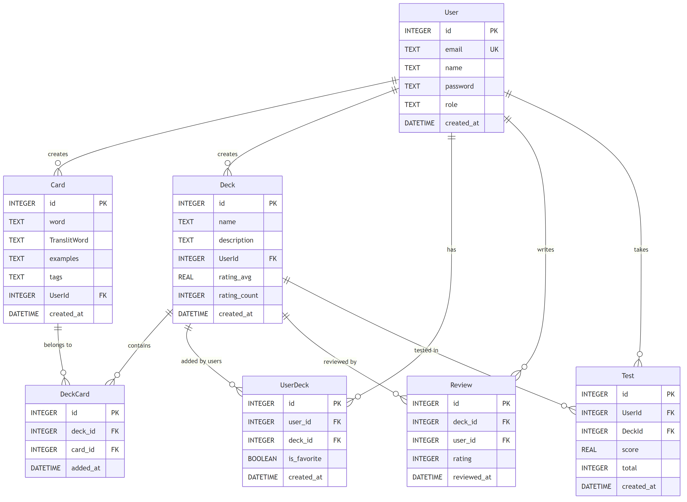

# 2 Разработка алгоритмов

## 2.1 Описание сущностей и связей

Модель данных системы построена на семи основных сущностях, обеспечивающих хранение информации о пользователях, контенте и результатах обучения.

**Сущность User** представляет зарегистрированного пользователя системы. Таблица содержит следующие атрибуты: уникальный идентификатор, адрес электронной почты, имя пользователя, хешированный пароль, роль в системе и временную метку регистрации. Адрес электронной почты должен быть уникальным в пределах системы и проходить валидацию формата. Роль определяет уровень доступа к функциям системы и может принимать значения «пользователь» или «администратор».

**Сущность Card** хранит информацию об отдельной карточке для обучения. Атрибуты включают идентификатор, слово на изучаемом языке, транслитерацию или перевод, примеры использования, строку с тегами через запятую, идентификатор создателя и время создания. Связь с таблицей User обеспечивает определение владельца карточки.

**Сущность Deck** представляет колоду карточек. Содержит идентификатор, название, описание, идентификатор создателя, средний рейтинг, количество оценок и время создания. Средний рейтинг и количество оценок вычисляются автоматически при добавлении или изменении оценок пользователей.

**Связующая таблица DeckCard** реализует отношение многие-ко-многим между колодами и карточками. Одна карточка может входить в несколько колод, а одна колода содержит множество карточек. Таблица включает идентификаторы колоды и карточки, а также временную метку добавления. Уникальность пары обеспечивается составным ограничением.

**Таблица UserDeck** связывает пользователей с колодами, которые они добавили в свою коллекцию. Содержит идентификаторы пользователя и колоды, флаг избранного и время добавления. Эта связь позволяет пользователю формировать личную библиотеку колод для обучения.

**Сущность Review** хранит оценки колод, выставленные пользователями. Атрибуты: идентификатор оценки, идентификаторы колоды и пользователя, числовая оценка от одного до пяти, временная метка. Один пользователь может оценить колоду только один раз, что обеспечивается уникальным ограничением на пару идентификаторов.

**Сущность Test** фиксирует результаты прохождения тестов. Включает идентификатор, идентификаторы пользователя и колоды, количество правильных ответов, общее количество вопросов и время прохождения. На основе этих данных вычисляется процент успешности.

Диаграмма сущностей и связей представлена на рисунке 2.1.

Рисунок 2.1 – Диаграмма сущностей и связей

Как видно из рисунка 2.1, центральной сущностью является User, от которой исходят связи к карточкам, колодам, тестам и оценкам. Это отражает тот факт, что каждый контент и каждое действие в системе привязано к конкретному пользователю.

## 2.2 Алгоритм формирования каталога колод

Формирование каталога колод выполняется при запросе пользователя к списку доступных колод. Алгоритм включает следующие шаги:

1. Получить параметры запроса: строку поиска и параметры пагинации.
2. Сформировать SQL-запрос к таблице Deck с выборкой всех колод.
3. Если задан параметр поиска, добавить условие фильтрации по вхождению строки в название или описание колоды.
4. Упорядочить результаты по времени создания в обратном порядке для отображения новых колод в начале списка.
5. Для каждой найденной колоды выполнить дополнительный запрос к таблице DeckCard с объединением Card для получения списка карточек.
6. Сформировать объекты ответа, включающие информацию о колоде и массив вложенных карточек.
7. Вернуть клиенту массив колод в формате JSON.

Данный подход обеспечивает гибкость поиска и позволяет клиентскому приложению отображать как базовую информацию о колодах, так и их содержимое без дополнительных запросов.

## 2.3 Алгоритм проверки прав доступа к колоде

При попытке пользователя получить детальную информацию о колоде или выполнить операции с ней необходимо проверить права доступа. Алгоритм проверки включает следующие этапы:

1. Извлечь идентификатор колоды из параметров запроса.
2. Выполнить запрос к таблице Deck для получения информации о колоде по идентификатору.
3. Если колода не найдена, вернуть ошибку с кодом 404.
4. Получить идентификатор создателя колоды и роль текущего пользователя из токена аутентификации.
5. Если пользователь является создателем колоды или имеет роль администратора, предоставить доступ.
6. В противном случае выполнить запрос к таблице UserDeck для проверки наличия связи между пользователем и колодой.
7. Если связь существует, предоставить доступ, иначе вернуть ошибку с кодом 403.

Такой подход позволяет обеспечить гибкую систему прав доступа, при которой создатели контента и администраторы имеют полный доступ, а обычные пользователи — только к добавленным в коллекцию колодам.

## 2.4 Алгоритм сохранения результата теста

При завершении теста результаты сохраняются в базе данных для последующего анализа и формирования статистики. Алгоритм выполняет следующие действия:

1. Получить от клиента данные о результате: идентификатор колоды, количество правильных ответов и общее количество вопросов.
2. Извлечь идентификатор пользователя из токена аутентификации.
3. Проверить, добавлена ли колода в коллекцию пользователя через запрос к таблице UserDeck.
4. Если колода не добавлена, вернуть ошибку с кодом 403 и сообщением о необходимости добавления колоды.
5. Выполнить вставку записи в таблицу Test с указанием идентификаторов пользователя и колоды, количества правильных ответов и общего количества вопросов.
6. Вычислить процент успешности как отношение правильных ответов к общему количеству.
7. Сформировать объект ответа с полной информацией о сохранённом тесте, включая автоматически присвоенный идентификатор.
8. Вернуть клиенту результат в формате JSON.

Данный алгоритм обеспечивает сохранение истории обучения пользователя и служит основой для расчёта статистических показателей.

## 2.5 Алгоритм вычисления общей статистики пользователя

Общая статистика пользователя формируется на основе анализа всех пройденных тестов за весь период использования системы. Алгоритм включает следующие шаги:

1. Получить идентификатор пользователя из токена аутентификации.
2. Выполнить агрегирующий SQL-запрос к таблице Test с фильтрацией по идентификатору пользователя.
3. Вычислить суммарное количество правильных ответов как сумму значений поля score.
4. Вычислить общее количество вопросов как сумму значений поля total.
5. Рассчитать количество неправильных ответов как разность общего количества вопросов и правильных ответов.
6. Вычислить общую точность как процентное отношение правильных ответов к общему количеству вопросов.
7. Выполнить запрос к таблице UserDeck для подсчёта количества колод в коллекции пользователя.
8. Сформировать объект ответа, включающий все вычисленные показатели.
9. Вернуть клиенту статистику в формате JSON.

Использование агрегирующих функций SQL позволяет эффективно вычислять статистику без необходимости загрузки всех записей о тестах в память приложения.

## 2.6 Алгоритм обновления рейтинга колоды

При выставлении или изменении оценки колоды необходимо пересчитать средний рейтинг. Алгоритм выполняет следующие действия:

1. Получить от клиента идентификатор колоды и числовое значение оценки от одного до пяти.
2. Извлечь идентификатор пользователя из токена аутентификации.
3. Проверить наличие колоды в коллекции пользователя и факт прохождения хотя бы одного теста.
4. Если условия не выполнены, вернуть соответствующую ошибку.
5. Выполнить запрос к таблице Review для проверки наличия ранее выставленной оценки от данного пользователя.
6. Если оценка существует, обновить её значение и временную метку, иначе вставить новую запись.
7. Выполнить агрегирующий запрос для вычисления среднего значения всех оценок колоды.
8. Подсчитать общее количество оценок.
9. Обновить поля rating_avg и rating_count в таблице Deck.
10. Сформировать и вернуть клиенту объект с информацией о сохранённой оценке.

Данный подход обеспечивает актуальность рейтинговых показателей и позволяет пользователям видеть общественную оценку качества колод.

## 2.7 Схема аутентификации на основе JWT

Аутентификация пользователей в системе реализована с использованием JSON Web Token. Процесс аутентификации включает следующие этапы.

При регистрации пользователь отправляет данные о себе на сервер. Сервер проверяет уникальность адреса электронной почты, хеширует пароль с использованием bcrypt и сохраняет запись в таблицу User. После успешной регистрации генерируется JWT-токен, содержащий идентификатор пользователя, адрес электронной почты и роль. Токен подписывается секретным ключом сервера и возвращается клиенту вместе с информацией о пользователе.

При аутентификации пользователь передаёт адрес электронной почты и пароль. Сервер извлекает запись пользователя из базы данных, сравнивает хеши паролей, и при совпадении генерирует новый JWT-токен, который возвращается клиенту.

Клиентское приложение сохраняет полученный токен в локальном хранилище браузера. При каждом последующем запросе к защищённым API-эндпоинтам токен передаётся в заголовке Authorization в формате Bearer. Серверная часть извлекает токен из заголовка, проверяет его подпись и срок действия. При успешной проверке из токена извлекается идентификатор пользователя, который используется для авторизации запроса. Если токен недействителен или отсутствует, сервер возвращает ошибку с кодом 401.

Такая схема аутентификации обеспечивает безопасную передачу учётных данных и позволяет серверу оставаться stateless, не сохраняя информацию о сеансах пользователей [4].
