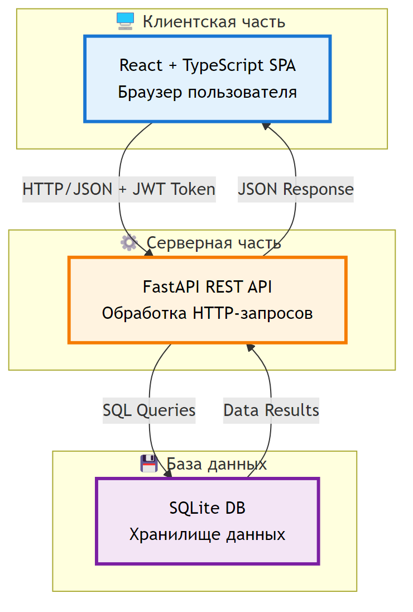
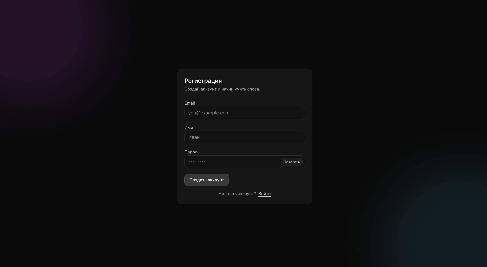
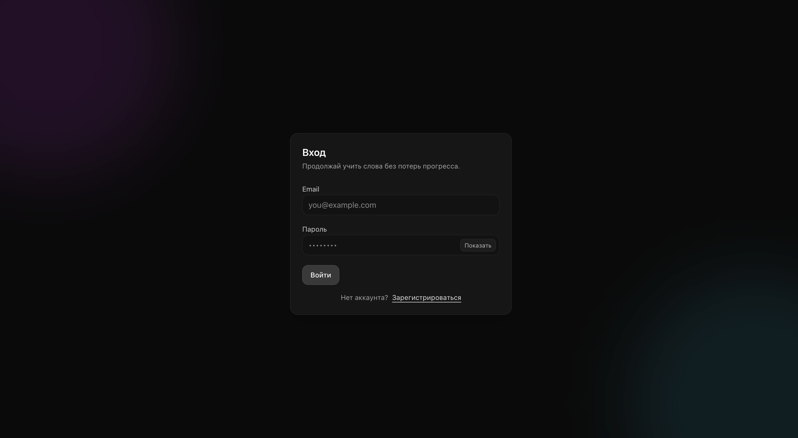
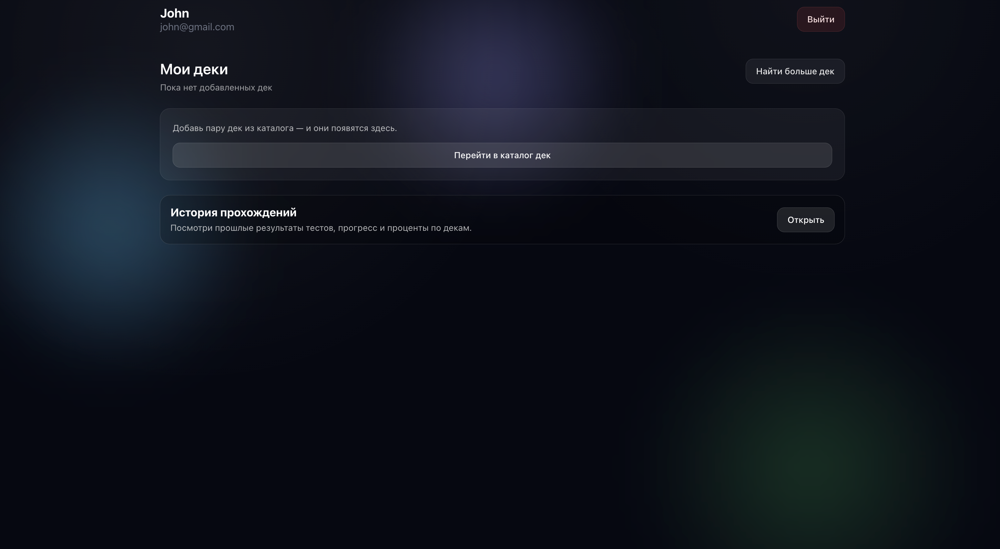
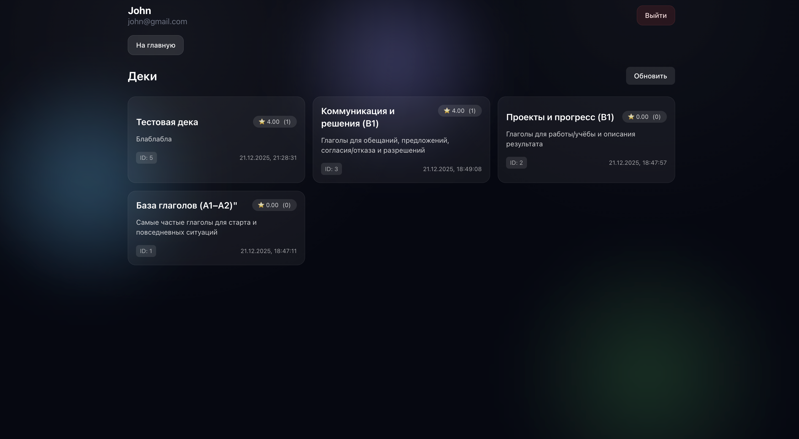
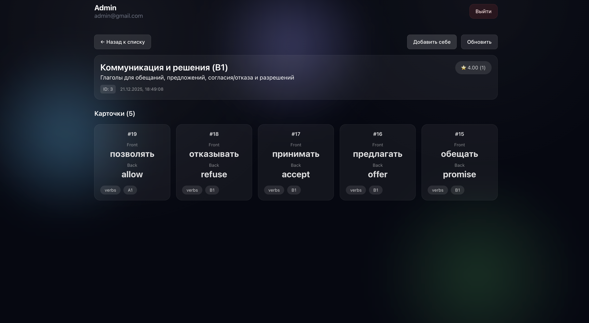
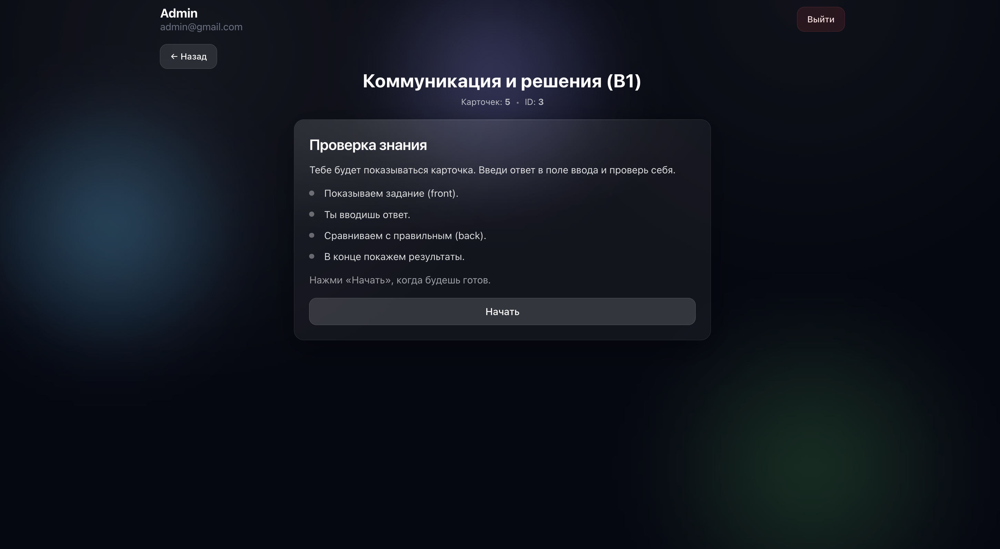
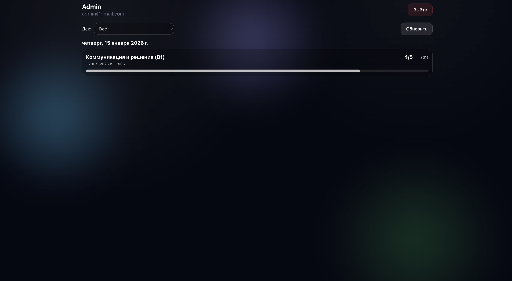
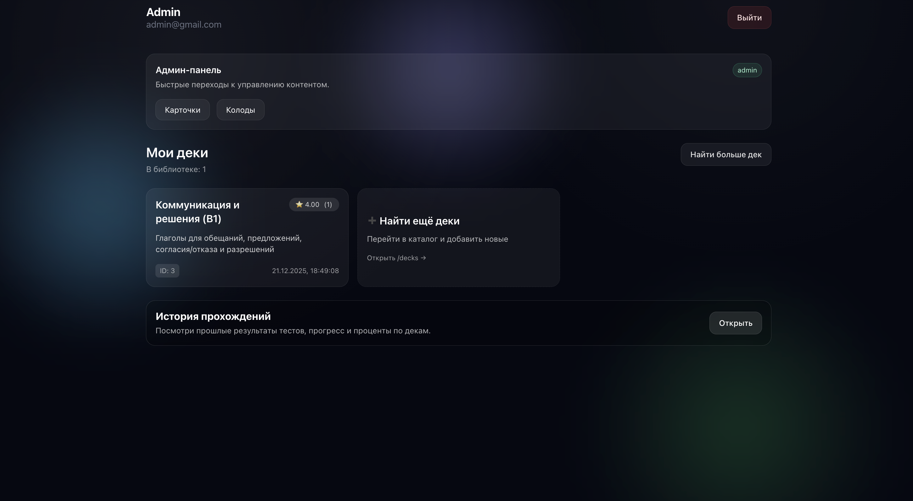

# 3 Разработка программы

## 3.1 Архитектура системы

Разработанная система построена по классической трёхзвенной архитектуре клиент-сервер с явным разделением слоёв представления, бизнес-логики и данных. Архитектура системы показана на рисунке 3.1.

Рисунок 3.1 – Архитектура системы

Как видно из рисунка 3.1, клиентская часть представляет собой одностраничное приложение, выполняющееся в браузере пользователя и взаимодействующее с сервером исключительно через HTTP-запросы к REST API. Серверная часть обрабатывает входящие запросы, выполняет бизнес-логику и взаимодействует с базой данных через SQL-запросы. База данных хранит все данные приложения в структурированном виде.

Взаимодействие между компонентами осуществляется следующим образом. Клиентское приложение формирует HTTP-запросы к API-эндпоинтам, передавая необходимые параметры в заголовках, теле запроса или URL. Запросы к защищённым ресурсам содержат JWT-токен в заголовке Authorization. Сервер принимает запрос, проверяет токен аутентификации, извлекает параметры и выполняет соответствующую бизнес-логику. При необходимости выполняются запросы к базе данных для чтения или записи информации. Результат обработки формируется в виде JSON-объекта и возвращается клиенту с соответствующим HTTP-статусом. Клиент обрабатывает ответ и обновляет пользовательский интерфейс.

Преимуществами данной архитектуры являются независимость разработки и развёртывания клиентской и серверной частей, возможность использования различных клиентских приложений для одного API и упрощение масштабирования системы [5].

## 3.2 Выбранный технологический стек и его обоснование

Для реализации серверной части выбран фреймворк FastAPI на языке Python. FastAPI обеспечивает высокую производительность обработки запросов благодаря асинхронной модели выполнения и автоматическую генерацию документации API в форматах OpenAPI и Swagger [6]. Встроенная поддержка валидации данных через Pydantic позволяет описывать модели данных в декларативном стиле с автоматической проверкой типов и ограничений. Использование аннотаций типов обеспечивает строгую типизацию и улучшает читаемость кода.

В качестве базы данных используется SQLite — встраиваемая СУБД, не требующая отдельного серверного процесса. SQLite подходит для прототипирования и небольших приложений благодаря простоте настройки и отсутствию зависимостей [7]. Для работы с базой данных применяется стандартная библиотека sqlite3, входящая в состав Python.

Для хеширования паролей используется библиотека bcrypt, реализующая криптографически стойкий алгоритм с автоматической генерацией соли. Генерация и проверка JWT-токенов выполняется библиотекой PyJWT. Поддержка CORS реализована встроенными средствами FastAPI через middleware.

Клиентская часть разработана с использованием библиотеки React версии 19, обеспечивающей эффективное управление состоянием компонентов и реактивное обновление пользовательского интерфейса. Использование TypeScript вместо JavaScript добавляет статическую типизацию, что снижает количество ошибок на этапе разработки и улучшает поддерживаемость кода [8].

Для маршрутизации применяется библиотека react-router-dom, позволяющая создавать многостраничную навигацию в рамках одностраничного приложения. Управление глобальным состоянием реализовано с помощью Zustand — лёгкой библиотеки состояния с минималистичным API. Стилизация выполнена с использованием Tailwind CSS — utility-first фреймворка, обеспечивающего быструю разработку адаптивных интерфейсов без написания пользовательских CSS-файлов.

Сборка клиентского приложения выполняется инструментом Vite, обеспечивающим быструю горячую перезагрузку модулей во время разработки и оптимизированную сборку для продакшена.

## 3.3 Описание модулей серверной части

Серверная часть приложения состоит из нескольких модулей, каждый из которых выполняет определённую функцию.

**Модуль main.py** является точкой входа в приложение и содержит определение всех API-эндпоинтов. В начале модуля создаётся экземпляр приложения FastAPI с указанием заголовка для автоматически генерируемой документации. Настраивается middleware для поддержки CORS с разрешением запросов из любых источников, что необходимо для локальной разработки. Определяется функция lifespan, выполняющая инициализацию базы данных при запуске приложения.

Эндпоинты сгруппированы по функциональности. Группа аутентификации включает регистрацию пользователя, вход в систему и получение профиля текущего пользователя. При регистрации проверяется уникальность адреса электронной почты, пароль хешируется, запись сохраняется в базе данных, генерируется JWT-токен и возвращается клиенту вместе с данными пользователя. При входе проверяется существование пользователя с указанным адресом, сравниваются хеши паролей, и при успехе возвращается токен.

Группа управления карточками предоставляет операции создания, редактирования, удаления и получения списка карточек. При создании карточки теги объединяются в строку через запятую для хранения в базе данных. При редактировании проверяется принадлежность карточки пользователю или наличие прав администратора. При удалении выполняется та же проверка прав. Получение списка карточек фильтруется по пользователю для обычных пользователей и возвращает все карточки для администраторов.

Группа управления колодами включает создание колоды с возможностью указания начального набора карточек, удаление колоды, добавление и удаление карточек из существующей колоды, получение каталога всех колод с поддержкой поиска и получение детальной информации о конкретной колоде. При создании колоды проверяется принадлежность добавляемых карточек пользователю. При получении детальной информации выполняется проверка прав доступа согласно алгоритму, описанному в разделе 2.3.

Группа работы с коллекцией пользователя предоставляет операции добавления колоды в коллекцию, удаления из коллекции и получения списка колод в коллекции. Добавление колоды создаёт запись в таблице UserDeck с проверкой отсутствия дубликатов.

Группа тестирования включает сохранение результата теста и получение истории тестов с фильтрацией по колоде и пагинацией. Сохранение результата выполняет проверку наличия колоды в коллекции пользователя.

Группа статистики предоставляет эндпоинт получения общей статистики пользователя, вычисляемой согласно алгоритму из раздела 2.5.

Группа оценок колод включает выставление оценки с автоматическим обновлением среднего рейтинга и получение информации о рейтинге конкретной колоды.

Для защиты эндпоинтов используется зависимость get_current_user, которая извлекает токен из заголовка Authorization, проверяет его подпись и срок действия, извлекает идентификатор пользователя и загружает полную информацию о пользователе из базы данных. Для операций, требующих прав администратора, применяется дополнительная зависимость get_current_admin, проверяющая роль пользователя.

**Модуль models.py** содержит определения моделей данных с использованием Pydantic. Модели разделены на входные, используемые для валидации данных от клиента, и выходные, определяющие структуру ответов API. Для критичных полей заданы валидаторы, проверяющие формат адреса электронной почты, диапазоны числовых значений и соотношения между полями.

**Модуль sqliteDB.py** инкапсулирует логику работы с базой данных. Функция get_db создаёт новое подключение к базе данных для каждого запроса. Функция init_db выполняет создание всех необходимых таблиц при первом запуске приложения, используя конструкцию CREATE TABLE IF NOT EXISTS для идемпотентности операции. Определения таблиц включают первичные ключи, внешние ключи с каскадными операциями, уникальные ограничения и значения по умолчанию для временных меток.

**Модуль utilities.py** содержит вспомогательные функции для работы с паролями и токенами. Функция hash_password принимает строку пароля и возвращает хеш, созданный с использованием bcrypt. Функция verify_password сравнивает предоставленный пароль с хешем. Функция create_access_token создаёт JWT-токен с заданным payload и сроком действия. Функция verify_token проверяет подпись токена и извлекает payload.

## 3.4 Описание структуры клиентской части

Клиентское приложение организовано по компонентному принципу с разделением на страницы, переиспользуемые компоненты и хранилища состояния.

Главный компонент App выполняет инициализацию приложения при загрузке страницы. Проверяется наличие токена в локальном хранилище браузера, и при его наличии отправляется запрос к эндпоинту профиля для получения информации о текущем пользователе. Результат сохраняется в глобальное хранилище состояния аутентификации. Компонент использует react-router-dom для определения маршрутизации и отображения соответствующих страниц.

Страница регистрации и входа представлены на рисунках 3.2 и 3.3 соответственно.

Рисунок 3.2 – Страница регистрации

Рисунок 3.3 – Страница входа в систему

Согласно рисункам 3.2 и 3.3, страницы аутентификации содержат формы ввода учётных данных с валидацией на стороне клиента. При успешной аутентификации токен сохраняется в локальное хранилище, информация о пользователе записывается в состояние, и выполняется перенаправление на главную страницу.

Главная страница приложения отображает персонализированную информацию для пользователя. Интерфейс главной страницы показан на рисунке 3.4.

Рисунок 3.4 – Главная страница приложения

Как видно из рисунка 3.4, главная страница включает приветствие пользователя, блок статистики обучения и список колод в личной коллекции. Статистика отображает количество правильных и неправильных ответов, общую точность и количество колод. Для каждой колоды в коллекции показывается название, описание, рейтинг и кнопки для перехода к изучению или просмотру деталей.

Страница каталога колод предоставляет возможность просмотра всех доступных колод с функцией поиска. Интерфейс страницы представлен на рисунке 3.5.

Рисунок 3.5 – Каталог колод

Согласно рисунку 3.5, пользователь может вводить поисковый запрос для фильтрации колод по названию или описанию. Каждая карточка колоды содержит кнопку добавления в коллекцию. После добавления колода становится доступной для изучения на главной странице.

Детальная страница колоды отображает полную информацию о колоде и список всех входящих в неё карточек. Пример интерфейса показан на рисунке 3.6.

Рисунок 3.6 – Детальная страница колоды

Как видно из рисунка 3.6, страница отображает название колоды, описание, средний рейтинг и список карточек с их содержимым. Пользователь может начать изучение колоды, нажав соответствующую кнопку.

Страница практики реализует интерактивный процесс изучения карточек. Интерфейс показан на рисунке 3.7.

Рисунок 3.7 – Страница практики с карточками

Согласно рисунку 3.7, пользователю последовательно показываются карточки из выбранной колоды. Для каждой карточки отображается слово, и пользователь должен ввести перевод или выбрать правильный вариант. После ответа показывается правильность и происходит переход к следующей карточке. По завершении отображается результат с количеством правильных ответов и процентом успешности. Результат автоматически сохраняется в базу данных.

Страница истории тестов отображает все пройденные тесты пользователя. Интерфейс представлен на рисунке 3.8.

Рисунок 3.8 – История пройденных тестов

Как видно из рисунка 3.8, для каждого теста отображается название колоды, дата прохождения, количество правильных ответов и процент успешности. Список упорядочен по времени прохождения.

Для администраторов доступны дополнительные страницы управления контентом. Административная панель показана на рисунке 3.9.

Рисунок 3.9 – Административная панель

Согласно рисунку 3.9, администратор может просматривать все карточки и колоды в системе, создавать новые, редактировать и удалять существующие независимо от их владельца.

Глобальное состояние приложения управляется через хранилище Zustand. Определено хранилище authStore для информации об аутентификации пользователя. Хранилище содержит данные текущего пользователя, флаги загрузки и инициализации, а также функции для их обновления. Использование централизованного хранилища избавляет от необходимости передавать данные пользователя через пропсы компонентов на всех уровнях вложенности.

Для взаимодействия с API создан модуль с функциями выполнения HTTP-запросов. Каждая функция инкапсулирует логику формирования запроса с необходимыми заголовками, обработку ответа и преобразование ошибок. Токен аутентификации извлекается из локального хранилища и автоматически добавляется к защищённым запросам.

Переиспользуемые компоненты пользовательского интерфейса включают кнопки, поля ввода, карточки, модальные окна и индикаторы загрузки. Все компоненты стилизованы с использованием классов Tailwind CSS и обеспечивают единообразный внешний вид приложения.

## 3.5 API-спецификация

Спецификация API представлена в виде таблиц, описывающих эндпоинты, методы HTTP, параметры запросов, формат ответов и возможные ошибки.

**Таблица 3.1** – Эндпоинты аутентификации

| Эндпоинт | Метод | Тело запроса | Ответ | Ошибки |
|----------|-------|--------------|-------|---------|
| /register | POST | email, name, password, role | token, user_data | 400 — email занят |
| /login | POST | email, password | token, user_data | 400 — неверные данные |
| /profile | GET | — | id, email, name, role | 401 — токен недействителен |

**Таблица 3.2** – Эндпоинты управления карточками

| Эндпоинт | Метод | Параметры | Ответ | Ошибки |
|----------|-------|-----------|-------|---------|
| /cards | POST | front, back, examples, tags | Объект карточки | 401 — не авторизован |
| /cards | GET | — | Массив карточек | 401 — не авторизован |
| /cards/{id} | PUT | front, back, examples, tags | Объект карточки | 403 — не ваша карточка |
| /cards/{id} | DELETE | — | Сообщение об удалении | 403 — не ваша карточка |

**Таблица 3.3** – Эндпоинты управления колодами

| Эндпоинт | Метод | Параметры | Ответ | Ошибки |
|----------|-------|-----------|-------|---------|
| /decks | POST | title, description, card_ids | Объект колоды с карточками | 401 — не авторизован |
| /decks | GET | search (опционально) | Массив колод с карточками | 401 — не авторизован |
| /decks/{id} | GET | — | Объект колоды с карточками | 403 — нет доступа |
| /decks/{id} | DELETE | — | Сообщение об удалении | 403 — не ваша колода |
| /decks/{id}/cards | POST | card_ids | Количество добавленных | 403 — не ваша колода |
| /decks/{id}/cards/{card_id} | DELETE | — | Сообщение об удалении | 403 — не ваша колода |

**Таблица 3.4** – Эндпоинты коллекции пользователя

| Эндпоинт | Метод | Параметры | Ответ | Ошибки |
|----------|-------|-----------|-------|---------|
| /user-decks | POST | deck_id, is_favorite | Объект UserDeck | 400 — уже добавлена |
| /user-decks | GET | — | Массив колод пользователя | 401 — не авторизован |
| /user-decks/{deck_id} | DELETE | — | Сообщение об удалении | 404 — не найдена |

**Таблица 3.5** – Эндпоинты тестирования и статистики

| Эндпоинт | Метод | Параметры | Ответ | Ошибки |
|----------|-------|-----------|-------|---------|
| /tests | POST | deck_id, score, total | Объект теста с процентом | 403 — колода не добавлена |
| /tests/history | GET | deck_id, limit, offset | Массив тестов | 401 — не авторизован |
| /stats | GET | — | Общая статистика | 401 — не авторизован |

**Таблица 3.6** – Эндпоинты оценок колод

| Эндпоинт | Метод | Параметры | Ответ | Ошибки |
|----------|-------|-----------|-------|---------|
| /reviews | POST | deck_id, rating | Объект оценки | 400 — нет теста, 403 — не добавлена |
| /reviews/deck/{deck_id} | GET | — | Средний рейтинг, оценка пользователя | 403 — нет доступа |

Все защищённые эндпоинты требуют наличия токена в заголовке Authorization в формате Bearer. При отсутствии или недействительности токена возвращается ошибка с кодом 401.

## 3.6 Модель данных

Модель данных реализована в виде таблиц SQLite со следующей структурой.

**Таблица 3.7** – Структура таблицы User

| Поле | Тип | Ограничения | Описание |
|------|-----|-------------|----------|
| id | INTEGER | PRIMARY KEY AUTOINCREMENT | Уникальный идентификатор |
| email | TEXT | UNIQUE NOT NULL | Адрес электронной почты |
| name | TEXT | NOT NULL | Имя пользователя |
| password | TEXT | NOT NULL | Хешированный пароль |
| role | TEXT | NOT NULL | Роль: user или admin |
| created_at | DATETIME | DEFAULT CURRENT_TIMESTAMP | Дата регистрации |

**Таблица 3.8** – Структура таблицы Card

| Поле | Тип | Ограничения | Описание |
|------|-----|-------------|----------|
| id | INTEGER | PRIMARY KEY AUTOINCREMENT | Уникальный идентификатор |
| word | TEXT | NOT NULL | Слово на изучаемом языке |
| TranslitWord | TEXT | — | Транслитерация или перевод |
| examples | TEXT | — | Примеры использования |
| tags | TEXT | — | Теги через запятую |
| UserId | INTEGER | FOREIGN KEY | Идентификатор создателя |
| created_at | DATETIME | DEFAULT CURRENT_TIMESTAMP | Дата создания |

**Таблица 3.9** – Структура таблицы Deck

| Поле | Тип | Ограничения | Описание |
|------|-----|-------------|----------|
| id | INTEGER | PRIMARY KEY AUTOINCREMENT | Уникальный идентификатор |
| name | TEXT | NOT NULL | Название колоды |
| description | TEXT | — | Описание колоды |
| UserId | INTEGER | FOREIGN KEY | Идентификатор создателя |
| rating_avg | REAL | DEFAULT 0.0 | Средний рейтинг |
| rating_count | INTEGER | DEFAULT 0 | Количество оценок |
| created_at | DATETIME | DEFAULT CURRENT_TIMESTAMP | Дата создания |

**Таблица 3.10** – Структура таблицы DeckCard

| Поле | Тип | Ограничения | Описание |
|------|-----|-------------|----------|
| id | INTEGER | PRIMARY KEY AUTOINCREMENT | Уникальный идентификатор |
| deck_id | INTEGER | FOREIGN KEY, NOT NULL | Идентификатор колоды |
| card_id | INTEGER | FOREIGN KEY, NOT NULL | Идентификатор карточки |
| added_at | DATETIME | DEFAULT CURRENT_TIMESTAMP | Дата добавления |

Ограничение UNIQUE(deck_id, card_id) предотвращает дублирование карточек в колоде. Внешние ключи настроены с каскадным удалением ON DELETE CASCADE для автоматического удаления связей при удалении колоды или карточки.

**Таблица 3.11** – Структура таблицы UserDeck

| Поле | Тип | Ограничения | Описание |
|------|-----|-------------|----------|
| id | INTEGER | PRIMARY KEY AUTOINCREMENT | Уникальный идентификатор |
| user_id | INTEGER | FOREIGN KEY, NOT NULL | Идентификатор пользователя |
| deck_id | INTEGER | FOREIGN KEY, NOT NULL | Идентификатор колоды |
| is_favorite | BOOLEAN | DEFAULT FALSE | Флаг избранного |
| created_at | DATETIME | DEFAULT CURRENT_TIMESTAMP | Дата добавления |

Ограничение UNIQUE(user_id, deck_id) предотвращает повторное добавление колоды в коллекцию пользователя.

**Таблица 3.12** – Структура таблицы Review

| Поле | Тип | Ограничения | Описание |
|------|-----|-------------|----------|
| id | INTEGER | PRIMARY KEY AUTOINCREMENT | Уникальный идентификатор |
| deck_id | INTEGER | FOREIGN KEY, NOT NULL | Идентификатор колоды |
| user_id | INTEGER | FOREIGN KEY, NOT NULL | Идентификатор пользователя |
| rating | INTEGER | NOT NULL CHECK(1 <= rating <= 5) | Оценка от 1 до 5 |
| reviewed_at | DATETIME | DEFAULT CURRENT_TIMESTAMP | Дата оценки |

Ограничение UNIQUE(user_id, deck_id) гарантирует единственность оценки пользователя для каждой колоды.

**Таблица 3.13** – Структура таблицы Test

| Поле | Тип | Ограничения | Описание |
|------|-----|-------------|----------|
| id | INTEGER | PRIMARY KEY AUTOINCREMENT | Уникальный идентификатор |
| UserId | INTEGER | FOREIGN KEY | Идентификатор пользователя |
| DeckId | INTEGER | FOREIGN KEY | Идентификатор колоды |
| score | REAL | NOT NULL | Количество правильных ответов |
| total | INTEGER | NOT NULL | Общее количество вопросов |
| created_at | DATETIME | DEFAULT CURRENT_TIMESTAMP | Дата прохождения |

Для оптимизации запросов рекомендуется создание составных индексов на часто используемые комбинации полей: индекс на паре user_id и deck_id в таблице UserDeck для быстрой проверки наличия колоды в коллекции, индекс на поле UserId в таблице Test для ускорения выборки истории тестов конкретного пользователя, индекс на полях name и description в таблице Deck для эффективного полнотекстового поиска.

## 3.7 Конфигурация окружения и инструкция по запуску

Для запуска серверной части необходима установка Python версии 3.11. Создание виртуального окружения выполняется командой создания venv с указанием пути к интерпретатору Python 3.11. После активации виртуального окружения устанавливаются зависимости из файла requirements.txt, который включает пакеты FastAPI, uvicorn для ASGI-сервера, pydantic для валидации, bcrypt для хеширования паролей, PyJWT для работы с токенами и python-multipart для обработки форм.

Запуск сервера осуществляется выполнением модуля main.py, который инициализирует базу данных, создаёт необходимые таблицы и запускает ASGI-сервер на порту 8000 с привязкой ко всем сетевым интерфейсам. При первом запуске автоматически создаётся файл базы данных app.db в текущей директории.

Для запуска клиентской части необходима установка Node.js актуальной версии. После перехода в директорию frontend выполняется установка зависимостей командой npm install, которая загружает все необходимые пакеты согласно файлу package.json. Запуск сервера разработки выполняется командой npm run dev, которая компилирует TypeScript-код, запускает Vite-сервер и открывает приложение в браузере по адресу localhost:5173.

Конфигурация клиента включает указание URL API-сервера в файле конфигурации окружения. Для локальной разработки используется адрес http://localhost:8000. При развёртывании в продакшене необходимо изменить этот адрес на соответствующий публичному домену сервера.

Сборка клиентского приложения для продакшена выполняется командой npm run build, которая создаёт оптимизированную версию приложения в директории dist. Полученные статические файлы могут быть размещены на любом веб-сервере или CDN [9].
